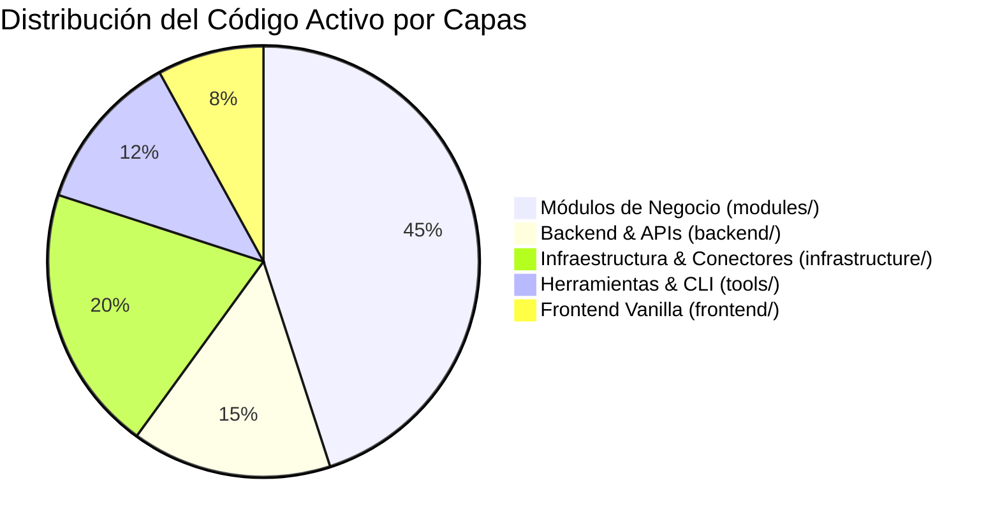

# 🏛️ Auditoría Global del Proyecto — Directrices de Karpathy

> **Evaluación integral de arquitectura, simplicidad, modularidad y verificabilidad sobre el código activo de `APP_CALIDAD` (UPLOADER_V2).**  
> *Excluye la carpeta `legacy/` según las reglas del workspace.*

---

## 1. 📊 Resumen Ejecutivo del Estado del Código

| Dimensión Karpathy | Calificación | Estado Actual |
| :--- | :---: | :--- |
| **1. Think Before Coding** | `8.5 / 10` | Arquitectura bien delimitada por dominios (`consumo`, `calidad`, `convenios`, `speech`). Parámetros de conexión explícitos en `.env`. |
| **2. Simplicity First** | `8.0 / 10` | Polars y Teradata SQL hacen el trabajo pesado eficientemente. Mínima sobrecarga de frameworks en frontend (Vanilla JS/CSS). |
| **3. Surgical Changes** | `8.2 / 10` | Se respeta la separación entre capas. Algunas utilidades en `tools/` duplican fragmentos que ya existen en `modules/`. |
| **4. Goal-Driven Execution** | `8.8 / 10` | Excelente trazabilidad: todos los orquestadores implementan `progress_callback` y logs detallados hacia la UI y terminal. |

---

## 2. 🔍 Evaluación Detallada por Directriz

### 1️⃣ Directriz 1: Think Before Coding (Suposiciones y Fronteras)
- **Aciertos:**
  - **Single Source of Truth en BD**: Las configuraciones de plantillas (`config/plantillas.json`) y mapeos de homologación residen en tablas permanentes de Teradata (`DLAB_GEC.M_EXP_CALIDAD_HOMOLOGA_*`), eliminando hardcoding en Python.
  - **Fronteras claras**: Separación estricta entre consultas corporativas de solo lectura (`E_DW_VIEWS`, `E_DW_VIEWS_DLAB`) y esquemas propios de persistencia (`DLAB_GEC`, `DB_SPEECH`).
- **Oportunidades de Mejora:**
  - En `backend/main.py` y `modules/consumo/use_cases/consumo_orchestrator.py` se asume la presencia de drivers ODBC específicos (`ODBC Driver 17 for SQL Server`). Si la máquina del nuevo responsable tiene `ODBC Driver 18`, debe asegurarse el fallback automático en la cadena de conexión.

---

### 2️⃣ Directriz 2: Simplicity First (Simplicidad y Cero Especulación)
- **Aciertos:**
  - **Frontend Ultra Ligero**: Cero overhead de bundlers o frameworks pesados (React/Node). Se usa HTML5 + CSS vanilla con glassmorphism + `app.js` reactivo puro, garantizando arranque instantáneo en cualquier laptop de trabajo sin dependencias de compilación.
  - **Motor de Datos con Polars**: Procesamiento en memoria de millones de filas en segundos sin saturar memoria RAM.
- **Oportunidades de Mejora:**
  - Existen scripts de prueba en `tools/` (`test_single_case.py`, `test_genesys_navigation.py`, `test_wrapup_fields.py`) que fueron creados durante el desarrollo exploratorio. Se recomienda agruparlos en `tools/scratch/` o documentar su estatus para que el nuevo equipo no los confunda con scripts productivos.

---

### 3️⃣ Directriz 3: Surgical Changes (Límites y No Duplicación)
- **Aciertos:**
  - Aislamiento completo de `legacy/` (cero interferencias con código Streamlit deprecado).
  - Los casos de uso (`use_cases/`) actúan como controladores puros y delegan el acceso a datos a `infrastructure/` y `sql/`.
- **Oportunidades de Mejora:**
  - **Consolidación de extractores Verint**: Varios scripts en `tools/` (`extract_transcripts_pa_tc.py`, `download_transcripts_from_verint.py`) tenían lógica propia de autenticación. Deben continuar delegando en `modules/verint/services/verint_api_client.py` y `modules/verint/transcripciones/extractors/`.

---

### 4️⃣ Directriz 4: Goal-Driven Execution (Verificabilidad y Feedback)
- **Aciertos:**
  - **Progreso en Tiempo Real**: WebSocket y callbacks de progreso en todos los pipelines largos (`Consumo`, `Calidad`, `Cierre`, `TCAD`, `Speech`).
  - **Manejo de Errores Amigables**: En `backend/main.py` y `infrastructure/database/teradata_connection.py`, los errores de red/login se traducen a mensajes comprensibles para el usuario final.
- **Oportunidades de Mejora:**
  - Extender la cobertura de pruebas unitarias mínimas usando el entorno virtual (`.\.venv\Scripts\python -m unittest discover tests`) para validar los parsers de fechas y transformaciones de Polars de forma determinista.

---

## 3. 📋 Plan de Acción Recomendado para el Equipo / Traspaso

1. **Documentación & Catálogo (Completado)**:
   - [DICCIONARIO_FUENTES_Y_LINAJE_DATOS.md](file:///c:/Users/USER/Documents/Documentos%20Personales/INTERBANK/APP_CALIDAD/docs/DICCIONARIO_FUENTES_Y_LINAJE_DATOS.md): Detalla todas las 27 consultas SQL, tablas y permisos.
   - [PLAN_TRANSICION.md](file:///c:/Users/USER/Documents/Documentos%20Personales/INTERBANK/APP_CALIDAD/docs/PLAN_TRANSICION.md): Guía paso a paso para levantar el sistema en una máquina nueva en menos de 15 minutos.
2. **Nuevo Módulo Speech para sofIA (Completado)**:
   - [modules/speech/](file:///c:/Users/USER/Documents/Documentos%20Personales/INTERBANK/APP_CALIDAD/modules/speech/): Extracción de Teradata + `TIPO_LEAD` de Insight + Transcripciones Verint + Carga SQL Server con flag `--skip-sql`.
3. **Mantenimiento Preventivo**:
   - Rotar credenciales personales en `.env` al completar la transición formal.
