# 📚 Diccionario Maestro de Fuentes de Datos, Linaje y Accesos

> **Guía técnica y de negocio para el equipo y nuevos responsables de la plataforma APP_CALIDAD / UPLOADER_V2.**  
> Este documento detalla qué datos existen, en qué tabla se consultan, cuál es su origen en el Data Warehouse corporativo y qué usuario/perfil tiene acceso.

---

## 1. 🔑 Esquema de Permisos y Perfiles de Acceso

| Esquema / Perfil | Tipo de Acceso | Rol / Propósito | Descripción |
| :--- | :--- | :--- | :--- |
| **`DLAB_GEC`** | `ALL (DDL + DML)` | Usuario de Servicio (`APP_GEC`) | Esquema propio de trabajo. Aquí residen todas las tablas intermedias (`M_EXP_*`), tablas maestras (`T_*`) y vistas consolidadas (`V_*`). |
| **`E_DW_VIEWS_DLAB`** | `SELECT` | Analítico / `APP_GEC` / LDAP | Vistas departamentales de Data Lab / CRM. Contiene históricos de ventas, pagos automáticos, incrementos de línea, préstamos y seguros. |
| **`E_DW_VIEWS`** | `SELECT` | Corporativo / `APP_GEC` / LDAP | Vistas oficiales del Enterprise Data Warehouse (EDW): reclamos GIRU, ventas masivas, carteras comerciales y ejecutivos. |
| **`DESNEGRET`** | `SELECT / EXECUTE` | Perfil de Retenciones | Vistas y tablas analíticas asociadas a campañas y gestiones de retención multiproducto y convenios. |

---

## 2. 🗺️ Diagrama de Linaje Global de Datos

```mermaid
flowchart TD
    subgraph EDW_Fuentes ["🏢 Enterprise Data Warehouse (E_DW_VIEWS / E_DW_VIEWS_DLAB)"]
        PA_SRC["V_CGR_PAGO_AUTOMATICO<br/>(Pagos Automáticos)"]
        IL_SRC["CGR_INC_LINEA_HST<br/>(Incremento Línea)"]
        UPG_SRC["CGR_UPGRADE_HST<br/>(Upgrades Tarjeta)"]
        PP_SRC["CGR_PRESTAMOS<br/>(Préstamos Personales)"]
        EC_SRC["CGR_EXTRACASH<br/>(Extra Cash)"]
        CD_SRC["V_CD_DESEMB_HISTORICO<br/>(Compra Deuda)"]
        SEG_SRC["V_DLAB_CGR_SEGUROS_VENTAS<br/>(Seguros)"]
        CNV_SRC["V_FCT_CNV_VENTAS<br/>(Ventas Convenios)"]
        GIRU_SRC["V_CRM_EXO_GIR_*<br/>(Reclamos / Retenciones GIRU)"]
        RCO_SRC["V_CNV_VISTA_RETENCION_BT<br/>(Retenciones Convenios)"]
        LPDP_SRC["TLV_CARGA_ACTUAL / DIGITAL<br/>(Bases y Consentimiento LPDP)"]
        EJEC_SRC["M_EXP_TELEVENTAS_EJECUTIVOS<br/>(Maestro Ejecutivos/Supervisores)"]
    end

    subgraph DLAB_Paso ["⚙️ Tablas de Extracción / Paso (DLAB_GEC)"]
        PA_EXP["M_EXP_VENTAS_PA"]
        IL_EXP["M_EXP_VENTAS_IL"]
        UPG_EXP["M_EXP_VENTAS_UPG"]
        PP_EXP["M_EXP_VENTAS_PP"]
        EC_EXP["M_EXP_VENTAS_EC"]
        CD_EXP["M_EXP_VENTAS_CD"]
        SEG_EXP["M_EXP_VENTAS_SEG"]
        GIRU_EXP["T_RETENCION_BASE_CALIDAD_GIRU"]
        RCO_EXP["REPORTE_RETENCION_CONVENIOS"]
    end

    subgraph Speech_Calidad ["🎙️ Motor Speech Analytics & Calidad"]
        SA_IN["M_EXP_CALIDAD_PURECLOUD_PRE<br/>(Verint / Genesys Audios)"]
        SA_MARK["02_sa_marcacion_ventas_lpdp.sql<br/>(Cruce DNI + Asesor + Flags)"]
        SA_MASTER["DLAB_GEC.M_EXP_CALIDAD_DATA_SPEECH_ANALYTICS"]
        SA_SCORE["03_sa_calculo_pesos_unpivot.sql<br/>(Ponderaciones y Reglas)"]
        FINAL_VIEW["V_EXP_CALIDAD_NOTA_FINAL<br/>(Reportería / Power BI)"]
    end

    PA_SRC --> PA_EXP
    IL_SRC --> IL_EXP
    UPG_SRC --> UPG_EXP
    PP_SRC --> PP_EXP
    EC_SRC --> EC_EXP
    CD_SRC --> CD_EXP
    SEG_SRC --> SEG_EXP
    GIRU_SRC & PA_SRC & IL_SRC & UPG_SRC --> GIRU_EXP
    RCO_SRC --> RCO_EXP

    DLAB_Paso & LPDP_SRC & SA_IN --> SA_MARK
    SA_MARK --> SA_MASTER
    SA_MASTER --> SA_SCORE --> FINAL_VIEW
```

---

## 3. 📖 Catálogo Detallado de Fuentes por Producto / Dominio

### 3.1 Pagos Automáticos (PA)
- **Tabla Origen:** `E_DW_VIEWS_DLAB.V_CGR_PAGO_AUTOMATICO`
- **Tabla Destino / Intermedia:** `DLAB_GEC.M_EXP_VENTAS_PA` | Flags en `DLAB_GEC.T_RETENCION_BASE_CALIDAD_GIRU`
- **Script Poblador:** [VENTAS_DN.sql](file:///c:/Users/USER/Documents/Documentos%20Personales/INTERBANK/APP_CALIDAD/modules/consumo/sql/VENTAS_DN.sql#L262-L291) | [SOURCE_TVL.sql](file:///c:/Users/USER/Documents/Documentos%20Personales/INTERBANK/APP_CALIDAD/modules/consumo/sql/SOURCE_TVL.sql#L13-L120)
- **Atributos de Negocio Clave:**
  - `DOCUMENTO_NUM`: DNI / Documento del titular.
  - `PROMOTOR_CD`: Registro del asesor de venta / retención.
  - `SOLICITUD_FC` / `FECDESEMBOLSO`: Fecha y hora exacta de registro.
  - `RUBRO_CD`: Código de rubro (servicios, luz, agua, telefonía, etc.).
  - `ESTADO_CD`: Estado de la afiliación (`'A'` = Activa).
  - `SUBEQUIPO` / `SUBEQUIPO_DSC`: Segmentación del canal (`'RETENCION MULTIPRODUCTO'`, `'LEALTAD'`, etc.).
  - **Límites de Pago**: Montos máximos o topes de cargo autorizados por el cliente.

---

### 3.2 Incrementos de Línea (IL / DIL)
- **Tabla Origen:** `E_DW_VIEWS_DLAB.CGR_INC_LINEA_HST`
- **Tabla Destino / Intermedia:** `DLAB_GEC.M_EXP_VENTAS_IL`
- **Script Poblador:** [VENTAS_DN.sql](file:///c:/Users/USER/Documents/Documentos%20Personales/INTERBANK/APP_CALIDAD/modules/consumo/sql/VENTAS_DN.sql#L236-L260)
- **Atributos de Negocio Clave:**
  - `DOCUMENTO_NUM`: Documento del cliente.
  - `LINEAACTUAL_AMT`: Nueva línea de crédito aprobada tras el incremento.
  - `VALIDO`: Flag de efectividad (`'1'` = Venta válida).
  - `SUBEQUIPO_DSC`: Canal emisor (`'RETENCION MULTIPRODUCTO'`, `'PRT'`, etc.).

---

### 3.3 Upgrades de Tarjeta de Crédito (UPG)
- **Tabla Origen:** `E_DW_VIEWS_DLAB.CGR_UPGRADE_HST`
- **Tabla Destino / Intermedia:** `DLAB_GEC.M_EXP_VENTAS_UPG`
- **Script Poblador:** [VENTAS_DN.sql](file:///c:/Users/USER/Documents/Documentos%20Personales/INTERBANK/APP_CALIDAD/modules/consumo/sql/VENTAS_DN.sql#L210-L234)
- **Atributos de Negocio Clave:**
  - `DOCUMENTO_NUM`: Documento del cliente.
  - `ESTADO_CD`: `'PF'` (Procede Final).
  - `SITUACION_DSC`: `'ENTREGADA'` (Tarjeta entregada al cliente).
  - `BENEFICIARIO_DSC`: Exclusión de `'ADICIONAL'`.

---

### 3.4 Préstamos Personales (PP / PPE) y Extra Cash (EC)
- **Tablas Origen:** `E_DW_VIEWS_DLAB.CGR_PRESTAMOS` | `E_DW_VIEWS_DLAB.CGR_EXTRACASH`
- **Tablas Destino:** `DLAB_GEC.M_EXP_VENTAS_PP`, `M_EXP_VENTAS_EC`, `M_EXP_CONSUMO_SELECT_PP_EC`
- **Scripts Pobladores:** [VENTAS_DN.sql](file:///c:/Users/USER/Documents/Documentos%20Personales/INTERBANK/APP_CALIDAD/modules/consumo/sql/VENTAS_DN.sql), [SOURCE_TVL.sql](file:///c:/Users/USER/Documents/Documentos%20Personales/INTERBANK/APP_CALIDAD/modules/consumo/sql/SOURCE_TVL.sql#L130-L204)
- **Atributos de Negocio Clave:**
  - `DESEMBOLSO_AMT`: Monto prestado / desembolsado.
  - `TASA_MENSUAL_VAL` / `TEM`: Tasa efectiva mensual.
  - `TEA`: Tasa efectiva anual.
  - `REENGANCHE_FLG`: Indicador si es reenganche o desembolso regular.
  - `OPERACION_DSC`: Tipo de operación (`'COMPRA DEUDA'`, `'REGULAR'`, etc.).

---

### 3.5 Reclamos y Retenciones GIRU (RTC / R_MULTI)
- **Tablas Origen:** `E_DW_VIEWS.V_CRM_EXO_GIR_RECLAMO`, `V_CRM_EXO_GIR_DETALLE_RECLAMO`, `V_CRM_EXO_GIR_TIPOLOGIA`, `V_CRM_EXO_GIR_AREA`, `V_CRM_EXO_GIR_DATO_ADIC_RECLAMO`
- **Tablas Destino / Vistas:** `DLAB_GEC.T_RETENCION_BASE_CALIDAD_GIRU` $\rightarrow$ `DLAB_GEC.RETENCION_GIRU_VIEW`
- **Script Poblador:** [SOURCE_TVL.sql](file:///c:/Users/USER/Documents/Documentos%20Personales/INTERBANK/APP_CALIDAD/modules/consumo/sql/SOURCE_TVL.sql#L10-L105)
- **Atributos de Negocio Clave:**
  - `RECLAMO`: ID único de reclamo/caso en GIRU.
  - `DESC_TIPO`: Motivo (`'Finalización de tarjeta de crédito'`, `'Anulación de tarjeta'`).
  - `ESTADO`: Estado del caso (`'NO PROCEDE'` / `'NF'` = Caso retenido, cliente no canceló).
  - `NUM_TARJETA`: Enmascarado/número de tarjeta involucrada (`cardNumber`).
  - `FLG_PA`, `FLG_IL`, `FLG_UPG`: Venta cross concretada durante la llamada de retención.

---

### 3.6 Retenciones Convenios (RCO)
- **Tabla Origen:** `E_DW_VIEWS_DLAB.V_CNV_VISTA_RETENCION_BT`
- **Tabla Destino / Vista:** `DLAB_GEC.REPORTE_RETENCION_CONVENIOS` $\rightarrow$ `DLAB_GEC.V_CNV_RETENCION_PBI`
- **Scripts:** [00_setup_retencion_convenios.sql](file:///c:/Users/USER/Documents/Documentos%20Personales/INTERBANK/APP_CALIDAD/modules/convenios/sql/00_setup_retencion_convenios.sql), [01_query_retencion_convenios.sql](file:///c:/Users/USER/Documents/Documentos%20Personales/INTERBANK/APP_CALIDAD/modules/convenios/sql/01_query_retencion_convenios.sql)
- **Atributos de Negocio Clave:**
  - `RETENCION_TASA`, `RETENCION_MONTO`: Mecanismo de retención aplicado.
  - `TiempoLlamada_retenciones`, `Tiemposilencio_retenciones`, `Tiempohablado_retenciones`.

---

### 3.7 Consentimiento LPDP y Campañas de Barrido
- **Tablas Origen / Destino:** `DLAB_GEC.TLV_CARGA_ACTUAL`, `DLAB_GEC.TLV_CARGA_ACTUAL_DIGITAL`, `DLAB_GEC.CA_CONSENTIMIENTO_DIARIO`
- **Scripts:** [CA_CONSENTIMIENTO_DIARIO.sql](file:///c:/Users/USER/Documents/Documentos%20Personales/INTERBANK/APP_CALIDAD/modules/consumo/sql/CA_CONSENTIMIENTO_DIARIO.sql), [02_sa_marcacion_ventas_lpdp.sql](file:///c:/Users/USER/Documents/Documentos%20Personales/INTERBANK/APP_CALIDAD/modules/calidad/sql/02_sa_marcacion_ventas_lpdp.sql#L213-L252)
- **Atributos de Negocio Clave:**
  - `VARIABLE_26`: Estado del consentimiento (`'S'` / `'N'`).
  - `FLAG_LPDP`: `'TIENE CONSENTIMIENTO INICIAL'` vs `'SOLICITAR CONSENTIMIENTO INICIAL'`.

---

## 4. 🧭 Cheat Sheet: "¿Dónde encuentro X dato?" (FAQ Rápido)

| Pregunta de Negocio | ¿En qué tabla busco? | Filtros / Columnas Clave |
| :--- | :--- | :--- |
| **¿Qué límite de pago automático autorizó el cliente?** | `E_DW_VIEWS_DLAB.V_CGR_PAGO_AUTOMATICO` | `DOCUMENTO_NUM`, `SOLICITUD_FC`, `RUBRO_CD`, montos |
| **¿El cliente aceptó un incremento de línea en televentas?** | `DLAB_GEC.M_EXP_VENTAS_IL` o `E_DW_VIEWS_DLAB.CGR_INC_LINEA_HST` | `DOCUMENTO_NUM`, `VALIDO = '1'`, `LINEAACTUAL_AMT` |
| **¿Un cliente que llamó para anular tarjeta compró un producto cross?** | `DLAB_GEC.RETENCION_GIRU_VIEW` | `NUM_DOCUMENTO`, `FLG_PA`, `FLG_IL`, `FLG_UPG` |
| **¿La llamada fue evaluada por Speech Analytics y qué nota obtuvo?** | `DLAB_GEC.V_EXP_CALIDAD_NOTA_FINAL` | `CONID` (Interaction ID Genesys/Verint), `DNI`, `NOTA_FINAL` |
| **¿Un asesor cometió un error crítico (Not-To-Do)?** | `DLAB_GEC.M_EXP_CALIDAD_HISTORICO_ERRORES` | `REGISTRO_EJECUTIVO`, `DESCRIPCION_ERROR`, `FECHA_LLAMADA` |
| **¿Qué teléfono y tipificación tuvo una llamada en Genesys?** | `DLAB_GEC.V_GESTION_CHIP` | `NUM_DOCUMENTO`, `NUM_TELEFONO`, `TIPIFICACION`, `FEC_LLAMADA` |

---

## 5. 🗂️ Guía Funcional de Scripts SQL (`.sql`): ¿Para qué sirve cada uno?

### 📦 A. Módulo Consumo (`modules/consumo/sql/`)
| Script SQL | Propósito Funcional | Tablas Afectadas / Generadas |
| :--- | :--- | :--- |
| **`VENTAS_DN.sql`** | **Extracción Masiva de Ventas**: Descarga y estandariza todas las ventas del mes (TC, Préstamos, Extra Cash, Compra Deuda, Seguros, Convenios, Incremento Línea, Upgrades, Pagos Automáticos) en tablas intermedias. | `M_EXP_VENTAS_TC`, `M_EXP_VENTAS_PP`, `M_EXP_VENTAS_EC`, `M_EXP_VENTAS_CD`, `M_EXP_VENTAS_SEG`, `M_EXP_VENTAS_CON`, `M_EXP_VENTAS_IL`, `M_EXP_VENTAS_UPG`, `M_EXP_VENTAS_PA`, `M_EXP_VENTAS_TCA` |
| **`CD40K.sql`** | **Tarjetas y Desembolsos Rápidos (CD40K)**: Procesa el canal de colocaciones de tarjetas hasta 40k soles. | `DLAB_GEC.T_SP_CD40K` |
| **`SOURCE_TVL.sql`** | **Bandeja de Orígenes y Canales**: Procesa retenciones GIRU con sus ventas cross (PA, IL, UPG), canal Seguros PRT, Préstamos/EC Select y refresca las vistas `V_GESTION_CHIP`, `V_CNV_RETENCION_PBI` y `RETENCION_GIRU_VIEW`. | `T_RETENCION_BASE_CALIDAD_GIRU`, `T_CALIDAD_SEGUROS_PRT`, `M_EXP_CONSUMO_SELECT_PP_EC`, `RETENCION_GIRU_VIEW` |
| **`CA_CONSENTIMIENTO_DIARIO.sql`** | **Consentimiento Diario LPDP**: Consolida el histórico de consentimientos otorgados/revocados cruzando con llamadas telefónicas diarias. | `DLAB_GEC.CA_CONSENTIMIENTO_DIARIO` |
| **`KRI_VENTAS_SIN_AUDIO.sql`** | **Auditoría KRI - Ventas sin Audio**: Identifica ventas desembolsadas en el banco que no cuentan con grabación de llamada o tipificación válida en Genesys/Verint. | Vistas y tablas KRI de control operativo |
| **`TLF_NO_AUTORIZADO.sql`** | **Auditoría Regulatoria LPDP**: Detecta llamadas realizadas hacia números telefónicos que no estaban en la base oficial autorizada o sin consentimiento previo. | Tablas de hallazgos regulatorios |
| **`CONSUMO_SELECT_TC_CD_SEG.sql`** | **Consolidado Consumo Select**: Consolida las ventas cruzadas de Tarjetas, Compra de Deuda y Seguros del segmento Select. | `DLAB_GEC.M_EXP_CONSUMO_SELECT_TC_CD_SEG` |

---

### 🎙️ B. Módulo Calidad & Speech Analytics (`modules/calidad/sql/` & `televentas/`)
| Script SQL | Propósito Funcional | Tablas Afectadas / Generadas |
| :--- | :--- | :--- |
| **`00_setup_homologaciones.sql`** | **Setup DDL de Calidad**: Crea y reemplaza las tablas maestras de homologación, catálogos de tipologías, pesos por pregunta y vistas base. | Vistas `V_EXP_CALIDAD_NOTA_SA`, `V_EXP_CALIDAD_NOTA_FINAL`, `V_EXP_ERRORES_CALIDAD_HISTORICO` |
| **`01_evaluacion_manual_pc.sql`** | **Evaluaciones Manuales**: Ingesta y normaliza las evaluaciones de llamadas realizadas manualmente por auditores en Insight PureCloud. | `DLAB_GEC.M_EXP_CALIDAD_PURECLOUD_PRE` |
| **`02_sa_marcacion_ventas_lpdp.sql`** | **Motor de Marcación Speech Analytics**: Cruza las grabaciones con las ventas de todos los productos por DNI y asesor, asigna tipo de campaña (`PRT01`, `RTC01`, etc.), valida consentimiento LPDP y genera la base lista para puntuar. | `DLAB_GEC.M_EXP_CALIDAD_DATA_SPEECH_ANALYTICS` |
| **`03_sa_calculo_pesos_unpivot.sql`** | **Ponderación y Scores**: Despivota las preguntas evaluadas por Speech Analytics y aplica los pesos porcentuales según la pauta de calidad de cada producto. | Tablas intermedias de cálculo de nota |
| **`04_sa_ajustes_curva.sql`** | **Calibración y Ajustes**: Aplica reglas de normalización de notas y compensaciones según lineamientos comerciales vigentes. | Ajustes de notas |
| **`04_b_sa_parche_nota_cero.sql`** | **Reglas de Penalización Fatal (Nota 0)**: Fuerza la nota final a 0 si ocurrió una falta crítica insubsanable (ej. venta sin consentimiento LPDP o suplantación). | Actualización de notas en `M_EXP_CALIDAD_DATA_SPEECH_ANALYTICS` |
| **`05_consolidacion_nota_final.sql`** | **Consolidación de Nota Final**: Fusiona notas de Speech Analytics automáticas con notas manuales y calcula el promedio ponderado final por ejecutivo. | `DLAB_GEC.V_EXP_CALIDAD_NOTA_FINAL` |
| **`06_carga_ntd.sql`** | **Gestión de Errores Not-To-Do (NTD)**: Registra y categoriza infracciones normativas y operativas de los ejecutivos para feedback de supervisores. | `M_EXP_NTD_OBSERVACIONES_PRE`, `M_EXP_NTD_REPORTING_HISTORICO` |
| **`99_parches_manuales.sql`** | **Utilidad de Excepciones**: Contiene sentencias para reprocesar o corregir casos atípicos puntuales sin alterar el flujo estándar. | Reprocesamiento manual |
| **`01_proceso_televentas_grouped.sql`** | **Agrupamiento de Televentas**: Agrupa y consolida la jerarquía de supervisores, coordinadores y ejecutivos de televentas. | `DLAB_GEC.V_EXP_TELEVENTAS_EJECUTIVOS_GROUPED_VIEW` |

---

### 📊 C. Módulo Cierre Mensual (`modules/cierre/sql/`)
| Script SQL | Propósito Funcional | Tablas Afectadas / Generadas |
| :--- | :--- | :--- |
| **`01_auditoria_y_cierre.sql`** | **Cuadre y Auditoría de Cierre**: Realiza conteos de control, detecta registros huérfanos y valida que no existan inconsistencias antes de cerrar el mes. | Reporte de cuadre previo al cierre |
| **`02_kri_resumen_total.sql`** | **Resumen Ejecutivo KRI**: Genera la matriz consolidada mensual de indicadores de riesgo clave (KRI) para auditoría interna. | Tablas de reporting KRI |
| **`03_consolidado_notas_cierre.sql`** | **Congelamiento de Notas Mensuales**: Cierra definitivamente las notas del periodo y las publica para el cálculo de comisiones y tableros en Power BI. | Tablas de notas oficiales de cierre |

---

### 🤝 D. Módulo Convenios (`modules/convenios/sql/`)
| Script SQL | Propósito Funcional | Tablas Afectadas / Generadas |
| :--- | :--- | :--- |
| **`00_setup_retencion_convenios.sql`** | **Setup DDL Retenciones Convenios**: Crea la tabla `REPORTE_RETENCION_CONVENIOS` y su vista para reportería. | `DLAB_GEC.REPORTE_RETENCION_CONVENIOS`, `VISTA_REPORTE_RETENCIONES_CONVENIOS` |
| **`01_query_retencion_convenios.sql`** | **Motor de Retención Convenios**: Cruza solicitudes de cancelación con bajas de tasa, cronogramas y tiempos de llamada para determinar retenciones válidas. | Inserción en `DLAB_GEC.REPORTE_RETENCION_CONVENIOS` |

---

### 🧪 E. Módulos Pilotos Especiales y Encuestas
| Script SQL | Propósito Funcional | Tablas Afectadas / Generadas |
| :--- | :--- | :--- |
| **`00_ddl_tcad_tables_views.sql`** | **Setup Piloto TCAD**: Estructura de tablas y vistas para el piloto de Tarjeta de Crédito Adicional / Digital. | Tablas y vistas `DLAB_GEC.*_TCAD` |
| **`01_dml_tcad_monthly_ingest.sql`** | **Ingesta Mensual TCAD**: Cruza llamadas y colocaciones de tarjetas adicionales. | Ingesta en `M_EXP_CROSS_TCAD` |
| **`01_ddl_stage_no_venta.sql`** | **Setup Piloto No Venta**: Tabla de staging para auditar llamadas tipificadas como "no venta". | Staging `PILOTO_NO_VENTA` |
| **`02_cruce_ventas_reales.sql`** | **Detección de Ventas Ocultas**: Cruza llamadas tipificadas como "no venta" contra ventas reales en el EDW para detectar desvíos de tipificación. | Reporte de desvíos de tipificación |
| **`ENCUESTAS_NPS_V2.sql`** | **Consolidación NPS e IVR**: Unifica las respuestas de encuestas de satisfacción de todos los productos y genera las vistas mensuales de NPS por ejecutivo. | `V_NPS_ENCUESTAS_IVR_RES_DIA`, `V_NPS_ENCUESTAS_IVR_RES_MES`, `V_NPS_EJECUTIVOS_PRODUCTO` |

