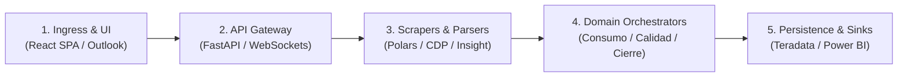
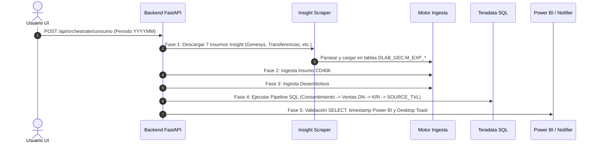
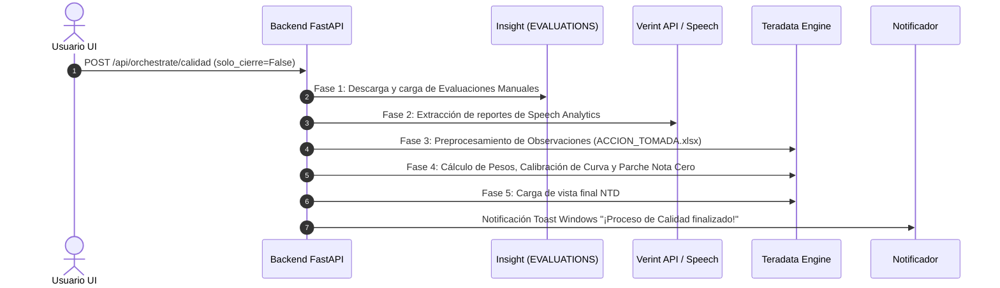

# 📘 Guía Educativa de Dominio y Arquitectura: Plataforma Calidad Televentas

Bienvenido a la documentación arquitectónica integral de **UPLOADER V2**. Este documento desglosa de forma didáctica la estructura, responsabilidades por capa, flujos de datos y reglas de negocio que rigen la plataforma unificada de calidad y televentas de Interbank.

---

## 🎯 1. Propósito y Propuesta de Valor del Sistema

La plataforma automatiza y centraliza la extracción, transformación, auditoría y carga analítica de datos operativos de Televentas y Calidad. Sus 5 objetivos neurálgicos son:

1. **Orquestación de Datos de Consumo (KRI Ventas):** Extracción automatizada de reportes de tráfico en Genesys Cloud vía Insight, cruce con desembolsos y consentimientos (LPDP), y cálculo de métricas de ventas no autorizadas y ventas sin audio.
2. **Evaluaciones de Calidad y Speech Analytics:** Integración híbrida de evaluaciones manuales (Insight) y analítica de voz automatizada (Verint Cloud), calculando notas ponderadas, calibración de curvas y parches de nota cero por faltas normativas críticas.
3. **Modo Cierre Mensual Idempotente:** Congelamiento de fotos históricas de auditoría y KRI mensual mediante transacciones estrictas `DELETE + INSERT` que garantizan cero duplicación.
4. **Automatización de Audios (Genesys & Outlook):** Detección de solicitudes de escuchas en Outlook Desktop, enriquecimiento de teléfonos de clientes vía Teradata y descarga desatendida mediante control del navegador Chrome (CDP).
5. **Ingesta Universal a Teradata:** Carga masiva de archivos (Excel/CSV/TXT) con normalización de caracteres Latin-1, prevención de truncamientos e inferencia automática de tipos de datos con Polars.

---

## 🏛️ 2. Topología de 5 Capas (Swimlanes Arquitectónicos)



### Capa 0: Ingress & Client UI (Canales de Entrada e Interfaz)

- [frontend/index.html](../frontend/index.html) — Contenedor SPA con diseño corporativo Interbank.
- [frontend/app.js](../frontend/app.js) — Gestor reactivo de estado, tabla interactiva de previsualización, editor de esquemas SQL y cliente WebSocket de streaming de logs.
- [frontend/styles.css](../frontend/styles.css) — Sistema de diseño con paleta Interbank (Azul `#0039A6` y Verde `#00A859`), Stepper de 5 fases y micro-animaciones.
- [modules/genesys/services/outlook_service.py](../modules/genesys/services/outlook_service.py) — Puente de integración local vía COM (`pywin32`) para leer buzones de correo.

### Capa 1: API Routing & Real-Time Gateway (Puerta de Enlace)

- [backend/main.py](../backend/main.py) — Servidor FastAPI asíncrono con endpoints REST, gestión de hilos de fondo (`BackgroundTasks`) y soporte de cancelación en caliente (`stop_checker`).
- `ConnectionManager` (WebSockets en [backend/main.py](../backend/main.py)) — Transmisión de logs y progreso en vivo a la UI con control de hilos sin bloquear el event loop principal.
- [infrastructure/system/health_check.py](../infrastructure/system/health_check.py) — Diagnóstico preflight de conectividad (Teradata, Outlook COM, Chrome CDP 9222).

### Capa 2: Data Parsers & Web Scrapers (Extracción y Normalización)

- [infrastructure/scrapers/insight_downloader.py](../infrastructure/scrapers/insight_downloader.py) — Scraper automatizado para la plataforma Insight con manejo de sesiones y descargas de 7 insumos de tráfico.
- [infrastructure/parsers/readers.py](../infrastructure/parsers/readers.py) & [infrastructure/parsers/cleaners.py](../infrastructure/parsers/cleaners.py) — Motor Polars de inferencia de esquemas, normalización `unidecode` y sanitización para juego de caracteres Teradata LATIN.
- [modules/genesys/services/genesys_browser.py](../modules/genesys/services/genesys_browser.py) — Automatización de Chrome vía CDP para búsqueda y descarga de interacciones en Genesys Cloud.
- [modules/verint/services/verint_api_client.py](../modules/verint/services/verint_api_client.py) — Cliente REST para extracción masiva de reportes de Speech Analytics desde Verint.

### Capa 3: Domain Orchestrators (Casos de Uso del Negocio)

- [modules/consumo/use_cases/consumo_orchestrator.py](../modules/consumo/use_cases/consumo_orchestrator.py) — Orquestador de 5 Fases para la Base de Consumo.
- [modules/calidad/use_cases/quality_orchestrator.py](../modules/calidad/use_cases/quality_orchestrator.py) — Orquestador de 5 Fases para Evaluaciones de Calidad y Speech.
- [modules/cierre/use_cases/cierre_orchestrator.py](../modules/cierre/use_cases/cierre_orchestrator.py) — Orquestador del Cierre Mensual Idempotente.
- [modules/calidad/televentas/use_cases/grouped_orchestrator.py](../modules/calidad/televentas/use_cases/grouped_orchestrator.py) — Agrupación automática de métricas para la plantilla P021.

### Capa 4: Persistence, DW & Analytics Sinks (Almacenamiento y Salida)

- [infrastructure/database/database.py](../infrastructure/database/database.py) & [infrastructure/database/sql_executor.py](../infrastructure/database/sql_executor.py) — Conexión con Teradata DW, ejecución por lotes optimizados y rollback automático ante errores.
- **Scripts SQL de Dominio:** Scripts parametrizados en `modules/*/sql/*.sql`.
- [infrastructure/system/notifier.py](../infrastructure/system/notifier.py) — Notificaciones nativas de escritorio de Windows (Toasts de 5 segundos).
- [infrastructure/system/powerbi_connector.py](../infrastructure/system/powerbi_connector.py) — Actualización de timestamps para refresco de Power BI en OneDrive.

---

## 🔄 3. Los 6 Flujos Críticos de Negocio

### ⚡ Flujo 1: Pipeline PBI Base Consumo (5 Fases E2E)



### 📊 Flujo 2: Pipeline PBI Evaluaciones Calidad



### 🔒 Flujo 3: Modo Cierre Mensual Idempotente

1. La UI activa la casilla `🔒 Modo Cierre Mensual`.
2. El orquestador inyecta `{PERIODO}` y `{PERIODO_ANTERIOR}`.
3. Se ejecuta `modules/cierre/sql/01_auditoria_y_cierre.sql`:
   - `DELETE FROM DLAB_GEC.M_EXP_CALIDAD_CIERRE_MENSUAL WHERE PERIODO = '{PERIODO}';`
   - `INSERT INTO DLAB_GEC.M_EXP_CALIDAD_CIERRE_MENSUAL ...`
4. Se ejecuta `modules/cierre/sql/02_kri_resumen_total.sql`:
   - `DELETE FROM DLAB_GEC.M_EXP_KRI_RESUMEN_TOTAL WHERE PERIODO = '{PERIODO}';`
   - `INSERT INTO DLAB_GEC.M_EXP_KRI_RESUMEN_TOTAL ...`
5. Garantía total: la ejecución repetida en el mismo período no genera registros duplicados ni altera meses previos.

### 🎧 Flujo 4: Solicitud y Descarga de Audios Genesys

1. **Lectura de Correo:** `OutlookService` lee los 3 correos más recientes en Outlook Desktop buscando parejas `(REG_EV, DNI)`.
2. **Enriquecimiento:** `TeradataService` consulta la base de datos o el caché local para asociar cada DNI a su teléfono de gestión.
3. **Automatización:** `GenesysBrowserAutomation` se conecta a Chrome vía CDP (puerto 9222), busca cada llamada en Genesys Cloud y descarga el archivo `.mp3` en `transcripciones_genesys/`.

### 📁 Flujo 5: Ingesta Universal a Teradata con Vista Previa

1. **Upload & Preview:** La interfaz envía el archivo temporal a `POST /api/upload/preview`.
2. **Inferencia Polars:** Se leen las primeras filas, sugiriendo tipos SQL (`VARCHAR`, `INTEGER`, `DECIMAL`).
3. **Limpieza:** Se eliminan tildes (`unidecode`) y se convierten caracteres conflictivos para Teradata LATIN.
4. **Carga Batch:** Ingesta por lotes con opción `Vaciar y cargar` o `Agregar registros`. Si la plantilla es `P021`, dispara automáticamente la agrupación de ejecutivos.

### 🩺 Flujo 6: Diagnóstico Preflight y WebSockets

1. La interfaz consulta `GET /api/health-check`.
2. Se evalúan simultáneamente:
   - Conectividad a Teradata (credenciales de red).
   - Disponibilidad de Outlook Desktop vía COM.
   - Sesión de Chrome CDP abierta en el puerto 9222.
3. Los resultados se reportan en badges interactivos en la esquina superior de la aplicación.

---

## 📊 4. Matriz de Responsabilidades de Componentes

| Componente               | Archivo Fuente                                                                                            | Rol / Responsabilidad Primaria                                     | Entrada Principal        | Salida Principal             |
| :----------------------- | :-------------------------------------------------------------------------------------------------------- | :----------------------------------------------------------------- | :----------------------- | :--------------------------- |
| **UI SPA**               | [frontend/app.js](../frontend/app.js)                                                                     | Renderizado de interfaz, validación de inputs y conexión WebSocket | Interacción de usuario   | Payload JSON / FormData      |
| **FastAPI Gateway**      | [backend/main.py](../backend/main.py)                                                                     | Enrutamiento HTTP, hilos asíncronos y broadcasting de eventos      | Peticiones HTTP REST     | Eventos JSON / WebSocket     |
| **Insight Scraper**      | [infrastructure/scrapers/insight_downloader.py](../infrastructure/scrapers/insight_downloader.py)         | Descarga automática de reportes de tráfico                         | Credenciales Insight     | Archivos `.txt` crudos       |
| **Polars Engine**        | [infrastructure/parsers/cleaners.py](../infrastructure/parsers/cleaners.py)                               | Inferencia de tipos, sanitización y normalización de textos        | Excel / CSV / TXT        | Polars DataFrame limpio      |
| **Genesys Bot**          | [modules/genesys/services/genesys_browser.py](../modules/genesys/services/genesys_browser.py)             | Control del navegador Chrome vía CDP para descargar audios         | Teléfono + DNI           | Archivos `.mp3` en disco     |
| **Consumo Orchestrator** | [modules/consumo/use_cases/consumo_orchestrator.py](../modules/consumo/use_cases/consumo_orchestrator.py) | Coordinación de las 5 fases de Base Consumo                        | Período `YYYYMM`         | Tablas Teradata `DLAB_GEC.*` |
| **Calidad Orchestrator** | [modules/calidad/use_cases/quality_orchestrator.py](../modules/calidad/use_cases/quality_orchestrator.py) | Orquestación de notas de calidad y Speech Analytics                | Período `YYYYMM`         | Tablas de notas y NTD        |
| **Cierre Orchestrator**  | [modules/cierre/use_cases/cierre_orchestrator.py](../modules/cierre/use_cases/cierre_orchestrator.py)     | Ejecución idempotente de auditoría y KRI mensual                   | Período `YYYYMM`         | Fotos mensuales congeladas   |
| **Teradata Engine**      | [infrastructure/database/database.py](../infrastructure/database/database.py)                             | Conexión ODBC/REST, inserciones batch y control transaccional      | DataFrames / Scripts SQL | Registros en Teradata DW     |
| **Desktop Notifier**     | [infrastructure/system/notifier.py](../infrastructure/system/notifier.py)                                 | Notificaciones nativas de Windows para alerta de término           | Título + Mensaje         | Toast de 5 segundos          |

---

## 🛠️ 5. Guía de Ejecución y Solución de Problemas

1. **Iniciar la aplicación:**
   ```cmd
   APP_CALIDAD.bat
   ```
2. **Si ocurre un bloqueo en el puerto 8000:**
   Verifique que ninguna instancia previa de Uvicorn haya quedado en memoria. El script `.bat` realiza un cierre limpio automático de procesos en el puerto `8000`.
3. **Si Genesys Cloud no responde a las descargas:**
   Inicie Chrome con depuración remota habilitada ejecutando:
   ```cmd
   chrome.exe --remote-debugging-port=9222 --user-data-dir="C:\ChromeDebug"
   ```
4. **Si Teradata rechaza caracteres en la carga:**
   Asegúrese de activar la casilla `Convertir sin acentos` o `Transformar a VARCHAR LATIN` en la pestaña de Ingesta para normalizar strings especiales.
