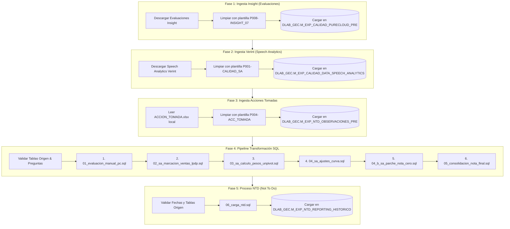

# 📊 Flujo de Ejecución - Proceso PBI Evaluaciones Calidad

Este documento describe las 5 fases del proceso semanal de **PBI Evaluaciones Calidad**, incluyendo las descargas, transformaciones y parches aplicados a las notas de calidad.

---

## 📊 Diagrama de Flujo (Mermaid)

---

## 🔍 Detalle por Fase (Entradas y Salidas)

### 📌 Fase 1: Ingesta de Insight (Evaluaciones Manuales)

- 📥 **INPUTS**:
  - **Plataforma Origen**: Insight (PureCloud).
  - **Formato Origen**: Archivo `.tsv` / `.csv` descargado mediante automatización.
  - **Estrategia de Lectura**: Lectura robusta con Polars (`quote_char=None`, `truncate_ragged_lines=True`, `ignore_errors=True`) y fallback de codificación `latin-1` para manejar comillas sin cerrar en comentarios de auditoría.
  - **Plantilla de Mapeo**: `P008-INSIGHT_07_EVALUATIONS` en `plantillas.json`.

- 📤 **OUTPUTS**:
  - **Tabla Destino Teradata**: `DLAB_GEC.M_EXP_CALIDAD_PURECLOUD_PRE` (Acción: `Delete + Load` completo).

---

### 📌 Fase 2: Ingesta de Verint (Speech Analytics)

- 📥 **INPUTS**:
  - **Plataforma Origen**: Verint Speech Analytics (WFO).
  - **Archivos Excel Descargados**: Archivos `data/input/proceso_calidad/Export_Calidad_*.xlsx`.
  - **Plantilla de Mapeo**: `P001-CALIDAD_SA` en `plantillas.json`.

- 📤 **OUTPUTS**:
  - **Tabla Destino Teradata**: `DLAB_GEC.M_EXP_CALIDAD_DATA_SPEECH_ANALYTICS` (Acción: `Delete + Load` inicial y *Append* por partición).

---

### 📌 Fase 3: Ingesta de Acciones Tomadas

- 📥 **INPUTS**:
  - **Archivo Excel Local**: `data/input/proceso_calidad/ACCION_TOMADA.xlsx` (actualizado automáticamente desde SharePoint vía COM).
  - **Plantilla de Mapeo**: `P004-ACC_TOMADA` en `plantillas.json`.
  - **Filtro / Limpieza**: Deduplicación por orden de severidad de acción tomada.

- 📤 **OUTPUTS**:
  - **Tabla Destino Teradata**: `DLAB_GEC.M_EXP_NTD_OBSERVACIONES_PRE` (Acción: `Delete + Load` completo).

---

### 📌 Fase 4: Pipeline de Transformación SQL Calidad

- 📥 **INPUTS**:
  - **Tablas Origen Teradata**: `M_EXP_CALIDAD_PURECLOUD_PRE`, `M_EXP_CALIDAD_DATA_SPEECH_ANALYTICS`, `M_EXP_VENTAS_TC`, `M_EXP_VENTAS_PP`, `M_EXP_VENTAS_CON`, `T_VENTAS_BPE_MARKET`, `V_GESTION_BNC`, `M_EXP_VENTAS_EC`, `V_GESTION_CHIP`, `M_EXP_VENTAS_CD`, `T_RETENCION_BASE_CALIDAD_GIRU`, `V_CNV_VISTA_RETENCION_BT`, `M_EXP_VENTAS_IL`, `M_EXP_VENTAS_TCA`, `M_EXP_VENTAS_UPG`, `M_EXP_VENTAS_PA`, `M_EXP_VENTAS_SEG`, `TLV_CARGA_ACTUAL`, `TLV_CARGA_ACTUAL_DIGITAL`.
  - **Archivos SQL**:
    1. `modules/calidad/sql/01_evaluacion_manual_pc.sql`
    2. `modules/calidad/sql/02_sa_marcacion_ventas_lpdp.sql`
    3. `modules/calidad/sql/03_sa_calculo_pesos_unpivot.sql`
    4. `modules/calidad/sql/04_sa_ajustes_curva.sql`
    5. `modules/calidad/sql/04_b_sa_parche_nota_cero.sql` *(Inyecta nota máxima cuando un ejecutivo tiene evaluación manual en Fase 1 pero no figura en Speech Analytics)*
    6. `modules/calidad/sql/05_consolidacion_nota_final.sql`

- 📤 **OUTPUTS**:
  - **Vista Consolidada Teradata**: `DLAB_GEC.V_EXP_CALIDAD_NOTA_FINAL`
  - **Tabla Histórica de Errores Teradata**: `DLAB_GEC.M_EXP_CALIDAD_HISTORICO_ERRORES`

---

### 📌 Fase 5: Proceso NTD (Not To Do)

- 📥 **INPUTS**:
  - **Tablas Origen Teradata**: `DLAB_GEC.M_EXP_CALIDAD_PURECLOUD_PRE` y `DLAB_GEC.M_EXP_NTD_OBSERVACIONES_PRE`.
  - **Archivo SQL**: `modules/calidad/sql/06_carga_ntd.sql`
  - **Validaciones**: Verificación de registros no vacíos y coincidencia del período máximo de Insight.

- 📤 **OUTPUTS**:
  - **Tabla Histórica NTD Teradata**: `DLAB_GEC.M_EXP_NTD_REPORTING_HISTORICO`
