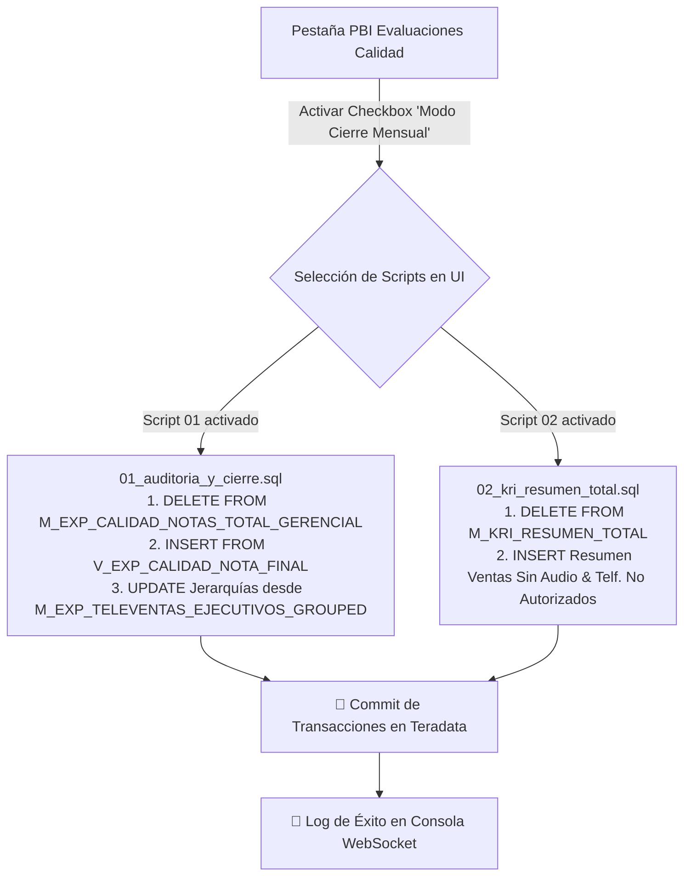

# 🔒 Flujo de Ejecución - Modo Cierre Mensual

Este documento describe la arquitectura e implementación del **Modo Cierre Mensual** de Calidad y KRI en la plataforma.

---

## 📊 Diagrama de Flujo (Mermaid)

---

## 🔍 Detalle por Script (Entradas y Salidas)

### 📌 1. Script `01_auditoria_y_cierre.sql` (Consolidado Gerencial & Jerarquías)

- 📥 **INPUTS**:
  - **Parámetro Dinámico**: `{PERIODO}` seleccionado en la UI (ej. `'202607'`).
  - **Vista Origen Teradata**: `DLAB_GEC.V_EXP_CALIDAD_NOTA_FINAL` (contiene la nota final consolidada de calidad).
  - **Matriz de Personal Teradata**: `DLAB_GEC.M_EXP_TELEVENTAS_EJECUTIVOS_GROUPED` (contiene ejecutivos activos y su estructura: Supervisor, Jefe, Equipo, Sub-equipo).

- 📤 **OUTPUTS**:
  - **Tabla Consolidadora Gerencial Teradata**: `DLAB_GEC.M_EXP_CALIDAD_NOTAS_TOTAL_GERENCIAL`
  - **Mecanismo de Idempotencia**:
    1. `DELETE FROM DLAB_GEC.M_EXP_CALIDAD_NOTAS_TOTAL_GERENCIAL WHERE PERIODO = '{PERIODO}';` (Limpia ejecuciones previas del período).
    2. `INSERT INTO DLAB_GEC.M_EXP_CALIDAD_NOTAS_TOTAL_GERENCIAL ... SELECT ... WHERE PERIODO = '{PERIODO}';`
    3. `UPDATE DLAB_GEC.M_EXP_CALIDAD_NOTAS_TOTAL_GERENCIAL ... FROM M_EXP_TELEVENTAS_EJECUTIVOS_GROUPED ...` (Mapea jerarquías organizacionales).

---

### 📌 2. Script `02_kri_resumen_total.sql` (Resumen de Métricas KRI)

- 📥 **INPUTS**:
  - **Parámetro Dinámico**: `{PERIODO}` seleccionado en la UI (ej. `'202607'`).
  - **Tabla Origen KRI Ventas Sin Audio**: `DLAB_GEC.T_EXP_KRI_VENTAS_SINAUDIO` (filtrando por `MESDESEMBOLSO = '{PERIODO}'`).
  - **Tabla Origen KRI Teléfonos No Autorizados**: `DLAB_GEC.T_EXP_KRI_TELF_NO_AUTORIZADO` (filtrando por `FECDESEMB` transformado a `YYYYMM`).

- 📤 **OUTPUTS**:
  - **Tabla Resumen KRI Teradata**: `DLAB_GEC.M_KRI_RESUMEN_TOTAL`
  - **Mecanismo de Idempotencia**:
    1. `DELETE FROM DLAB_GEC.M_KRI_RESUMEN_TOTAL WHERE PERIODO = CAST('{PERIODO}' AS INTEGER);` (Limpia ejecuciones previas del período).
    2. `INSERT INTO DLAB_GEC.M_KRI_RESUMEN_TOTAL ... FULL OUTER JOIN ...` (Inserta resumen consolidado de ventas totales, sin audio y teléfonos no válidos).
