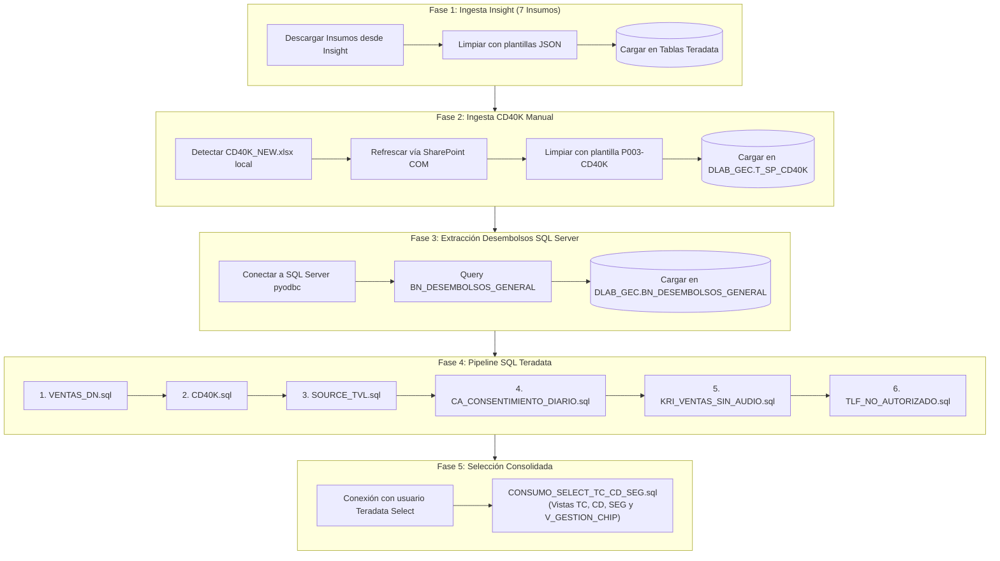

# ⚡ Flujo de Ejecución - Proceso PBI Base Consumo

Este documento describe las 5 fases secuenciales del proceso de **PBI Base Consumo** ejecutado desde la plataforma.

---

## 📊 Diagrama de Flujo (Mermaid)

---

## 🔍 Detalle por Fase (Entradas y Salidas)

### 📌 Fase 1: Ingesta de Insumos desde Insight

- 📥 **INPUTS**:
  - **Servicio / API**: Plataforma Insight (PureCloud).
  - **Formato Origen**: Archivos de texto delimitados por tabulaciones (`.tsv`) descargados temporalmente.
  - **Insumos Requeridos**:
    1. `TRAFICO_GENESYS` (Plantilla `P009-INSIGHT_01_TRAFICO_GENESYS`)
    2. `CONV_ATTRIBUTES` (Plantilla `P010-INSIGHT_02_CONV_ATTRIBUTES`)
    3. `DERIVA_BT` (Plantilla `P011-INSIGHT_03_DERIVA_BT`)
    4. `CLOUD_MARCA_TRANSF` (Plantilla `P012-INSIGHT_04_CLOUD_MARCA_TRANSF`)
    5. `BT_TRANSFERENCIA` (Plantilla `P013-INSIGHT_05_BT_TRANSFERENCIA`)
    6. `IVR_VENTAS` (Plantilla `P014-INSIGHT_06_IVR_VENTAS`)
    7. `EVALUATIONS` (Plantilla `P008-INSIGHT_07_EVALUATIONS`)

- 📤 **OUTPUTS**:
  - **Tablas Destino Teradata**:
    - `DLAB_GEC.M_EXP_TRAFICO_GENESIS`
    - `DLAB_GEC.M_EXP_BT_CONVERSATIONS_ATTRIBUTES`
    - `DLAB_GEC.M_EXP_DERIVA_BT_TIEMPOS`
    - `DLAB_GEC.M_EXP_CO_CLOUD_MARCA_TRASNFERENCIA_PRE`
    - `DLAB_GEC.M_DERIVA_BT_EV_TRANSFERENCIA`
    - `DLAB_GEC.M_EXP_IVR_VENTAS_2022`
    - `DLAB_GEC.M_EXP_CALIDAD_PURECLOUD_PRE`

---

### 📌 Fase 2: Ingesta de CD40K Manual

- 📥 **INPUTS**:
  - **Archivo Excel Local**: `data/input/base_consumo/CD40K_NEW.xlsx`
  - **Plantilla de Mapeo**: `P003-CD40K` en `plantillas.json`
  - **Automatización**: Actualización automática desde SharePoint mediante conexión COM de Excel antes de la lectura.

- 📤 **OUTPUTS**:
  - **Tabla Destino Teradata**: `DLAB_GEC.T_SP_CD40K` (Acción: `Delete + Load` completo).

---

### 📌 Fase 3: Extracción de Desembolsos desde SQL Server

- 📥 **INPUTS**:
  - **Base de Datos Origen**: SQL Server Corporativo vía `pyodbc`.
  - **Tabla / Query Origen**: `SELECT * FROM BN_DESEMBOLSOS_GENERAL WHERE periodo >= {periodo_num}`.

- 📤 **OUTPUTS**:
  - **Tabla Destino Teradata**: `DLAB_GEC.BN_DESEMBOLSOS_GENERAL` (Acción: `Delete + Load` para el período).

---

### 📌 Fase 4: Pipeline de Transformación SQL Teradata

- 📥 **INPUTS**:
  - **Tablas Origen Teradata**: `T_SP_CD40K`, `BN_DESEMBOLSOS_GENERAL`, `M_EXP_TRAFICO_GENESIS`, `M_EXP_BT_CONVERSATIONS_ATTRIBUTES`, entre otras.
  - **Archivos SQL**:
    1. `modules/consumo/sql/ventas_dn.sql`
    2. `modules/consumo/sql/cd40k.sql`
    3. `modules/consumo/sql/source_tvl.sql`
    4. `modules/consumo/sql/ca_consentimiento_diario.sql`
    5. `modules/consumo/sql/kri_ventas_sin_audio.sql`
    6. `modules/consumo/sql/tlf_no_autorizado.sql`

- 📤 **OUTPUTS**:
  - **Tablas Consolidadas Teradata**:
    - `DLAB_GEC.M_EXP_VENTAS_DN`
    - `DLAB_GEC.M_EXP_BASE_CD40K`
    - `DLAB_GEC.M_EXP_SOURCE_TVL`
    - `DLAB_GEC.T_EXP_CONSENTIMIENTO_DIARIO`
    - `DLAB_GEC.T_EXP_KRI_VENTAS_SINAUDIO`
    - `DLAB_GEC.T_EXP_KRI_TELF_NO_AUTORIZADO`

---

### 📌 Fase 5: Selección Consolidada

- 📥 **INPUTS**:
  - **Archivo SQL**: `modules/consumo/sql/CONSUMO_SELECT_TC_CD_SEG.sql`
  - **Tablas Origen Teradata**: Tablas consolidadas de la Fase 4.
  - **Conexión**: Usuario de lectura/escritura selectiva (`TERADATA_USER_SELECT`).

- 📤 **OUTPUTS**:
  - **Tabla Consolidada Teradata**: `DLAB_GEC.M_EXP_CONSUMO_SELECT_TC_CD_SEG`
  - **Vista Teradata**: `DLAB_GEC.V_GESTION_CHIP` (reemplazada y parametrizada con el período de ejecución).
