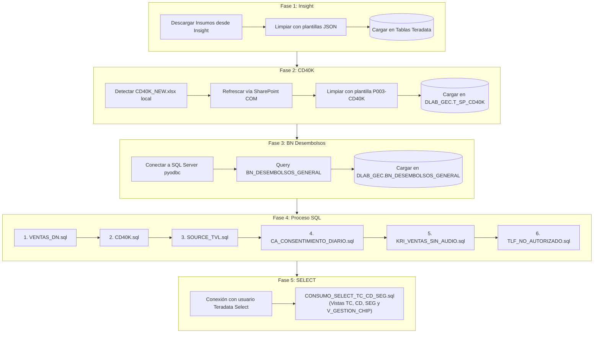

# ⚡ Flujo de Ejecución - Proceso PBI Base Consumo

Este documento describe las 5 fases secuenciales del proceso de **PBI Base Consumo** ejecutado desde la plataforma.

---

## 📊 Diagrama de Flujo (Mermaid)

---

## 📋 Insumos Indispensables y Requisitos Previos

Para ejecutar el flujo de **PBI Base Consumo**, los siguientes archivos y accesos son requeridos:

| Insumo | Ruta Exacta en `data/input/` | Estado / Condición | Comportamiento si NO está |
| :--- | :--- | :---: | :--- |
| **`CD40K_NEW.xlsx`** (o `CD40K.xlsx`) | `data/input/base_consumo/CD40K_NEW.xlsx` | 🟡 **Opcional (Fase 2)** | Si la casilla `Fase 2` está marcada y no existe el archivo, la fase falla. Si se desmarca `Fase 2`, el flujo continúa normalmente. |
| **7 Insumos Insight** | Descarga automática vía Scraper | 🔵 **Automático (Fase 1)** | Se descargan directamente desde Insight. Requiere credenciales en `.env`. |
| **Credenciales SQL Server** | `.env` (`SQL_SERVER_HOST`, etc.) | 🟡 **Opcional (Fase 3)** | Si no están configuradas, la Fase 3 (Desembolsos) se omite con aviso informativo. |
| **Credenciales Teradata** | `.env` (`TERADATA_USER`, `TERADATA_PASSWORD`) | 🔴 **INDISPENSABLE** | Requeridas para ejecutar las transformaciones y vistas de colocaciones en `DLAB_GEC`. |

---

## 🔍 Detalle por Fase (Entradas y Salidas)

### 📌 Fase 1: Ingesta de Insumos desde Insight

- 📥 **INPUTS**:
  - **Servicio / API**: Plataforma Insight (PureCloud).
  - **Formato Origen**: Archivos de texto delimitados por tabulaciones (`.tsv`) descargados temporalmente.
  - **Estrategia de Lectura**: Lectura robusta con Polars (`quote_char=None`, `truncate_ragged_lines=True`, `ignore_errors=True`) y fallback de codificación `latin-1` ante posibles inconsistencias de comillas en campos de texto libre.
  - **Insumos Requeridos**:
    1. `TRAFICO_GENESYS` (Plantilla `P009-INSIGHT_01_TRAFICO_GENESYS`)
    2. `CONV_ATTRIBUTES` (Plantilla `P010-INSIGHT_02_CONV_ATTRIBUTES`)
    3. `DERIVA_BT` (Plantilla `P011-INSIGHT_03_DERIVA_BT`)
    4. `CLOUD_MARCA_TRANSF` (Plantilla `P012-INSIGHT_04_CLOUD_MARCA_TRANSF`)
    5. `BT_TRANSFERENCIA` (Plantilla `P013-INSIGHT_05_BT_TRANSFERENCIA`)
    6. `IVR_VENTAS` (Plantilla `P014-INSIGHT_06_IVR_VENTAS`)
    7. `EVALUATIONS` (Plantilla `P008-INSIGHT_07_EVALUATIONS`)

- 📤 **OUTPUTS**:
  - **Tablas Destino Teradata**:
    - `DLAB_GEC.M_EXP_TRAFICO_GENESIS`
    - `DLAB_GEC.M_EXP_BT_CONVERSATIONS_ATTRIBUTES`
    - `DLAB_GEC.M_EXP_DERIVA_BT_TIEMPOS`
    - `DLAB_GEC.M_EXP_CO_CLOUD_MARCA_TRASNFERENCIA_PRE`
    - `DLAB_GEC.M_DERIVA_BT_EV_TRANSFERENCIA`
    - `DLAB_GEC.M_EXP_IVR_VENTAS_2022`
    - `DLAB_GEC.M_EXP_CALIDAD_PURECLOUD_PRE`

---

### 📌 Fase 2: Ingesta de CD40K Manual

- 📥 **INPUTS**:
  - **Archivo Excel Local**: `data/input/base_consumo/CD40K_NEW.xlsx`
  - **Plantilla de Mapeo**: `P003-CD40K` en `plantillas.json`
  - **Automatización**: Actualización automática desde SharePoint mediante conexión COM de Excel antes de la lectura.

- 📤 **OUTPUTS**:
  - **Tabla Destino Teradata**: `DLAB_GEC.T_SP_CD40K` (Acción: `Delete + Load` completo).

---

### 📌 Fase 3: Extracción de Desembolsos desde SQL Server

- 📥 **INPUTS**:
  - **Base de Datos Origen**: SQL Server Corporativo vía `pyodbc`.
  - **Tabla / Query Origen**: `SELECT * FROM BN_DESEMBOLSOS_GENERAL WHERE periodo >= {periodo_num}`.

- 📤 **OUTPUTS**:
  - **Tabla Destino Teradata**: `DLAB_GEC.BN_DESEMBOLSOS_GENERAL` (Acción: `Delete + Load` para el período).

---

### 📌 Fase 4: Pipeline de Transformación SQL Teradata

- 📥 **INPUTS**:
  - **Tablas Origen Teradata / Vistas Corporativas**: `T_SP_CD40K`, `BN_DESEMBOLSOS_GENERAL`, `M_EXP_TELEVENTAS_EJECUTIVOS`, `M_EXP_DOCUMENTOS_EVALUADOS`, `TLV_CARGA_ACTUAL`, `TLV_CARGA_ACTUAL_DIGITAL_PRC`, `E_DW_VIEWS.V_FCT_RT_TC_HISTORICO`, `E_DW_VIEWS_DLAB.CGR_PRESTAMOS`, `E_DW_VIEWS_DLAB.CGR_EXTRACASH`, `E_DW_VIEWS_DLAB.V_CD_DESEMB_HISTORICO`, `E_DW_VIEWS.V_FCT_CNV_VENTAS`, `E_DW_VIEWS_DLAB.CGR_UPGRADE_HST`, `E_DW_VIEWS_DLAB.CGR_INC_LINEA_HST`, `E_DW_VIEWS_DLAB.V_CGR_PAGO_AUTOMATICO`, `E_DW_VIEWS_DLAB.V_DLAB_CGR_SEGUROS_VENTAS`, `E_DW_VIEWS.V_CRM_EXO_GIR_*`, `V_CONT_TELEFONO_APICLIENTE`, entre otras.

  - **Archivos SQL y Tablas Generadas/Modificadas por cada Script**:

    1. **`modules/consumo/sql/VENTAS_DN.sql`**
       - 📤 **Outputs**:
         - `DLAB_GEC.M_EXP_VENTAS_TC` (Ventas Tarjetas de Crédito - DTC)
         - `DLAB_GEC.M_EXP_VENTAS_PP` (Ventas Préstamos Personales - DPP)
         - `DLAB_GEC.M_EXP_VENTAS_EC` (Ventas Extra Cash - DEC)
         - `DLAB_GEC.M_EXP_VENTAS_CD` (Ventas Compra de Deuda - DCD)
         - `DLAB_GEC.M_EXP_VENTAS_CON` (Ventas Convenios - DCO)
         - `DLAB_GEC.M_EXP_VENTAS_UPG` (Ventas Upgrade - DUPG)
         - `DLAB_GEC.M_EXP_VENTAS_IL` (Ventas Incremento de Línea - DIL)
         - `DLAB_GEC.M_EXP_VENTAS_PA` (Ventas Pago Automático - PA)
         - `DLAB_GEC.M_EXP_VENTAS_SEG` (Ventas Seguros - SEG)

    2. **`modules/consumo/sql/CD40K.sql`**
       - 📤 **Outputs / Updates**:
         - `DLAB_GEC.T_SP_CD40K` (Update TRIM)
         - `DLAB_GEC.M_EXP_CD40K` (Filtro Compra de Deuda > 40K y EECC)

    3. **`modules/consumo/sql/SOURCE_TVL.sql`**
       - 📤 **Outputs**:
         - `DLAB_GEC.T_RETENCION_BASE_CALIDAD_GIRU` (Base Calidad GIRU Reclamos)
         - `DLAB_GEC.T_CALIDAD_SEGUROS_PRT` (Calidad Seguros PRT)
         - `DLAB_GEC.M_EXP_CONSUMO_SELECT_PP_EC` (Canal Select Préstamos Personales y Extra Cash)
         - `DLAB_GEC.V_GESTION_CHIP` (Vista Teradata parametrizada)
         - `DLAB_GEC.V_CNV_RETENCION_PBI` (Vista Retención Power BI)

    4. **`modules/consumo/sql/CA_CONSENTIMIENTO_DIARIO.sql`**
       - 📤 **Outputs**:
         - `DLAB_GEC.M_EXP_CONSENTIMIENTO_PP`
         - `DLAB_GEC.M_EXP_CONSENTIMIENTO_TC`
         - `DLAB_GEC.M_EXP_CONSENTIMIENTO_EC`
         - `DLAB_GEC.M_EXP_CONSENTIMIENTO_CD`
         - `DLAB_GEC.M_EXP_CONSENTIMIENTO_CON`
         - `DLAB_GEC.M_EXP_CONSENTIMIENTO_IL`
         - `DLAB_GEC.M_EXP_CONSENTIMIENTO_UPG`
         - `DLAB_GEC.M_EXP_CONSENTIMIENTO_DPP`
         - `DLAB_GEC.M_EXP_CONSENTIMIENTO_DTC`
         - `DLAB_GEC.M_EXP_CONSENTIMIENTO_DEC`
         - `DLAB_GEC.M_EXP_CONSENTIMIENTO_DCD`
         - `DLAB_GEC.M_EXP_CONSENTIMIENTO_DPRT`

    5. **`modules/consumo/sql/KRI_VENTAS_SIN_AUDIO.sql`**
       - 📤 **Outputs / Intermedias**:
         - `DLAB_GEC.M_EXP_CO_KRI_VENTA_TOTAL`
         - `DLAB_GEC.TEMP_TRAFICO`
         - `DLAB_GEC.M_EXP_TRAFICO_GENESYS` (Update DNI / Tip Cliente)
         - `DLAB_GEC.T_EXP_KRI_VENTAS_SINAUDIO`
         - `DLAB_GEC.T_EXP_KRI_VENTAS_SINAUDIO_CALIDAD`

    6. **`modules/consumo/sql/TLF_NO_AUTORIZADO.sql`**
       - 📤 **Outputs / Intermedias**:
         - Tablas intermedias por producto (`M_EXP_TLFNO_AUTORIZADO_TC`, `PP`, `CD`, `EC`, `CON`, `IL`, `UPG`, `TCA`, `ALL`)
         - `DLAB_GEC.T_EXP_KRI_TELF_NO_AUTORIZADO`
         - `DLAB_GEC.T_EXP_KRI_TELF_NO_AUTORIZADO_CALIDAD`

---

### 📌 Fase 5: Selección Consolidada

- 📥 **INPUTS**:
  - **Archivo SQL**: `modules/consumo/sql/CONSUMO_SELECT_TC_CD_SEG.sql`
  - **Vistas Corporativas Teradata**:
    - `E_DW_VIEWS.V_AGG_VENTAS_CONSOLIDADAS`
    - `E_DW_VIEWS.V_CARTERA_CLIENTE_HIST`

- 📤 **OUTPUTS**:
  - **Tabla Consolidada Teradata**: `DLAB_GEC.M_EXP_CONSUMO_SELECT_TC_CD_SEG` (Tarjetas de Crédito, Compra de Deuda y Seguros del Canal Select)

