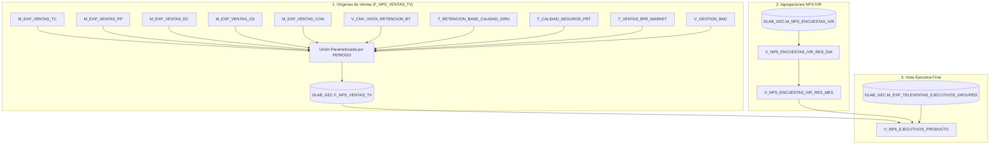

# 📈 Flujo de Ejecución - Encuestas NPS Televentas (V2)

Este documento detalla el pipeline analítico implementado en `ENCUESTAS_NPS_V2.sql` para el cálculo dinámico y parametrizado del **Net Promoter Score (NPS)** de ejecutivos en los diferentes canales de Televentas.

---

## 📊 Diagrama de Flujo (Mermaid)

---

## 🔍 Detalle del Pipeline

### 📌 Paso 1 & 2: Tabla FACT y Carga de Ventas (`F_NPS_VENTAS_TV`)

- **Propósito**: Consolidar en una tabla unificada todas las colocaciones del período parametrizado `{PERIODO}` (ej: `'202608'`).
- **Idempotencia**: Ejecuta `DELETE FROM DLAB_GEC.F_NPS_VENTAS_TV WHERE PERIODO = '{PERIODO}';` antes de reinsertar.
- **Fuentes Unificadas**:
  1. `M_EXP_VENTAS_TC` -> Producto: `'TLV TC'`, Origen: `'TC'`
  2. `M_EXP_VENTAS_PP` -> Producto: `'TLV CASH'`, Origen: `'PP'`
  3. `M_EXP_VENTAS_EC` -> Producto: `'TLV CASH'`, Origen: `'EC'`
  4. `M_EXP_VENTAS_CD` -> Producto: `'TLV CASH'`, Origen: `'CD'`
  5. `M_EXP_VENTAS_CON` -> Producto: `'CONVENIOS'`, Origen: `'CONV_TLV'`
  6. `V_CNV_VISTA_RETENCION_BT` -> Producto: `'RET. CONV'`, Origen: `'R_CO'`
  7. `T_RETENCION_BASE_CALIDAD_GIRU` -> Producto: `'RET. MULTI'`, Origen: `'R_MULTI'`
  8. `T_CALIDAD_SEGUROS_PRT` -> Producto: `'GDP'`, Origen: `'SEG'`
  9. `T_VENTAS_BPE_MARKET` -> Producto: `'BANCA NEGOCIOS'`, Origen: `'BNB'`
  10. `V_GESTION_BNC` -> Producto: `'BANCA NEGOCIOS'`, Origen: `'BNC'`

---

### 📌 Paso 3 & 4: Vistas de Encuestas IVR (`RES_DIA` y `RES_MES`)

- **`DLAB_GEC.V_NPS_ENCUESTAS_IVR_RES_DIA`**:
  - Grano diario por asesor (`REG_EV`) y fecha de encuesta.
  - Métricas calculadas:
    - `CANT_ENCUESTAS_ENVIADAS`: Total de llamadas transferidas a la encuesta.
    - `CANT_ENCUESTAS_RESPONDIDAS`: Registros con respuesta en `RESP_1`.
    - `CANT_PROMOTORES`: Calificaciones con `NOTA = 1`.
    - `CANT_DETRACTORES`: Calificaciones con `NOTA = -1`.
    - `NPS`: `(CANT_PROMOTORES - CANT_DETRACTORES) / CANT_ENCUESTAS_RESPONDIDAS`.

- **`DLAB_GEC.V_NPS_ENCUESTAS_IVR_RES_MES`**:
  - Agregación mensual a nivel de asesor (`REGISTRO`, `CODIGO`, `PRODUCTO`).

---

### 📌 Paso 5: Vista Ejecutiva Final (`V_NPS_EJECUTIVOS_PRODUCTO`)

- Cruza la estructura de ejecutivos (`M_EXP_TELEVENTAS_EJECUTIVOS_GROUPED`) con las ventas consolidadas (`F_NPS_VENTAS_TV`) y las métricas de encuestas mensuales (`V_NPS_ENCUESTAS_IVR_RES_MES`).
- **KPIs Resultantes**:
  - `PORC_ENVIO`: `CANT_ENCUESTAS_ENVIADAS / CANT_VENTAS`
  - `PORC_RESPUESTA`: `CANT_ENCUESTAS_RESPONDIDAS / CANT_ENCUESTAS_ENVIADAS`
  - `NPS`: Ratio neto de recomendación mensual por asesor y producto.
