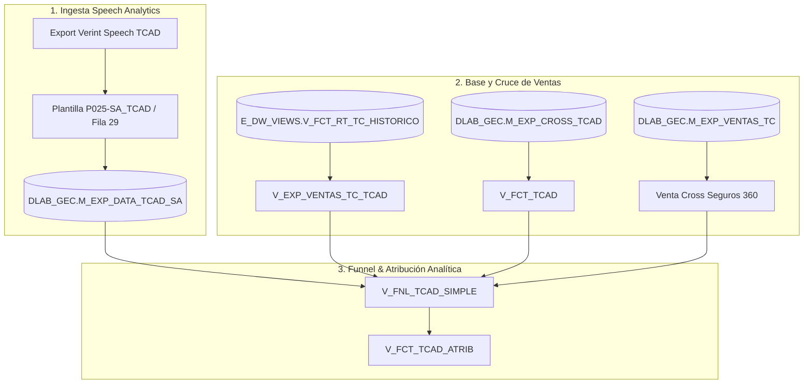
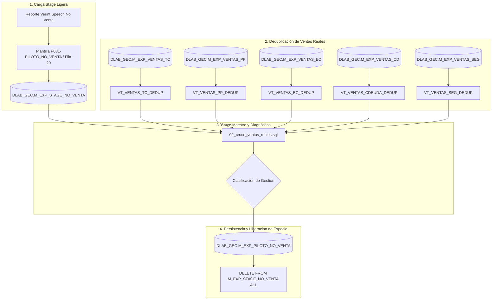

# 🚀 Flujo de Ejecución - Pilotos Analíticos (TCAD y No Venta)

Este documento detalla la arquitectura, flujos de datos, fuentes, esquemas y scripts SQL de los módulos especializados **Piloto TCAD** (Tarjetas Adicionales & Seguro 360) y **Piloto No Venta** (Speech Analytics & Objeciones).

---

## 1. 💳 Piloto TCAD (Tarjetas Adicionales y Cross Seguro 360)

### 📊 Diagrama de Flujo

### 🔍 Especificación Técnica

- **Plantillas de Mapeo:**
  - `P025-SA_TCAD`: Ingesta de reportes de Speech Analytics Verint (salto a fila 29 / `header_row: 28`).
  - `P026-CROSS_TCAD`: Mapeo para consolidado de cross TC adicional.
- **Tablas Físicas Teradata:**
  - `DLAB_GEC.M_EXP_DATA_TCAD_SA`: Datos de llamadas Speech Analytics.
    - *Columnas clave*: `CONID` (PI), `DNI`, `REG_EV`, `FECHA_LLAMADA`, `OFRE_TCAD`, `OFRE_360`, `TCAD_A`, `TCAD_B`, `FLG_NEW_SPEECH_TCAD`, `VENTA_TC`, `VENTA_TCAD`, `PERIODO`.
  - `DLAB_GEC.M_EXP_CROSS_TCAD`: Datos consolidados de solicitudes y aprobaciones de adicionales.
    - *Primary Index*: `(DNI, REG_EJECUTIVO, FECHA_SOLICITUD)`.
    - *Columnas*: `PERIODO`, `DNI`, `REG_EJECUTIVO`, `EJECUTIVO`, `SUPERVISOR`, `INDICADOR`, `FECHA_SOLICITUD`, `FECHA_APROBACION`, `FLG_VALIDO`, `CODIGO`.

- **Vistas Analíticas Teradata:**
  1. `DLAB_GEC.V_EXP_VENTAS_TC_TCAD`: Ventas de tarjetas de crédito normalizadas y filtradas por ejecutivos de Televentas (`EQUIPOVENTA_DSC IN ('TLV TARJETAS', 'Televentas')`, `SUB_EQUIPO = 'TC'`, `ESTADOSOLICITUD_DSC = 'Aprobado'`).
  2. `DLAB_GEC.V_FCT_TCAD`: Filtra y clasifica adicionales vendidas (`TCAD_VENDIDA`) y activadas (`TCAD_ACTIVADA`) desde `M_EXP_CROSS_TCAD`.
  3. `DLAB_GEC.V_FNL_TCAD_SIMPLE`: Funnel analítico que consolida por cliente (`CODDOC`) y fecha de venta:
     - Ofrecimientos directos: `OFRE_TCAD`, `OFRE_360`, `OFER_A`, `OFER_B`, `FLG_NEW_SPEECH_TCAD` (Flag 1/0 de llamadas con nuevo speech piloto).
     - Adicionales: `VENTA_TCAD_FLAG`, `CANT_TCAD`, `ACTIVA_TCAD_FLAG`, `CANT_TCAD_ACTIVADA`.
     - Seguros: `VENTA_SEG_FLAG` (Cross Seguro 360 obtenido de `M_EXP_VENTAS_TC` con `FLAGSEGURO = 1`).
  4. `DLAB_GEC.V_FCT_TCAD_ATRIB`: Atribuye las tarjetas adicionales vendidas al promotor y supervisor de la venta principal de TC en el período correspondiente.

- **Scripts SQL:**
  - `modules/Piloto TCAD/sql/00_ddl_tcad_tables_views.sql`: DDL de tablas y reemplazo de vistas analíticas.
  - `modules/Piloto TCAD/sql/01_dml_tcad_monthly_ingest.sql`: Ingesta mensual y cruces analíticos.

---

## 2. 🎯 Piloto No Venta (Analítica de Objeciones y Cierres)

### 📊 Diagrama de Flujo

### 🔍 Especificación Técnica

- **Plantilla de Mapeo:** `P031-PILOTO_NO_VENTA` en `config/plantillas.json`.
- **Lector:** Salto dinámico a fila 29 (`header_row: 28`) con 22 columnas de objeciones (tasa alta, lo pensará, sin interés, competencia, endeudamiento, ocupado, mala experiencia, membresía) y silencios.
- **Diagnósticos Generados Automáticamente:**
  1. `VENTA RESCATADA (MANEJO DE OBJECION EXITOSO)`: El cliente tuvo objeciones pero se concretó la venta real.
  2. `VENTA CONFORME`: Venta real registrada sin objeciones en audio.
  3. `FUGA / TIPIFICACION ERRONEA (RECHAZO POR TASA)`: Tipificada como "No califica" pero el cliente rechazó por tasa alta.
  4. `NO VENTA - LEAD EN SEGUIMIENTO (LO PENSARA)`: Cliente interesado que postergó la decisión.
  5. `NO VENTA - FALTA DE REBATIMIENTO`: Existió objeción del cliente sin intento de manejo/cierre por parte del asesor.
  6. `NO VENTA REGULAR`: Gestión regular sin objeciones críticas ni venta.
- **Tablas Teradata:**
  - `DLAB_GEC.M_EXP_STAGE_NO_VENTA`: Tabla stage ligera temporal de ingesta.
  - `DLAB_GEC.M_EXP_PILOTO_NO_VENTA`: Tabla física histórica permanente con clave primaria `(PERIODO, DNI, REG_EV, FECHA_LLAMADA)`.
- **Scripts:**
  - `modules/piloto_no_venta/sql/01_ddl_stage_no_venta.sql`: DDL de stage y tabla final.
  - `modules/piloto_no_venta/sql/02_cruce_ventas_reales.sql`: Cruce deduplicado por `MESDESEMBOLSO`, inserción en tabla final y `DELETE ALL` de stage.
