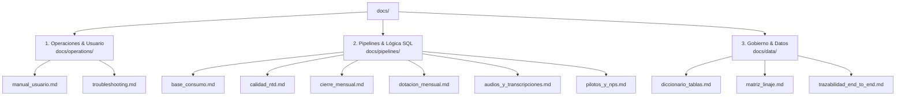

# 📚 Hub de Documentación Técnica - APP_CALIDAD

Bienvenido a la base de conocimiento y documentación técnica de la **Plataforma Calidad Televentas**.

---

## 🧭 Mapa de Navegación por Dominio

---

## 📂 1. Dominio: Operaciones y Usuario (`docs/operations/`)

> **Audiencia:** Operadores, Analistas de Calidad, Supervisores.

- 📖 **[Manual de Usuario](operations/manual_usuario.md):** Guía paso a paso para la carga a Teradata, descarga de audios y orquestación.
- 🤝 **[Plan de Traspaso & Onboarding](operations/plan_de_traspaso.md):** Guía de instalación en laptop nueva, matriz de accesos y setup de OneDrive.
- 🩺 **[Troubleshooting y Diagnóstico](operations/troubleshooting.md):** Resolución de fallos de entorno (Outlook, Chrome CDP, Teradata).

---

## ⚡ 2. Dominio: Pipelines y Lógica de Negocio (`docs/pipelines/`)

> **Audiencia:** Ingenieros de Datos, Desarrolladores.

- 📊 **[PBI Base Consumo](pipelines/base_consumo.md):** Las 5 fases del pipeline de consumo, insumos y scripts SQL.
- 📈 **[PBI Evaluaciones Calidad](pipelines/calidad_ntd.md):** Proceso de consolidado NTD y reglas de ponderación.
- 🔒 **[Modo Cierre Mensual](pipelines/cierre_mensual.md):** Idempotencia, scripts `01_auditoria` y `02_kri_resumen`.
- 👥 **[Dotación Mensual & Licencias SA](pipelines/dotacion_mensual.md):** Fases 1 a 5, ausentismos de las 4 analistas y licencias Verint.
- 🎧 **[Audios y Transcripciones](pipelines/audios_y_transcripciones.md):** Genesys Cloud, Outlook MAPI y Verint ExtJS.
- 🚀 **[Pilotos y Encuestas NPS](pipelines/pilotos_y_nps.md):** Piloto TCAD, Objeciones No Venta y NPS IVR.

---

## 🗄️ 3. Dominio: Catálogo y Linaje de Datos (`docs/data/`)

> **Audiencia:** BI, Gobierno de Datos, Desarrolladores, Auditores.

- 🗺️ **[Trazabilidad Técnica End-to-End](data/trazabilidad_end_to_end.md):** Mapa exhaustivo de archivos de código, scripts SQL, triggers y destinos de los 8 módulos.
- 📋 **[Diccionario de Tablas](data/diccionario_tablas.md):** Catálogo de tablas en `DLAB_GEC` y esquemas de tipos.
- 🔄 **[Matriz de Linaje de Datos](data/matriz_linaje.md):** Trazabilidad conceptual desde orígenes hasta PowerBI.

