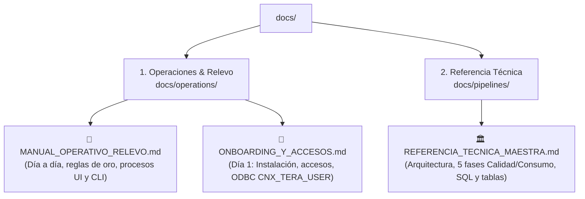

# 📚 Hub de Documentación — APP_CALIDAD

Base de conocimiento oficial y unificada de la **Plataforma Calidad Televentas**.  
Estructurada bajo el principio de **3 únicas fuentes de la verdad** para eliminar redundancias y ambigüedades.

---

## 🧭 Mapa de Documentación

---

## 📂 1. Documentación de Operaciones (`docs/operations/`)

* 📘 **[MANUAL_OPERATIVO_RELEVO.md](operations/MANUAL_OPERATIVO_RELEVO.md):**  
  **La guía indispensable para el relevo y la continuidad.** Contiene los 8 secretos y reglas de oro del negocio, el calendario operativo mensual (qué se corre diario, semanal y a fin de mes), el paso a paso de los procesos en la UI (1-click) y el catálogo detallado de procesos por consola/semi-automáticos (Auditorías WhatsApp/PA-TC con Gemini, Piloto TCAD, No Venta, Transcripciones y Homologaciones).

* 🚀 **[ONBOARDING_Y_ACCESOS.md](operations/ONBOARDING_Y_ACCESOS.md):**  
  **Manual para el Día 1 en la empresa.** Matriz completa de accesos y aprobadores (Mondalgo, Jurado, Ortega), configuración obligatoria del DSN de sistema ODBC 64-bit `CNX_TERA_USER` para Power BI, estructura de carpetas OneDrive y pasos de instalación del entorno virtual (`.venv`) y Playwright.

---

## 🏛️ 2. Referencia Técnica Maestra (`docs/pipelines/`)

* 🏛️ **[REFERENCIA_TECNICA_MAESTRA.md](pipelines/REFERENCIA_TECNICA_MAESTRA.md):**  
  **Fuente única de la verdad de código y bases de datos.** Detalla la arquitectura global (FastAPI + React 18 + Teradata + SQL Server), el flujo técnico detallado de los pipelines de Calidad (Fases 1 a 5), Base Consumo (Fases 1 a 5), Dotación y Cierre Mensual, junto con el diccionario maestro de tablas temporales, históricas y vistas de `DLAB_GEC`.
