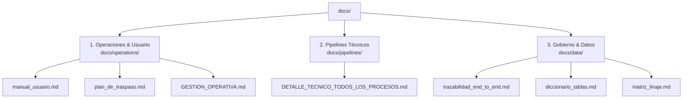

# 📚 Hub de Documentación Técnica - APP_CALIDAD

Bienvenido a la base de conocimiento y documentación técnica de la **Plataforma Calidad Televentas**.

---

## 🧭 Mapa de Navegación por Dominio

---

## 📂 1. Dominio: Operaciones y Usuario (`docs/operations/`)

> **Audiencia:** Operadores, Analistas de Calidad, Supervisores, Nuevos Reemplazos.

- 📖 **[Manual de Usuario](operations/manual_usuario.md):** Guía visual paso a paso para la carga a Teradata, descarga de audios y orquestación web.
- 🤝 **[Plan de Traspaso & Onboarding](operations/plan_de_traspaso.md):** Guía completa de instalación en laptop nueva, matriz de accesos y setup de OneDrive.
- 📅 **[Gestión Operativa](operations/GESTION_OPERATIVA.md):** Matriz operativa mensual con cronograma de tareas, frecuencias y dependencias.

---

## ⚡ 2. Dominio: Pipelines y Lógica Técnica (`docs/pipelines/`)

> **Audiencia:** Ingenieros de Datos, Desarrolladores.

- ⚙️ **[Detalle Técnico de Todos los Procesos](pipelines/DETALLE_TECNICO_TODOS_LOS_PROCESOS.md):** Fuente única de la verdad técnica con diagramas Mermaid end-to-end (tablas exactas Teradata `DLAB_GEC`), scripts SQL y reglas de negocio para los 11 pipelines:
  1. Calidad NTD (Fases 1 a 5)
  2. Consumo Base (Fases 1 a 5)
  3. Dotación Mensual (Fases 1 a 4 + Licencias SA)
  4. Cierre Mensual & Idempotencia
  5. Auditoría PA-TC con Gemini
  6. Auditoría WhatsApp con Gemini
  7. Transcripciones Verint (API REST)
  8. Pipeline Speech (Teradata → SQL Server `DB_SPEECH`)
  9. Genesys Cloud (API REST v2)
  10. Pilotos (No Venta y TCAD)
  11. Convenios Comerciales

---

## 🗄️ 3. Dominio: Catálogo y Linaje de Datos (`docs/data/`)

> **Audiencia:** BI, Gobierno de Datos, Desarrolladores, Auditores.

- 🗺️ **[Trazabilidad Técnica End-to-End](data/trazabilidad_end_to_end.md):** Mapa exhaustivo de archivos de código, scripts SQL, triggers y destinos de los 8 módulos.
- 📋 **[Diccionario de Tablas](data/diccionario_tablas.md):** Catálogo de tablas en `DLAB_GEC` y esquemas de tipos.
- 🔄 **[Matriz de Linaje de Datos](data/matriz_linaje.md):** Trazabilidad conceptual desde orígenes hasta PowerBI.

