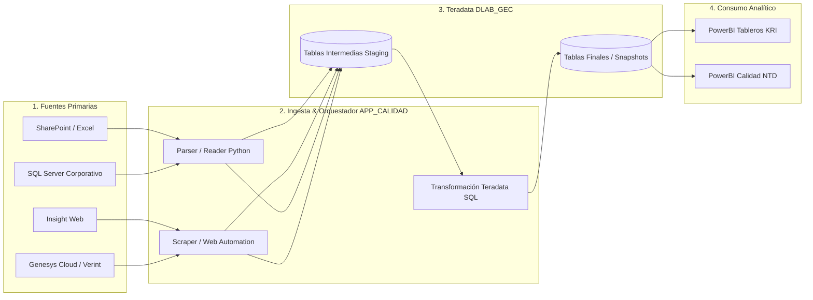

# 🗺️ Matriz de Linaje de Datos End-to-End

Este documento detalla el linaje y trazabilidad de los datos desde sus fuentes primarias hasta los tableros analíticos en PowerBI.

---

## 🔄 Linaje de Datos por Pipeline

---

## 📋 Inventario de Fuentes

| Fuente | Tipo de Acceso | Transformación / Limpieza | Destino en Teradata |
| :--- | :--- | :--- | :--- |
| **`CD40K_NEW.xlsx`** | Archivo Local / SharePoint | Mapeo `P003-CD40K`, normalización de columnas | `DLAB_GEC.T_SP_CD40K` |
| **Bases de Desembolsos**| SQL Server (`pyodbc`) | Extracción por fecha de desembolso | `DLAB_GEC.BN_DESEMBOLSOS_GENERAL` |
| **Muestreos Insight** | Web Scraping / API | Parsing JSON, filtros de no conformidades | `DLAB_GEC.EVALUACIONES_CALIDAD` |
| **Audios Genesys** | Chrome CDP / Outlook | Enriquecimiento telefónico y descarga MP3 | Almacén local `data/downloads/` |

---

## 🔍 Trazabilidad Técnica Detallada por Proceso

Para consultar el mapa detallado de archivos fuente (`.py`), queries (`.sql`), endpoints de API y variables de entorno requeridas por cada flujo, consulta la:
👉 **[trazabilidad_end_to_end.md:L1](trazabilidad_end_to_end.md)**.

