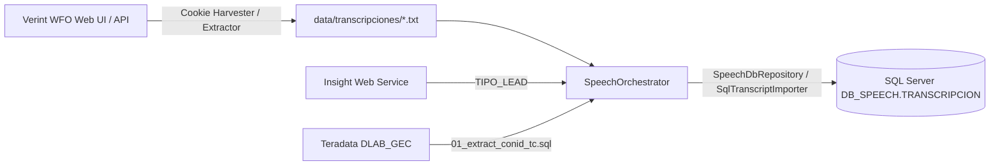
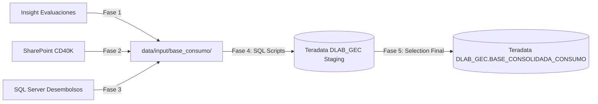
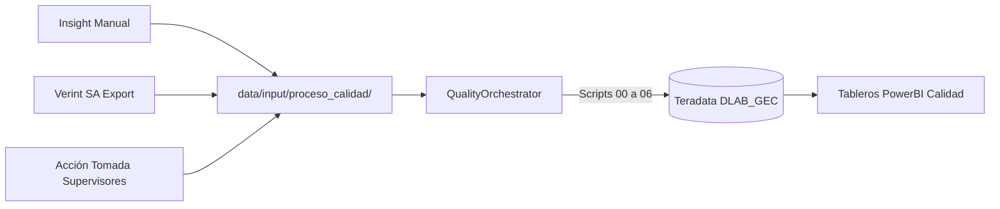
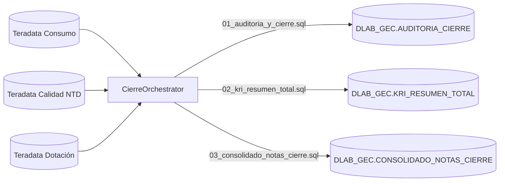
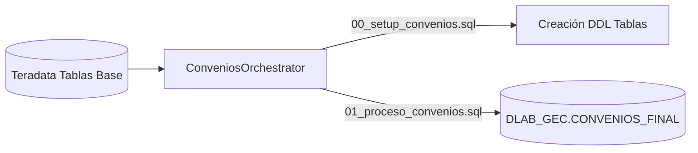
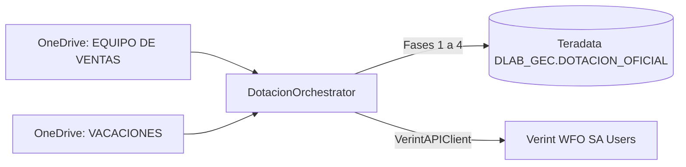

# 🗺️ Matriz de Trazabilidad Técnica End-to-End

Este documento detalla la **trazabilidad completa origen-a-fin (código, archivos, SQL y persistencia)** para cada proceso y módulo de la plataforma `APP_CALIDAD`. Su propósito es permitir a cualquier nuevo desarrollador u operador localizar inmediatamente qué archivo debe ejecutar, modificar o auditar ante cualquier incidencia.

---

## 📌 Índice de Módulos

1. [Transcripciones Verint y Speech Analytics](#1-transcripciones-verint-y-speech-analytics)
2. [Base Consumo (Pipeline 5 Fases)](#2-base-consumo-pipeline-5-fases)
3. [Evaluaciones Calidad Not To Do (NTD)](#3-evaluaciones-calidad-not-to-do-ntd)
4. [Cierre Mensual y Snapshots KRI](#4-cierre-mensual-y-snapshots-kri)
5. [Convenios ETL y Setup](#5-convenios-etl-y-setup)
6. [Dotación Mensual y Licencias Verint](#6-dotación-mensual-y-licencias-verint)
7. [Descarga de Audios Genesys Cloud](#7-descarga-de-audios-genesys-cloud)
8. [Piloto TCAD (Tarjetas y Adicionales)](#8-piloto-tcad-tarjetas-y-adicionales)
9. [Matriz Resumen de Referencia Rápida](#9-matriz-resumen-de-referencia-rápida)

---

## 1. Transcripciones Verint y Speech Analytics

Este flujo extrae las transcripciones de llamadas desde Verint WFO, enriquece los registros con el `TIPO_LEAD` consultando Insight y persiste los resultados en SQL Server para el motor analítico sofIA.



### Ficha Técnica

| Componente | Detalle / Ruta |
| :--- | :--- |
| **Origen Primario** | Portal Verint WFO (`https://wfo.mt5.verintcloudservices.com/wfo/control/signin`) vía sesión web / ExtJS. |
| **Depósito Local Intermedio** | `data/transcripciones/` (archivos `.txt` con convención `{YYYYMMDD}_{DNI}_{ASESOR}_{CAMPANA}_{UUID}.txt`). |
| **Disparador Web API** | `POST /api/speech/sync` en [main.py:L244](../../backend/main.py). |
| **Disparadores CLI** | • Descarga Verint: [download_transcripts_from_verint.py:L1](../../modules/verint/tools/download_transcripts_from_verint.py)<br/>• Sincronización a BD: [run_sync_speech.py:L1](../../modules/speech/tools/run_sync_speech.py)<br/>• Auditoría de cobertura: [run_transcript_audit.py:L1](../../modules/verint/tools/run_transcript_audit.py) |
| **Extractor / Harvester** | • [verint_transcript_extractor.py:L1](../../modules/verint/transcripciones/extractors/verint_transcript_extractor.py)<br/>• [verint_cookie_harvester.py:L1](../../modules/verint/services/verint_cookie_harvester.py)<br/>• [verint_api_client.py:L1](../../modules/verint/services/verint_api_client.py) |
| **Orquestador Principal** | [speech_orchestrator.py:L1](../../modules/speech/use_cases/speech_orchestrator.py) (`SpeechOrchestrator.run()`). |
| **Servicio de Enriquecimiento** | [insight_lead_service.py:L1](../../modules/speech/services/insight_lead_service.py) (`InsightLeadService.enrich_leads()`). |
| **Repositorio / Persistencia** | • [speech_repository.py:L1](../../infrastructure/database/repositories/speech_repository.py) (`SpeechDbRepository`)<br/>• [sql_transcript_importer.py:L1](../../infrastructure/database/sql_transcript_importer.py) (`SqlTranscriptImporter`) |
| **Scripts SQL Involucrados** | [01_extract_conid_tc.sql:L1](../../modules/speech/sql/01_extract_conid_tc.sql) (extrae interacciones candidatos desde Teradata). |
| **Destino Final** | SQL Server `DB_SPEECH`, tabla `dbo.TRANSCRIPCION` (`CON_ID`, `DNI`, `FECHA_CONTACTO`, `ASESOR_ID`, `TRANSCRIPCION_TEXTO`, `TIPO_LEAD`). |
| **Variables .env Requeridas** | `VERINT_USER`, `VERINT_PASS`, `VERINT_COOKIES`, `USERNAME_INSIGHT`, `PASSWORD_INSIGHT`, `SPEECH_SQLSERVER_SERVER`, `SPEECH_SQLSERVER_DATABASE`, `SPEECH_SQLSERVER_USER`, `SPEECH_SQLSERVER_PASSWORD`, `SPEECH_SQLSERVER_DRIVER`, `TERADATA_USER_SELECT`, `TERADATA_PASSWORD_SELECT`, `TERADATA_HOST_SELECT`, `TERADATA_LOGMECH_SELECT`. |

---

## 2. Base Consumo (Pipeline 5 Fases)

Pipeline mensual para generar la base maestra consolidada de ventas y desembolsos del negocio Consumo.



### Ficha Técnica

| Componente | Detalle / Ruta |
| :--- | :--- |
| **Orígenes Primarios** | • Insight PureCloud (evaluaciones y leads)<br/>• SharePoint Corporativo (`CD40K_NEW.xlsx`)<br/>• SQL Server Desembolsos (`BN_DESEMBOLSOS_GENERAL`). |
| **Depósito Local de Insumos** | `data/input/base_consumo/` |
| **Disparador Web API** | `POST /api/consumo/run-pipeline` en [main.py:L130](../../backend/main.py). |
| **Orquestador Principal** | [consumo_orchestrator.py:L1](../../modules/consumo/use_cases/consumo_orchestrator.py) (`ConsumoOrchestrator.run()`). |
| **Fases de Ejecución** | • **Fase 1:** [phase1_insight_ingest.py:L1](../../modules/consumo/use_cases/phases/phase1_insight_ingest.py)<br/>• **Fase 2:** [phase2_cd40k.py:L1](../../modules/consumo/use_cases/phases/phase2_cd40k.py)<br/>• **Fase 3:** [phase3_desembolsos.py:L1](../../modules/consumo/use_cases/phases/phase3_desembolsos.py)<br/>• **Fase 4:** [phase4_sql_scripts.py:L1](../../modules/consumo/use_cases/phases/phase4_sql_scripts.py)<br/>• **Fase 5:** [phase5_selection.py:L1](../../modules/consumo/use_cases/phases/phase5_selection.py) |
| **Scripts SQL Involucrados** | 1. [CA_CONSENTIMIENTO_DIARIO.sql:L1](../../modules/consumo/sql/CA_CONSENTIMIENTO_DIARIO.sql)<br/>2. [CD40K.sql:L1](../../modules/consumo/sql/CD40K.sql)<br/>3. [SOURCE_TVL.sql:L1](../../modules/consumo/sql/SOURCE_TVL.sql)<br/>4. [TLF_NO_AUTORIZADO.sql:L1](../../modules/consumo/sql/TLF_NO_AUTORIZADO.sql)<br/>5. [VENTAS_DN.sql:L1](../../modules/consumo/sql/VENTAS_DN.sql)<br/>6. [CONSUMO_SELECT_TC_CD_SEG.sql:L1](../../modules/consumo/sql/CONSUMO_SELECT_TC_CD_SEG.sql)<br/>7. [KRI_VENTAS_SIN_AUDIO.sql:L1](../../modules/consumo/sql/KRI_VENTAS_SIN_AUDIO.sql) |
| **Destino Final** | Teradata esquema `DLAB_GEC`: `T_SP_CD40K`, `BN_DESEMBOLSOS_GENERAL`, `KRI_VENTAS_SIN_AUDIO` y `BASE_CONSOLIDADA_CONSUMO`. |
| **Variables .env Requeridas** | `TERADATA_HOST`, `TERADATA_USER`, `TERADATA_PASSWORD`, `TERADATA_LOGMECH`, `SQLSERVER_SERVER`, `SQLSERVER_DATABASE`, `SQLSERVER_USER`, `SQLSERVER_PASSWORD`, `SQLSERVER_DRIVER`, `USERNAME_INSIGHT`, `PASSWORD_INSIGHT`. |

---

## 3. Evaluaciones Calidad Not To Do (NTD)

Orquestación mensual del cálculo de notas de calidad de ventas, no conformidades críticas y normalización de evaluaciones de asesores de televentas.



### Ficha Técnica

| Componente | Detalle / Ruta |
| :--- | :--- |
| **Orígenes Primarios** | • Muestreos manuales de Insight PureCloud<br/>• Evaluaciones automáticas Verint Speech Analytics<br/>• Formularios de retroalimentación de supervisores. |
| **Depósito Local de Insumos** | `data/input/proceso_calidad/` |
| **Disparador Web API** | `POST /api/calidad/run-pipeline` en [main.py:L155](../../backend/main.py). |
| **Disparador CLI / Soporte** | • Auditoría de cumplimiento: [audit_cumplimiento_pa_tc.py:L1](../../modules/calidad/tools/audit_cumplimiento_pa_tc.py)<br/>• Reprocesamiento agrupado: [reprocesar_televentas_grouped.py:L1](../../modules/calidad/televentas/tools/reprocesar_televentas_grouped.py) |
| **Orquestador Principal** | [quality_orchestrator.py:L1](../../modules/calidad/use_cases/quality_orchestrator.py) (`QualityOrchestrator.run()`). |
| **Fases de Ejecución** | • **Fase 1:** [phase1_ingest_insight.py:L1](../../modules/calidad/use_cases/phases/phase1_ingest_insight.py)<br/>• **Fase 2:** [phase2_ingest_verint.py:L1](../../modules/calidad/use_cases/phases/phase2_ingest_verint.py)<br/>• **Fase 3:** [phase3_ingest_accion_tomada.py:L1](../../modules/calidad/use_cases/phases/phase3_ingest_accion_tomada.py)<br/>• **Fase 4:** [phase4_sql_scripts.py:L1](../../modules/calidad/use_cases/phases/phase4_sql_scripts.py)<br/>• **Fase 5:** [phase5_ntd.py:L1](../../modules/calidad/use_cases/phases/phase5_ntd.py) |
| **Scripts SQL Involucrados** | 1. [00_setup_homologaciones.sql:L1](../../modules/calidad/sql/00_setup_homologaciones.sql)<br/>2. [01_evaluacion_manual_pc.sql:L1](../../modules/calidad/sql/01_evaluacion_manual_pc.sql)<br/>3. [02_sa_marcacion_ventas_lpdp.sql:L1](../../modules/calidad/sql/02_sa_marcacion_ventas_lpdp.sql)<br/>4. [03_sa_calculo_pesos_unpivot.sql:L1](../../modules/calidad/sql/03_sa_calculo_pesos_unpivot.sql)<br/>5. [04_sa_ajustes_curva.sql:L1](../../modules/calidad/sql/04_sa_ajustes_curva.sql)<br/>6. [04_b_sa_parche_nota_cero.sql:L1](../../modules/calidad/sql/04_b_sa_parche_nota_cero.sql)<br/>7. [05_consolidacion_nota_final.sql:L1](../../modules/calidad/sql/05_consolidacion_nota_final.sql)<br/>8. [06_carga_ntd.sql:L1](../../modules/calidad/sql/06_carga_ntd.sql) |
| **Destino Final** | Teradata esquema `DLAB_GEC`: `EVALUACIONES_CALIDAD_CONSOLIDADO`, `TABLA_NTD_MENSUAL` (fuente del reporte PBI Calidad). |
| **Variables .env Requeridas** | `TERADATA_HOST`, `TERADATA_USER`, `TERADATA_PASSWORD`, `TERADATA_LOGMECH`, `USERNAME_INSIGHT`, `PASSWORD_INSIGHT`, `VERINT_COOKIES`. |

---

## 4. Cierre Mensual y Snapshots KRI

Genera la fotografía histórica consolidada del mes cerrado, calculando ratios de cobertura KRI y notas definitivas para auditoría y comités de riesgo.



### Ficha Técnica

| Componente | Detalle / Ruta |
| :--- | :--- |
| **Orígenes Primarios** | Tablas intermedias generadas por los pipelines de Consumo, Calidad NTD y Dotación en `DLAB_GEC`. |
| **Disparador Web API** | `POST /api/cierre/run-pipeline` en [main.py:L175](../../backend/main.py). |
| **Orquestador Principal** | [cierre_orchestrator.py:L1](../../modules/cierre/use_cases/cierre_orchestrator.py) (`CierreOrchestrator.run()`). |
| **Scripts SQL Involucrados** | 1. [01_auditoria_y_cierre.sql:L1](../../modules/cierre/sql/01_auditoria_y_cierre.sql)<br/>2. [02_kri_resumen_total.sql:L1](../../modules/cierre/sql/02_kri_resumen_total.sql)<br/>3. [03_consolidado_notas_cierre.sql:L1](../../modules/cierre/sql/03_consolidado_notas_cierre.sql) |
| **Destino Final** | Teradata esquema `DLAB_GEC`: `KRI_RESUMEN_TOTAL`, `CONSOLIDADO_NOTAS_CIERRE` (consumido por tableros ejecutivos y PowerBI KRI). |
| **Variables .env Requeridas** | `TERADATA_HOST`, `TERADATA_USER`, `TERADATA_PASSWORD`, `TERADATA_LOGMECH`. |

---

## 5. Convenios ETL y Setup

Crea estructuras y ejecuta transformaciones del producto Convenios para el periodo de corte mensual.



### Ficha Técnica

| Componente | Detalle / Ruta |
| :--- | :--- |
| **Orígenes Primarios** | Tablas corporativas de préstamos por convenio y base transaccional en Teradata. |
| **Disparador Web API** | `POST /api/convenios/run-pipeline` en [main.py:L200](../../backend/main.py). |
| **Orquestador Principal** | [convenios_orchestrator.py:L1](../../modules/convenios/use_cases/convenios_orchestrator.py) (`ConveniosOrchestrator.run()`). |
| **Scripts SQL Involucrados** | 1. [00_setup_convenios.sql:L1](../../modules/convenios/sql/00_setup_convenios.sql) (creación de estructuras y permisos si no existen).<br/>2. [01_proceso_convenios.sql:L1](../../modules/convenios/sql/01_proceso_convenios.sql) (transformación del periodo). |
| **Destino Final** | Teradata esquema `DLAB_GEC`: `CONVENIOS_FINAL`. |
| **Variables .env Requeridas** | `TERADATA_HOST`, `TERADATA_USER`, `TERADATA_PASSWORD`, `TERADATA_LOGMECH`. |

---

## 6. Dotación Mensual y Licencias Verint

Sincroniza la nómina de asesores activos de televentas, cruza vacaciones/licencias y gestiona el cupo de licencias Speech Analytics en el portal Verint.



### Ficha Técnica

| Componente | Detalle / Ruta |
| :--- | :--- |
| **Orígenes Primarios** | • Carpetas compartidas OneDrive (`EQUIPO DE VENTAS {AÑO}`, `VACACIONES`) gestionadas por RRHH/Supervisión.<br/>• Verint WFO REST API (`/wfo/control/users`). |
| **Disparadores Web API** | • Pipeline general: `POST /api/dotacion/run-pipeline` en [main.py:L220](../../backend/main.py).<br/>• Sincronización licencias Verint: `POST /api/dotacion/run-licencias` en [main.py:L232](../../backend/main.py). |
| **Orquestador Principal** | [dotacion_orchestrator.py:L1](../../modules/dotacion/use_cases/dotacion_orchestrator.py) (`DotacionOrchestrator.run()`). |
| **Integración Verint** | [verint_api_client.py:L1](../../modules/verint/services/verint_api_client.py) (`VerintAPIClient.update_user_licenses()`). |
| **Destino Final** | • Teradata `DLAB_GEC.DOTACION_OFICIAL`.<br/>• Portal Verint WFO (activación/inactivación de licencias Speech Analytics). |
| **Variables .env Requeridas** | `TERADATA_HOST`, `TERADATA_USER`, `TERADATA_PASSWORD`, `VERINT_USER`, `VERINT_PASS`, `VERINT_COOKIES`. |

---

## 7. Descarga de Audios Genesys Cloud

Automatización basada en Chrome DevTools Protocol (CDP) y lector MAPI Outlook para extraer números telefónicos y descargar grabaciones MP3 desde Genesys Cloud.

```mermaid
flowchart LR
    A[Buzón Outlook MAPI] -->|OutlookService| B[Extracción REG_EV + DNI]
    B -->|TeradataRepository| C[Enriquecimiento Teléfonos]
    C -->|GenesysDownloader / CDP 9222| D[Genesys Cloud Web]
    D -->|Descarga MP3| E[data/downloads/audios/{PERIODO}/]
```

### Ficha Técnica

| Componente | Detalle / Ruta |
| :--- | :--- |
| **Orígenes Primarios** | • Correos en Outlook (solicitudes de auditoría externa/interna).<br/>• Interacciones indexadas en Teradata.<br/>• Grabaciones en Genesys Cloud (`https://login.mypurecloud.com`). |
| **Depósito Local de Salida** | `data/downloads/audios/{PERIODO}/` (grabaciones de audio en formato `.mp3` / `.wav`). |
| **Disparador Web API** | `POST /api/genesys/start-download` en [main.py:L260](../../backend/main.py). |
| **Disparador CLI** | [run_genesys_download.py:L1](../../modules/genesys/tools/run_genesys_download.py). |
| **Lector MAPI Outlook** | [outlook_service.py:L1](../../modules/genesys/services/outlook_service.py) (`OutlookService.read_audit_requests()`). |
| **Descargador CDP** | [downloader.py:L1](../../modules/genesys/services/downloader.py) (`GenesysDownloader.download_interaction_audio()`). |
| **Configuración** | [config.py:L1](../../modules/genesys/config.py). |
| **Destino Final** | Archivos de audio en almacenamiento local (`data/downloads/audios/`). |
| **Variables .env Requeridas** | `TERADATA_HOST`, `TERADATA_USER`, `TERADATA_PASSWORD`. Requiere Google Chrome iniciado con `--remote-debugging-port=9222`. |

---

## 8. Piloto TCAD (Tarjetas y Adicionales)

Extracción y generación de reportes muestrales para la auditoría de ventas de Tarjetas de Crédito y Adicionales.

```mermaid
flowchart LR
    A[(Teradata DLAB_GEC)] --> B[TcadOrchestrator]
    B -->|Plantilla SQL TCAD| C[data/reports/REPORTE_TCAD_{PERIODO}.xlsx]
```

### Ficha Técnica

| Componente | Detalle / Ruta |
| :--- | :--- |
| **Orígenes Primarios** | Base de ventas de tarjetas y adicionales en Teradata. |
| **Disparador CLI** | [tcad_orchestrator.py:L1](../../modules/Piloto%20TCAD/use_cases/tcad_orchestrator.py). |
| **Orquestador Principal** | [tcad_orchestrator.py:L1](../../modules/Piloto%20TCAD/use_cases/tcad_orchestrator.py) (`TcadOrchestrator.run()`). |
| **Destino Final** | Archivo Excel de auditoría generado en `data/reports/`. |
| **Variables .env Requeridas** | `TERADATA_HOST`, `TERADATA_USER`, `TERADATA_PASSWORD`, `TERADATA_LOGMECH`. |

---

## 9. Matriz Resumen de Referencia Rápida

| Módulo / Proceso | Origen de Datos | Trigger Web / CLI | Archivo Orquestador | SQL Scripts | Destino Persistente |
| :--- | :--- | :--- | :--- | :--- | :--- |
| **1. Transcripciones Verint** | Verint WFO UI / Insight | `POST /api/speech/sync`<br/>`run_sync_speech.py` | [speech_orchestrator.py](../../modules/speech/use_cases/speech_orchestrator.py) | [01_extract_conid_tc.sql](../../modules/speech/sql/01_extract_conid_tc.sql) | SQL Server `DB_SPEECH.TRANSCRIPCION` |
| **2. Base Consumo** | SharePoint CD40K, SQL Server, Insight | `POST /api/consumo/run-pipeline` | [consumo_orchestrator.py](../../modules/consumo/use_cases/consumo_orchestrator.py) | `CA_CONSENTIMIENTO_DIARIO.sql` a `KRI_VENTAS_SIN_AUDIO.sql` | Teradata `DLAB_GEC.BASE_CONSOLIDADA_CONSUMO` |
| **3. Calidad NTD** | Insight Evaluaciones, Verint SA | `POST /api/calidad/run-pipeline` | [quality_orchestrator.py](../../modules/calidad/use_cases/quality_orchestrator.py) | `00_setup_homologaciones.sql` a `06_carga_ntd.sql` | Teradata `DLAB_GEC.EVALUACIONES_CALIDAD_CONSOLIDADO` |
| **4. Cierre Mensual** | Consumo + Calidad NTD | `POST /api/cierre/run-pipeline` | [cierre_orchestrator.py](../../modules/cierre/use_cases/cierre_orchestrator.py) | `01_auditoria_y_cierre.sql` a `03_consolidado_notas_cierre.sql` | Teradata `DLAB_GEC.KRI_RESUMEN_TOTAL` |
| **5. Convenios** | Teradata Préstamos | `POST /api/convenios/run-pipeline` | [convenios_orchestrator.py](../../modules/convenios/use_cases/convenios_orchestrator.py) | `00_setup_convenios.sql`, `01_proceso_convenios.sql` | Teradata `DLAB_GEC.CONVENIOS_FINAL` |
| **6. Dotación Mensual** | OneDrive RRHH / Verint API | `POST /api/dotacion/run-pipeline` | [dotacion_orchestrator.py](../../modules/dotacion/use_cases/dotacion_orchestrator.py) | N/A (Dataframe Python & API) | Teradata `DLAB_GEC.DOTACION_OFICIAL` & Verint SA |
| **7. Audios Genesys** | Outlook MAPI / Genesys Cloud | `POST /api/genesys/start-download`<br/>`run_genesys_download.py` | [downloader.py](../../modules/genesys/services/downloader.py) | N/A (CDP 9222 Automation) | Carpeta local `data/downloads/audios/` |
| **8. Piloto TCAD** | Teradata Tarjetas | CLI `tcad_orchestrator.py` | [tcad_orchestrator.py](../../modules/Piloto%20TCAD/use_cases/tcad_orchestrator.py) | Template SQL TCAD | `data/reports/REPORTE_TCAD_*.xlsx` |

---

## 🛠️ Diagnóstico Inmediato de Entorno (Readiness Test)

Para que el nuevo operador o relevo técnico verifique en segundos que cuenta con las variables de entorno (`.env`), carpetas con permisos de escritura y drivers de base de datos operativos, debe ejecutar:

```powershell
.\.venv\Scripts\python -m unittest tests/test_environment_readiness.py
```
