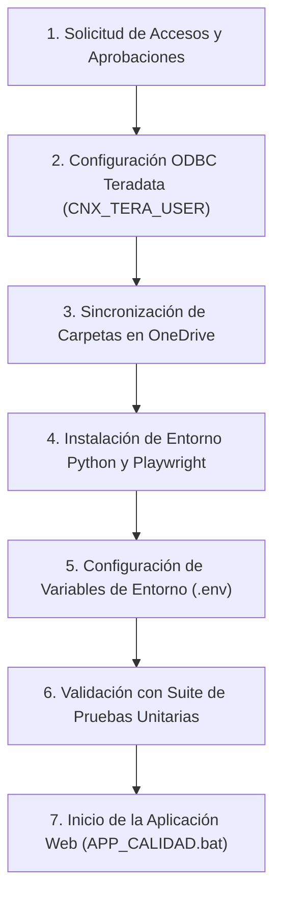

# Guía de Onboarding, Accesos y Puesta en Marcha

Este documento describe los requerimientos de accesos, configuración de controladores y puesta en marcha inicial de la plataforma `APP_CALIDAD`.

---

## Flujo de Puesta en Marcha



---

## 1. Matriz de Accesos y Responsables de Aprobación

Solicita los siguientes accesos tan pronto te asignen la laptop corporativa:

| Sistema / Recurso | Host / URL | Tipo de Acceso | Aprobador / Contacto | Propósito |
| :--- | :--- | :--- | :--- | :--- |
| **Teradata (Personal & Cliente)** | `IBKTD` | Usuario personal `B44xxx` | Ticket **Smart Desk** con aprobación de **Jose Salcedo** *(Soporte técnico de configuración: Juan Carlos Mondalgo)* | Instalación de cliente Teradata y permisos de consulta en esquema `DLAB_DESNEGRET`. |
| **Teradata (Genérico)** | `IBKTD` (Puerto 1025) | Usuario: `APP_GEC`<br/>Mecanismo: `TD2` | Inteligencia Comercial | Carga masiva de tablas en `DLAB_GEC` y ejecución de scripts SQL del pipeline. |
| **SharePoint Calidad & Power BI Service** | `https://interbankpe.sharepoint.com/sites/InteligenciayExperienciaCanal` | Correo corporativo | **Vanessa Ortega** o **Juan Carlos Mondalgo** | Acceso a insumos compartidos (`ACCION_TOMADA.xlsx`) y al área de trabajo (workspace) en Power BI Service (**CANALES Y SRVICIO AL CLIENTE**, reporte **CALIDAD de servicios**). |
| **Verint Speech Analytics** | `https://wfo.mt5.verintcloudservices.com/wfo/control/signin` | Correo corporativo (SSO) | **Carlos Jurado** | Descarga de transcripciones SA y licenciamiento de asesores. |
| **Insight PureCloud** | `https://s425vp01/Insight` | Usuario personal `B44xxx` | **Portal de Accesos** (dentro de **Smart Desk**)<br/>*(Solicitar orientación a **Juan Carlos Mondalgo**)* | Solicitar acceso obligatorio a las **2 bases / áreas**: `GCI_PRD_Insight_TLVentas` (tráfico y evaluaciones TLV) y `GCI_PRD_Insight_ACOE` (atributos y reportería cruzada). |
| **Insight Digital (WhatsApp)** | Entorno Insight Digital | Usuario personal `B44xxx` | **Gary Tamara** (Canales Digitales) | Coordinar y solicitar orientación para la habilitación de acceso a la reportería y extracción estructurada de gestiones de WhatsApp (equivalente al Insight de llamadas pero para mensajería digital). |
| **Genesys Cloud** | `https://login.mypurecloud.com` | Correo corporativo (SSO Microsoft) | Habilitado por defecto | Acceso nativo con credenciales de Windows para descarga de audios. |
| **SQL Server: DB_SPEECH** | Servidor SQL corporativo | Usuario servicio speech | Administrador Base Speech | Persistencia de transcripciones del motor sofIA. |

> [!NOTE]
> **Detalle para el Ticket de Insight en Smart Desk:** En la solicitud del Portal de Accesos se debe especificar explícitamente el acceso de consulta a los dos identificadores de área (bases):
> 1. `GCI_PRD_Insight_TLVentas`: Aloja las consultas de tráfico, agentes y evaluaciones de televentas (`session_summary`, `conversation_attributes`).
> 2. `GCI_PRD_Insight_ACOE`: Necesaria para la extracción de atributos de conversación (`CONV_ATTRIBUTES`) y cruce de interacciones.

---

## 2. Configuración del ODBC Teradata (`CNX_TERA_USER`)

> [!IMPORTANT]
> Power BI Desktop y el Gateway institucional buscan un Data Source Name (DSN) con este nombre exacto. Si no está configurado, las conexiones de Power BI fallarán.

### Pasos de Configuración en Windows:
1. Abre el menú Inicio y busca **Orígenes de datos ODBC (64 bits)**.
2. Ve a la pestaña **DSN de sistema** y haz clic en **Agregar...**.
3. Selecciona el controlador **Teradata Database ODBC Driver 17.xx** (o versión instalada) y haz clic en **Finalizar**.
4. Completa los campos con los siguientes valores exactos:
   * **Data Source Name:** `CNX_TERA_USER`
   * **Description:** Conexión Teradata APP_CALIDAD / Power BI
   * **Server (Name or IP):** `IBKTD`
   * **Authentication Mechanism:** `TD2`
   * **Username:** `APP_GEC`
   * **Default Database:** `DLAB_GEC`
5. Haz clic en **Test Connection**, ingresa la contraseña corporativa de `APP_GEC` y verifica que el mensaje sea `Test connection was successful!`.
6. Guarda y cierra el Administrador ODBC.

---

## 3. Estructura de Carpetas OneDrive Requeridas

Los insumos de dotación y vacaciones se leen de carpetas compartidas en OneDrive. Debes solicitar acceso de lectura/edición a:

```
C:\Users\<TU_USUARIO>\OneDrive - Interbank\
├── 1. EXPERIENCIA DE COMPRA\                 <-- Solicitar acceso a CAROLINA ANGULO
│   ├── EQUIPO DE VENTAS 2026\                <-- Libros mensuales de dotación comercial
│   └── GESTIÓN 2026\
│       ├── DOTACION\                         <-- LICENCIAS_SA_2026.xlsx
│       │   └── TERADATA\                     <-- Históricos TELEVENTAS_EJECUTIVOS
│       └── VACACIONES\                       <-- Gestión de Vacaciones y Horarios 2026.xlsx
└── Televentas\                               <-- Carpeta local propia para respaldos
```

---

## 4. Instalación Local y Puesta en Marcha

### 4.1 Ubicación del Proyecto
Ubica el proyecto en una ruta sin caracteres especiales ni espacios excesivos:
```
c:\Users\<TU_USUARIO>\Documents\Documentos Personales\INTERBANK\APP_CALIDAD
```

### 4.2 Creación del Entorno Virtual e Instalación de Dependencias
Abre PowerShell dentro de la carpeta del proyecto:
```
# Crear entorno virtual localizado
python -m venv .venv

# Activar entorno
.\.venv\Scripts\Activate.ps1

# Instalar dependencias
.\.venv\Scripts\python -m pip install --upgrade pip
.\.venv\Scripts\python -m pip install -r requirements.txt
```

### 4.3 Instalación del Navegador Playwright
En la red corporativa de Interbank se requiere deshabilitar temporalmente la verificación estricta TLS durante la descarga de binarios de Chromium:
```
$env:NODE_TLS_REJECT_UNAUTHORIZED="0"
.\.venv\Scripts\python -m playwright install chromium
```

### 4.4 Configuración del Archivo de Entorno (`.env`)
Solicita las credenciales vigentes y configura el archivo `.env` en la raíz del proyecto:
* `TERADATA_USER=APP_GEC`
* `TERADATA_PASSWORD=...`
* `TERADATA_HOST=IBKTD`
* `TERADATA_LOGMECH=TD2`
* `USERNAME_INSIGHT=B44xxx`
* `PASSWORD_INSIGHT=...`
* `VERINT_USER=...`
* `VERINT_PASS=...`
* `GEMINI_API_KEY=...`

---

## 5. Validación con Pruebas Automatizadas

Antes de iniciar la plataforma, verifica la integridad del entorno ejecutando la suite de pruebas:
```
.\.venv\Scripts\python -m unittest discover -s tests
```
* **Criterio de aceptación:** Las pruebas deben finalizar con estado `OK`.

---

## 6. Inicio de la Aplicación Web

Para iniciar la plataforma web:
* Ejecute el archivo [APP_CALIDAD.bat](../../APP_CALIDAD.bat) en la raíz del proyecto.
* O ejecute en consola:
  ```
  .\.venv\Scripts\python -m uvicorn backend.main:app --host 127.0.0.1 --port 8000 --reload
  ```
* Ingrese desde su navegador a: `http://127.0.0.1:8000`.
