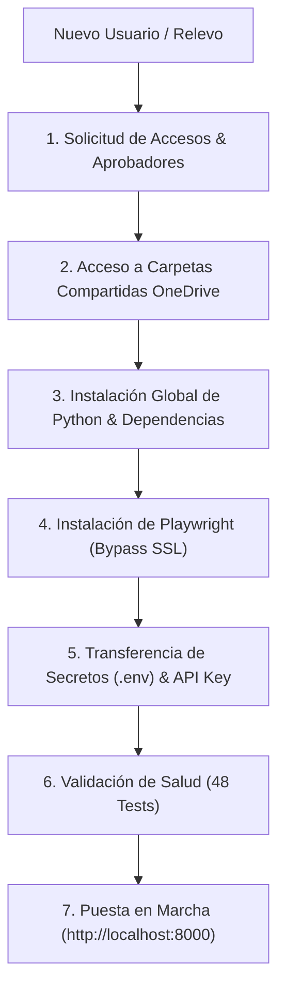

# 🤝 Plan de Traspaso e Instalación para Nuevos Usuarios (Onboarding Guide)

Este documento es la **guía maestra de configuración, aprovisionamiento y puesta en marcha** de la plataforma `APP_CALIDAD` en una nueva laptop de usuario o para un nuevo relevo técnico en el equipo de Experiencia y Calidad Televentas de Interbank.

---

## 📌 Resumen de Arquitectura y Componentes

`APP_CALIDAD` centraliza la automatización operativa de Calidad Televentas a través de:
1. **Frontend:** React 18 SPA (`frontend/app.js`, `frontend/styles.css`).
2. **Backend API:** FastAPI con WebSockets en vivo (`backend/main.py`).
3. **Bases de Datos:** Teradata (`DLAB_GEC`, `DLAB_DESNEGRET`), SQL Server (`DB_SPEECH` sofIA).
4. **Automatización RPA:** Playwright para Genesys Cloud y cosechador dinámico de sesiones para Verint WFO.
5. **Herramientas de Soporte:** Formateador SQL y scripts de Auditoría WSP.



---

## 🔑 1. Matriz de Accesos, Servidores y Contactos de Aprobación

Solicita los siguientes accesos al ingresar o configurar la laptop:

| Sistema / Base de Datos | Host / URL / Servidor | Tipo de Acceso | Contacto / Aprobador | Propósito |
| :--- | :--- | :--- | :--- | :--- |
| **Teradata (Personal)** | `IBKTD` | Código de usuario directo (`B44xxx`) | **Juan Carlos Mondalgo** | **Imprescindible:** Solicitar acceso al esquema `DLAB_DESNEGRET` en Teradata. |
| **Teradata (Genérico)** | `IBKTD` (Puerto 1025) | Usuario: `APP_GEC`<br/>Mecanismo: `TD2` | Equipo Inteligencia Comercial | Carga masiva de tablas en `DLAB_GEC` y ejecución de scripts SQL. |
| **Teradata (LDAP Select)** | `IBKTD` | Usuario personal (`B44xxx`)<br/>Mecanismo: `LDAP` | TI Interbank / IDM | Extracción de `CONSUMO_SELECT_TC_CD_SEG`. |
| **SharePoint Calidad UX/UI & Power BI** | `https://interbankpe.sharepoint.com/sites/InteligenciayExperienciaCanal` | Usuario corporativo normal | **Vanessa Ortega** o **Juan Carlos Mondalgo** | Agregar al SharePoint de Calidad y al área de trabajo de Power BI (**"CALIDAD de servicios"**). |
| **Verint Speech Analytics** | `https://wfo.mt5.verintcloudservices.com/wfo/control/signin` | Correo corporativo (Windows Auth / SSO) | **Carlos Jurado** (Enviar correo con: correo, registro y nombre completo) | No requiere password estático; ingresa vía Windows Auth corporativo para grabaciones y licencias SA. |
| **Insight PureCloud** | `https://s425vp01/Insight` | Registro personal (`B44xxx`) | Administrador Genesys | Consulta de leads y llamadas indexadas desde Genesys Cloud. |
| **Genesys Cloud** | `https://login.mypurecloud.com` | Correo corporativo (SSO) | Soporte Canales Digitales | Descarga y monitoreo de audios de interacciones. |
| **SQL Server: Speech** | `DB_SPEECH` | Motor sofIA | Administrador Base Speech | Sincronización y persistencia de transcripciones procesadas. |
| **SQL Server: Market** | `S83VP2\BDT` | Usuario: `ibetlmarket` | TI BI / Datamart | Cruces históricos de campañas y saldos. |
| **SQL Server: Select** | `BTSELECT\SQL2008` (BD `SELECT2020`) | Usuario: `sa` | Equipo Canal Select | Extracción de la tabla `Llamadas_Final`. |
| **SQL Server: Warehouse** | `BTWAREHOUSE` (BD `telesoft_bt`) | Tablas `dbo.INGRESADOS*` | Equipo Televentas | Validación de bases ingresadas a discador. |

---

## 📂 2. Estructura de Carpetas OneDrive (Dueños y Creación)

Al recibir una laptop nueva, la carpeta `OneDrive - Interbank` estará limpia. Debes gestionar los accesos compartidos y crear tu carpeta local:

```text
C:\Users\<TU_USUARIO>\OneDrive - Interbank\
├── 1. EXPERIENCIA DE COMPRA\                 <-- Solicitar acceso a JANESY LOPEZ
│   ├── EQUIPO DE VENTAS 2026\                <-- Libros mensuales EQUIPO DE VENTAS
│   └── GESTIÓN 2026\
│       ├── DOTACION\                         <-- LICENCIAS_SA_2026.xlsx
│       │   └── TERADATA\                     <-- TELEVENTAS_EJECUTIVOS.xlsx
│       └── VACACIONES\                       <-- Gestión de Vacaciones y Horarios 2026.xlsx
├── Dotación 2026\                             <-- Solicitar acceso a JACQUELINE
│   └── Dotación 202608\                      <-- Consolidado Planilla ausentismo 202608.xlsx
│       └── Equipo Select\                    <-- Dotacion_Ausencias_Select_Agosto26.xlsx
└── Televentas\                               <-- CARPETA DE CREACIÓN PROPIA (Crear manualmente)
```

> [!TIP]
> - **`1. EXPERIENCIA DE COMPRA\`**: Solicita a **Janesy Lopez** que te comparta la carpeta y agrégala a tu OneDrive mediante *"Agregar acceso directo a Mis archivos"*.
> - **`Dotación {YYYY}\`**: Solicita a **Jacqueline** el acceso compartido.
> - **`Televentas\`**: Es un directorio de trabajo propio; créalo directamente dentro de `OneDrive - Interbank\`.

---

## 💻 3. Instalación de Python y Dependencias (Modo Global)

> [!WARNING]
> **Política de Seguridad Corporativa de Interbank:**
> Las laptops del banco bloquean las políticas de ejecución de scripts dentro de entornos virtuales (`.venv\Scripts\activate`). Por lo tanto, Python y todas las librerías deben instalarse **a nivel global o de usuario del sistema**.

Ejecuta en **PowerShell**:

### Paso 1: Verificar versión de Python
```powershell
python --version
```
*(Requiere Python 3.11 o superior).*

### Paso 2: Instalar Dependencias Globalmente
```powershell
python -m pip install --upgrade pip
pip install -r requirements.txt
```

### Paso 3: Instalar Playwright Chromium (Bypass SSL)
Debido a que el proxy corporativo de Interbank intercepta certificados SSL durante descargas pesadas de binarios, desactiva temporalmente la validación SSL para descargar Chromium:
```powershell
$env:NODE_TLS_REJECT_UNAUTHORIZED="0"
playwright install chromium
```

### Paso 4: Drivers del Sistema
- **Microsoft ODBC Driver 17 for SQL Server:** Requerido para `DB_SPEECH` y conexiones SQL Server.
- **Teradata ODBC Driver / TTU:** Requerido para la conexión con `IBKTD`.

---

## 🔐 4. Configuración del Archivo `.env` y Secretos

El archivo `.env` se transferirá **directamente de forma segura** desde el usuario anterior hacia el nuevo relevo. 

### Variables Clave y Dinámica de Autenticación:

1. **`VERINT_USER` / Autenticación Verint:**
   - Ya **no requiere contraseña (`VERINT_PASS`)**, pues la plataforma utiliza Windows Authentication / SSO.
   - Las cookies de sesión (`VERINT_COOKIES`) **se capturan automáticamente en tiempo de ejecución** mediante el módulo [`verint_cookie_harvester.py`](file:///c:/Users/USER/Documents/Documentos%20Personales/INTERBANK/APP_CALIDAD/modules/verint/services/verint_cookie_harvester.py), el cual las almacena en un caché local (`verint_cookies_cache.json`). El valor en `.env` solo opera como fallback.
2. **`GEMINI_API_KEY`:**
   - Cada usuario debe generar y colocar su **API Key personal** gratuita desde [Google AI Studio](https://aistudio.google.com/) para las funciones asistidas por IA.
3. **`TERADATA_USER` & `TERADATA_USER_SELECT`:**
   - Credenciales genéricas (`APP_GEC`) y personales (`B44xxx`).

---

## 🛠️ 5. Herramientas y Utilidades Complementarias

El repositorio incluye herramientas operativas organizadas por dominio modular (`modules/<dominio>/tools/` e `infrastructure/tools/`):

1. **Auditoría WhatsApp / WSP (`modules/calidad/tools/audit_cumplimiento_pa_tc.py` y `modules/transcripciones/tools/run_transcript_audit.py`):**
   - Utilidad para la auditoría de cumplimiento y calidad en gestiones asistida por modelos LLM.
2. **SQL Formatter (`infrastructure/tools/sql_formatter.py`):**
   - Herramienta para formatear listas y estandarizar cláusulas SQL `IN ('...')` de forma local e independiente.
3. **Televentas Ejecutivos (`modules/dotacion/tools/run_televentas_ejecutivos.py`):**
   - Herramienta para generar y reconciliar el maestro de ejecutivos de televentas (Fase 4).
4. **Speech & Verint Tools (`modules/speech/tools/` y `modules/verint/tools/`):**
   - Extracción y sincronización de transcripciones desde Verint e Insight hacia Teradata y SQL Server.

---

## 🧪 6. Verificación de Salud (Health Check)

Verifica que toda la suite de pruebas unitarias pase al 100%:

```powershell
python -m unittest discover -s tests
```

**Resultado esperado:**
```text
Ran 48 tests in 0.250s
OK
```

---

## 🚀 7. Puesta en Marcha y Calendario Operativo

### Cómo arrancar la plataforma
Ejecuta `iniciar_app.bat` o desde terminal:
```powershell
python backend/main.py
```
Abre en tu navegador: **`http://localhost:8000`**

### Calendario Operativo Mensual

| Momento del Mes | Módulo en UI | Insumos | Propósito |
| :--- | :--- | :--- | :--- |
| **Días 1 al 4 (Inicio de Mes)** | **`👥 Dotación & Licencias`** ➜ *Pipeline de Dotación* | `EQUIPO DE VENTAS` (Mes Ant), `Consolidado Ausentismo`, `Dotación Select`, `Gestión Vacaciones` | Sincroniza Roster (R0-R3), calcula vacaciones y distribuye cuotas a las 4 analistas. |
| **Día a Día (Continuo)** | **`📁 Subir a Teradata`** | Excels exportados | Carga y tipado automático hacia `DLAB_GEC`. |
| **Día a Día (Continuo)** | **`🎧 Audios Genesys`** | Outlook abierto + Genesys Cloud | Descarga masiva de interacciones `.mp3`. |
| **Día a Día (Continuo)** | **`⚡ PBI Base Consumo`** | Insumos en `Televentas\` | Ejecución de Fases 1 a 5 de Base Consumo. |
| **Día ~25 (Cierre de Mes)** | **`📊 PBI Evaluaciones Calidad`** ➜ *Modo Cierre* | Evaluaciones del mes en Teradata | Cierre contable, KRI resumen y snapshot. |
| **Día ~25 (Fin de Mes)** | **`👥 Dotación & Licencias`** ➜ *Licencias SA* | `LICENCIAS_SA_{YYYY}.xlsx` + `Consolidado Ausentismo` | Nueva hoja mensual en el libro anual de licencias Verint SA. |
