# Plataforma Calidad Televentas — Detalle Técnico de Todos los Procesos
> Referencia técnica completa. Para frecuencias y contexto de negocio, ver `GESTION_OPERATIVA.md`.  
> Stack: Python · FastAPI · Polars · Teradata (`DLAB_GEC`) · SQL Server (`DB_SPEECH`) · React 18 SPA

---

## ÍNDICE

1. [Calidad NTD — Pipeline 5 Fases](#1-calidad-ntd--pipeline-5-fases)
2. [Consumo Base — Pipeline 5 Fases](#2-consumo-base--pipeline-5-fases)
3. [Dotación — Pipeline 4 Fases + Licencias SA](#3-dotaci%C3%B3n--pipeline-4-fases--licencias-sa)
4. [Cierre Mensual](#4-cierre-mensual)
5. [Auditoría PA-TC con Gemini](#5-auditor%C3%ADa-pa-tc-con-gemini)
6. [Auditoría WhatsApp con Gemini](#6-auditor%C3%ADa-whatsapp-con-gemini)
7. [Transcripciones Verint](#7-transcripciones-verint)
8. [Pipeline Speech — Teradata → SQL Server](#8-pipeline-speech--teradata--sql-server)
9. [Genesys — Audio y Outlook](#9-genesys--audio-y-outlook)
10. [Pilotos](#10-pilotos)
11. [Convenios](#11-convenios)
12. [Diccionario de Tablas DLAB_GEC](#12-diccionario-de-tablas-dlab_gec)

---

## 1. Calidad NTD — Pipeline 5 Fases

**Orquestador:** [quality_orchestrator.py](file:///c:/Users/USER/Documents/Documentos%20Personales/INTERBANK/APP_CALIDAD/modules/calidad/use_cases/quality_orchestrator.py)  
**Cómo ejecutar:** UI → Sección *Calidad* → Botón *Ejecutar Pipeline Completo* (o fases individuales)

### 1.1 Diagrama End-to-End de Calidad NTD

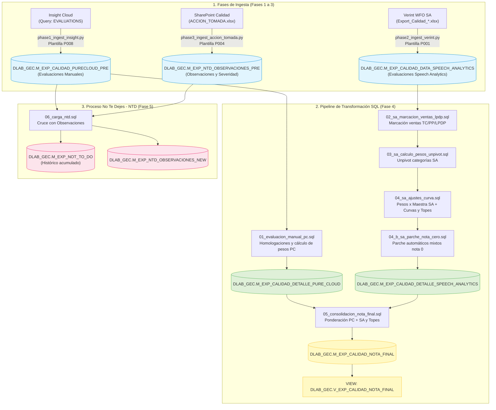

**Archivos SQL:**

| Script | Qué hace |
|---|---|
| [00_setup_homologaciones.sql](file:///c:/Users/USER/Documents/Documentos%20Personales/INTERBANK/APP_CALIDAD/modules/calidad/sql/00_setup_homologaciones.sql) | Crea tablas de homologación (setup único) |
| [01_evaluacion_manual_pc.sql](file:///c:/Users/USER/Documents/Documentos%20Personales/INTERBANK/APP_CALIDAD/modules/calidad/sql/01_evaluacion_manual_pc.sql) | `DLAB_GEC.M_EXP_CALIDAD_PURECLOUD_PRE` → `DLAB_GEC.M_EXP_CALIDAD_DETALLE_PURE_CLOUD` |
| [02_sa_marcacion_ventas_lpdp.sql](file:///c:/Users/USER/Documents/Documentos%20Personales/INTERBANK/APP_CALIDAD/modules/calidad/sql/02_sa_marcacion_ventas_lpdp.sql) | SA + marcación ventas TC/PP/LPDP |
| [03_sa_calculo_pesos_unpivot.sql](file:///c:/Users/USER/Documents/Documentos%20Personales/INTERBANK/APP_CALIDAD/modules/calidad/sql/03_sa_calculo_pesos_unpivot.sql) | Unpivot categorías SA, promedios |
| [04_sa_ajustes_curva.sql](file:///c:/Users/USER/Documents/Documentos%20Personales/INTERBANK/APP_CALIDAD/modules/calidad/sql/04_sa_ajustes_curva.sql) | Pesos × `DLAB_GEC.M_EXP_CALIDAD_MAESTRA_SA` + curvas + topes |
| [04_b_sa_parche_nota_cero.sql](file:///c:/Users/USER/Documents/Documentos%20Personales/INTERBANK/APP_CALIDAD/modules/calidad/sql/04_b_sa_parche_nota_cero.sql) | Parche automático SA mixtos nota=0 |
| [05_consolidacion_nota_final.sql](file:///c:/Users/USER/Documents/Documentos%20Personales/INTERBANK/APP_CALIDAD/modules/calidad/sql/05_consolidacion_nota_final.sql) | PC + SA → `DLAB_GEC.M_EXP_CALIDAD_NOTA_FINAL` |
| [06_carga_ntd.sql](file:///c:/Users/USER/Documents/Documentos%20Personales/INTERBANK/APP_CALIDAD/modules/calidad/sql/06_carga_ntd.sql) | `DLAB_GEC.M_EXP_NOT_TO_DO` + `DLAB_GEC.M_EXP_NTD_OBSERVACIONES_NEW` |
| [99_parches_manuales.sql](file:///c:/Users/USER/Documents/Documentos%20Personales/INTERBANK/APP_CALIDAD/modules/calidad/sql/99_parches_manuales.sql) | Correcciones puntuales post-cierre |

---

## 2. Consumo Base — Pipeline 5 Fases

**Orquestador:** [consumo_orchestrator.py](file:///c:/Users/USER/Documents/Documentos%20Personales/INTERBANK/APP_CALIDAD/modules/consumo/use_cases/consumo_orchestrator.py)

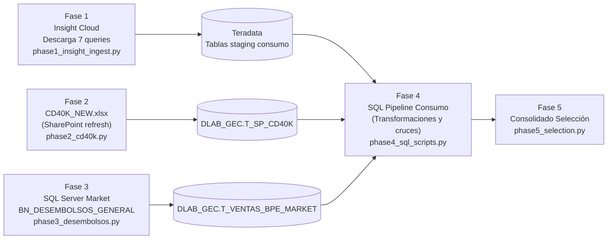

**Notas técnicas:**
- Fase 1: itera sobre `consumo_insumos_config` en `config.json` — cada entrada define una query de Insight y su tabla destino.
- Fase 2: acepta `CD40K_NEW.xlsx` o `CD40K.xlsx`; hace auto-refresh de SharePoint vía COM.
- Fase 3: se omite silenciosamente si `SQLSERVER_SERVER` no está en `.env`.
- Fase 5: llama `run_selection_transformation` del `sql_executor.py`.

---

## 3. Dotación — Pipeline 4 Fases + Licencias SA

**Orquestador:** [dotacion_orchestrator.py](file:///c:/Users/USER/Documents/Documentos%20Personales/INTERBANK/APP_CALIDAD/modules/dotacion/use_cases/dotacion_orchestrator.py)  
**Config:** [dotacion_config.py](file:///c:/Users/USER/Documents/Documentos%20Personales/INTERBANK/APP_CALIDAD/modules/dotacion/dotacion_config.py)  
**Cómo ejecutar:** UI → Sección *Dotación* → Botón *Ejecutar Pipeline Dotación* (o *Ejecutar Licencias SA*)

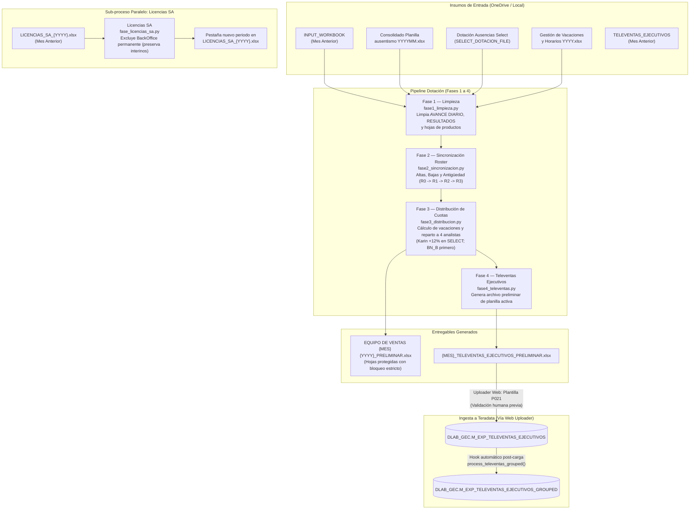

### 3.1 Mapa de Rutas de Insumos y Entregables (OneDrive)

El orquestador resuelve automáticamente la carpeta base de OneDrive del usuario (`OneDrive - Interbank` o `OneDrive`):

| Insumo / Entregable | Tipo | Ruta Relativa en OneDrive | Archivo Dinámico por Período |
| :--- | :--- | :--- | :--- |
| **Plantilla Mes Anterior** | Insumo | `1. EXPERIENCIA DE COMPRA\EQUIPO DE VENTAS {YYYY}\` | `{M_ANT} EQUIPO DE VENTAS {MES_ANT_UPPER} {Y_ANT}.xlsx` |
| **Consolidado Ausentismo** | Insumo | `Dotación {YYYY}\Dotación {YYYYMM}\` | `Consolidado Planilla ausentismo {YYYYMM}.xlsx` |
| **Dotación Select** | Insumo | `Dotación {YYYY}\Dotación {YYYYMM}\Equipo Select\` | `Dotacion_Ausencias_Select_{MesCap}{YY}.xlsx` |
| **Gestión de Vacaciones** | Insumo | `1. EXPERIENCIA DE COMPRA\GESTIÓN {YYYY}\VACACIONES\` | `Gestión de Vacaciones y Horarios {YYYY}.xlsx` (hoja: `Programación de Fechas {YYYY}`) |
| **Televentas Mes Anterior** | Insumo | `1. EXPERIENCIA DE COMPRA\GESTIÓN {YYYY}\DOTACION\TERADATA\` | `{M_ANT} {MES_ANT_UPPER}_TELEVENTAS_EJECUTIVOS.xlsx` |
| **Libro Maestro Licencias** | Insumo / Salida | `1. EXPERIENCIA DE COMPRA\GESTIÓN {YYYY}\DOTACION\` | `LICENCIAS_SA_{YYYY}.xlsx` |
| **Equipo de Ventas Final** | Entregable | `1. EXPERIENCIA DE COMPRA\EQUIPO DE VENTAS {YYYY}\` | `{M_ACT} EQUIPO DE VENTAS {MES_ACT_UPPER} {YYYY}_PRELIMINAR.xlsx` |
| **Televentas Final** | Entregable | `1. EXPERIENCIA DE COMPRA\GESTIÓN {YYYY}\DOTACION\TERADATA\` | `{M_ACT} {MES_ACT_UPPER}_TELEVENTAS_EJECUTIVOS_PRELIMINAR.xlsx` |

**Reglas de negocio críticas:**
- **Seguridad en RESULTADOS:** La hoja `RESULTADOS` se limpia en filas manuales (18, 21, 24, 27) y se re-bloquea estrictamente a nivel de celda (`locked=True`, `ws.protection.sheet=True`) para impedir modificaciones manuales de usuario.
- **Reparto a 4 analistas:** Las hojas con 2 evaluaciones (`BN_B`, `PP`, `SEG`, `CxC 1`) se reparten equitativamente primero. Karin absorbe su meta adicional (+12%) en hojas de 1 evaluación (`SELECT`).
- **Licencias SA:** La función `is_backoffice()` excluye puestos BackOffice permanentes pero preserva asesores BO interinos.
- **Ingesta a Teradata:** El pipeline no sube directamente a Teradata para permitir validación humana del archivo preliminar. La subida se realiza mediante la plantilla **`P021-TELEVENTAS_EJECUTIVOS`** en la web, la cual ejecuta automáticamente el hook para generar `DLAB_GEC.M_EXP_TELEVENTAS_EJECUTIVOS_GROUPED`.

---

## 4. Cierre Mensual

**Orquestador:** [cierre_orchestrator.py](file:///c:/Users/USER/Documents/Documentos%20Personales/INTERBANK/APP_CALIDAD/modules/cierre/use_cases/cierre_orchestrator.py)  
**Cómo ejecutar:** UI → Sección *Cierre* → Seleccionar período cerrado → Elegir scripts a ejecutar

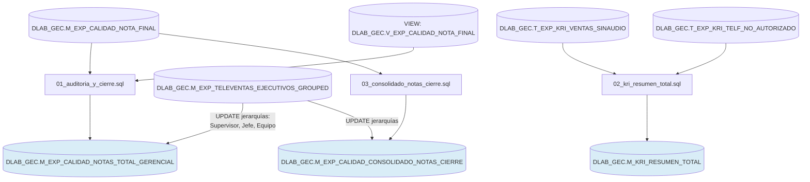

**Scripts:**

| Script | Tabla destino | Descripción |
|---|---|---|
| [01_auditoria_y_cierre.sql](file:///c:/Users/USER/Documents/Documentos%20Personales/INTERBANK/APP_CALIDAD/modules/cierre/sql/01_auditoria_y_cierre.sql) | `DLAB_GEC.M_EXP_CALIDAD_NOTAS_TOTAL_GERENCIAL` | Notas + jerarquía organizativa para Power BI gerencial |
| [02_kri_resumen_total.sql](file:///c:/Users/USER/Documents/Documentos%20Personales/INTERBANK/APP_CALIDAD/modules/cierre/sql/02_kri_resumen_total.sql) | `DLAB_GEC.M_KRI_RESUMEN_TOTAL` | Ventas sin audio + teléfonos no autorizados |
| [03_consolidado_notas_cierre.sql](file:///c:/Users/USER/Documents/Documentos%20Personales/INTERBANK/APP_CALIDAD/modules/cierre/sql/03_consolidado_notas_cierre.sql) | `DLAB_GEC.M_EXP_CALIDAD_CONSOLIDADO_NOTAS_CIERRE` | Consolidado de notas con jerarquía para reportes |

---

## 5. Auditoría PA-TC con Gemini

**Archivo fuente:** [audit_cumplimiento_pa_tc.py](file:///c:/Users/USER/Documents/Documentos%20Personales/INTERBANK/APP_CALIDAD/modules/calidad/tools/audit_cumplimiento_pa_tc.py)  
**Cómo ejecutar:** `.\.venv\Scripts\python modules\calidad\tools\audit_cumplimiento_pa_tc.py`  
**Input auto-detectado:** `Solicitud Cumplimiento TC YYYY.xlsx` en raíz del proyecto  
**Output:** `Solicitud Cumplimiento TC YYYY_Auditada.xlsx` + `logs/audit_pago_automatico.log`

### 5.1 Diagrama de Flujo Técnico Detallado

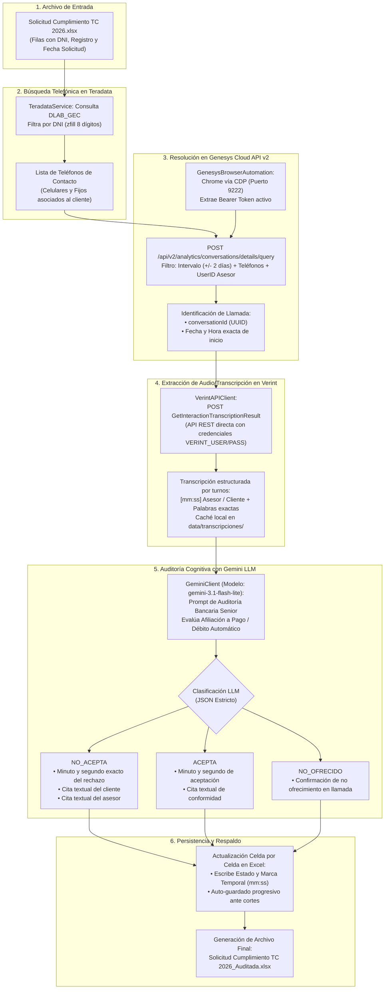

### 5.2 Desglose Paso a Paso del Flujo

1. **Lectura del Excel de Cumplimiento:** Detecta automáticamente `Solicitud Cumplimiento TC YYYY.xlsx` en la raíz. Lee fila por fila los registros pendientes de auditoría (DNI, código de asesor y fecha estimada).
2. **Cruce Telefónico en Teradata:** Con el DNI normalizado a 8 dígitos (`zfill(8)`), consulta en las tablas maestras de `DLAB_GEC` todos los números telefónicos registrados para ese cliente.
3. **Localización de Llamada en Genesys Cloud:** Mediante `GenesysBrowserAutomation` se conecta por Chrome DevTools Protocol (CDP) para reutilizar la sesión corporativa y obtener el Bearer Token. Envía una consulta analítica a `https://api.mypurecloud.com/api/v2/analytics/conversations/details/query` filtrando por teléfono, usuario y una ventana de tiempo de $\pm 2$ días respecto a la fecha de la solicitud, obteniendo el `conversationId` exacto.
4. **Descarga de Transcripción Verint:** `VerintAPIClient` consume directamente el endpoint REST `GetInteractionTranscriptionResult` de Verint WFO sin necesidad de interfaz gráfica. Convierte los milisegundos de cada turno de habla a formato `[mm:ss]` separando las intervenciones de "Asesor" y "Cliente".
5. **Auditoría Focalizada con Gemini:** El diálogo estructurado se envía al modelo `gemini-3.1-flash-lite` con temperatura 0.0 y salida JSON estricta. El modelo evalúa:
   - `NO_ACEPTA`: El asesor ofreció pero el cliente declinó (registra `timestamp_cliente` en `mm:ss` y citas textuales).
   - `ACEPTA`: El cliente consintió la afiliación explícitamente.
   - `NO_OFRECIDO`: No hubo mención de pago/débito automático.
6. **Escritura y Salvaguarda Progresiva:** El resultado se escribe celda por celda en el archivo Excel tras cada llamada analizada, evitando pérdida de avance ante interrupciones de red.

---

## 6. Auditoría WhatsApp con Gemini

**Archivo:** [run_transcript_audit.py](file:///c:/Users/USER/Documents/Documentos%20Personales/INTERBANK/APP_CALIDAD/modules/verint/tools/run_transcript_audit.py)  
**Cómo ejecutar:** `.\.venv\Scripts\python modules\verint\tools\run_transcript_audit.py`  
**Input:** `data/input/auditorias_wsp/*.docx` + `Plantillas TLV WhatsApp.xlsx`  
**Output:** Excel gerencial con 2 pestañas (*Resumen_Evaluaciones* + *Detalle_Hallazgos*)

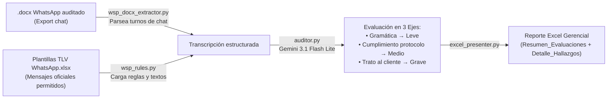

**Ejes de evaluación:**
- **Gramática** → Leve
- **Cumplimiento del protocolo** → Medio
- **Trato con el cliente** → Grave
- **Regla especial:** si el cliente proporcionó su DNI antes de que el asesor lo solicitara, se aplica la excepción "DNI Reciente Previo" y no se computa penalización.

---

## 7. Transcripciones Verint

Existen **tres variantes** operativas según la necesidad:

### 7a. Barrido Masivo (Batch)

**Archivo:** [batch_verint_extractor.py](file:///c:/Users/USER/Documents/Documentos%20Personales/INTERBANK/APP_CALIDAD/modules/verint/tools/batch_verint_extractor.py)

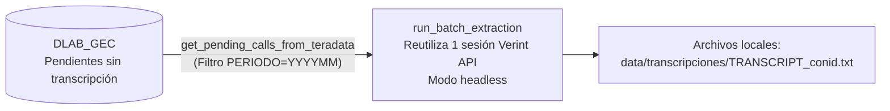

### 7b. Descarga para PA-TC (desde Excel)

**Archivo:** [download_transcripts_from_verint.py](file:///c:/Users/USER/Documents/Documentos%20Personales/INTERBANK/APP_CALIDAD/modules/verint/tools/download_transcripts_from_verint.py)

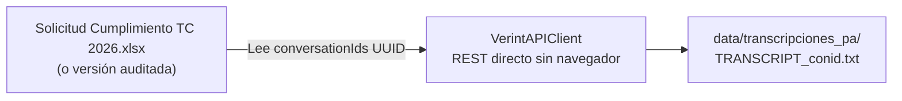

---

## 8. Pipeline Speech — Teradata → SQL Server

**Archivo:** [speech_orchestrator.py](file:///c:/Users/USER/Documents/Documentos%20Personales/INTERBANK/APP_CALIDAD/modules/speech/use_cases/speech_orchestrator.py)  
**Servicio TIPO_LEAD:** [insight_lead_service.py](file:///c:/Users/USER/Documents/Documentos%20Personales/INTERBANK/APP_CALIDAD/modules/speech/services/insight_lead_service.py)

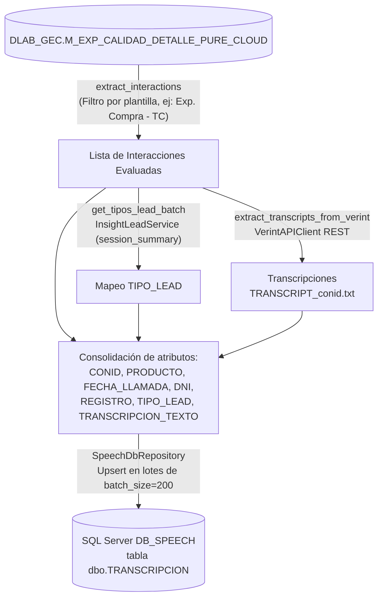

---

## 9. Genesys — Audio y Outlook

**Módulo:** `modules/genesys/`  
**Cómo ejecutar:** UI → Sección *Genesys* (o CLI: `python -m modules.genesys.genesys_downloader`)

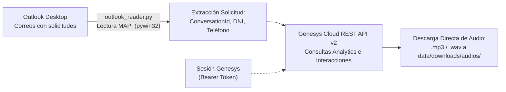

**Precisiones de Arquitectura (API vs Playwright):**
- **Genesys Cloud (100% API):** La descarga y consulta de interacciones se realiza directamente mediante la **API REST v2** de Genesys (`requests`). No se utiliza Playwright para navegación web ni descargas interactivas de audio.
- **Verint WFO (Playwright sólo para Cookies):** El único uso de Playwright en toda la plataforma es el cosechador de cookies [verint_cookie_harvester.py](file:///c:/Users/USER/Documents/Documentos%20Personales/INTERBANK/APP_CALIDAD/modules/verint/services/verint_cookie_harvester.py), el cual automatiza el login para obtener las cookies de sesión. Una vez capturadas las cookies, toda la extracción y descarga de transcripciones se hace vía HTTP REST con `VerintAPIClient` sin abrir navegadores.

---

## 10. Pilotos

### 10a. Piloto No Venta

**Estado:** 🚧 En desarrollo  
**Módulo:** `modules/piloto_no_venta/`

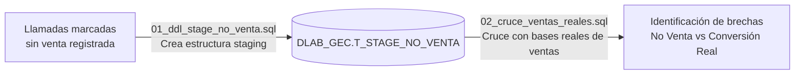

### 10b. Piloto TCAD

**Estado:** 🚧 En desarrollo  
**Módulo:** `modules/Piloto TCAD/`

- Módulo experimental para tarjetas adicionales en proceso de estandarización.

---

## 11. Convenios

**Módulo:** `modules/convenios/`

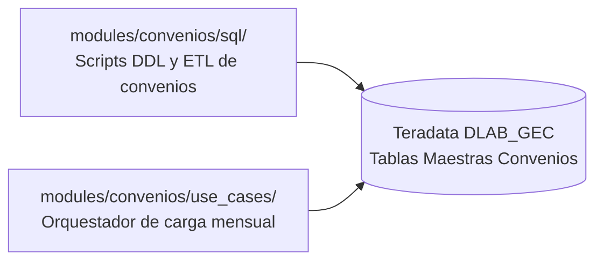

- Se ejecuta a demanda ante la incorporación o actualización de convenios comerciales.

---

## 12. Diccionario de Tablas DLAB_GEC

### 12.1 Tablas de Staging (se truncan en cada ejecución)

| Tabla Completa | Descripción | Fase / Módulo | Script Python |
|---|---|---|---|
| `DLAB_GEC.M_EXP_CALIDAD_PURECLOUD_PRE` | Evaluaciones crudas desde Insight (1 fila = 1 pregunta evaluada, incluye toda la metadata de la interacción) | Calidad Fase 1 | [phase1_ingest_insight.py](file:///c:/Users/USER/Documents/Documentos%20Personales/INTERBANK/APP_CALIDAD/modules/calidad/use_cases/phases/phase1_ingest_insight.py) · Plantilla `P008-INSIGHT_07_EVALUATIONS` |
| `DLAB_GEC.M_EXP_CALIDAD_DATA_SPEECH_ANALYTICS` | Reporte Speech Analytics Verint (1 fila = 1 interacción, detecciones por categoría) | Calidad Fase 2 | [phase2_ingest_verint.py](file:///c:/Users/USER/Documents/Documentos%20Personales/INTERBANK/APP_CALIDAD/modules/calidad/use_cases/phases/phase2_ingest_verint.py) · Plantilla `P001-CALIDAD_SA` |
| `DLAB_GEC.M_EXP_NTD_OBSERVACIONES_PRE` | Acciones tomadas (`ACCION_TOMADA.xlsx`), deduplicadas por rango de severidad | Calidad Fase 3 | [phase3_ingest_accion_tomada.py](file:///c:/Users/USER/Documents/Documentos%20Personales/INTERBANK/APP_CALIDAD/modules/calidad/use_cases/phases/phase3_ingest_accion_tomada.py) · Plantilla `P004-ACC_TOMADA` |
| `DLAB_GEC.T_SP_CD40K` | Ingesta manual base CD40K de Consumo | Consumo Fase 2 | [phase2_cd40k.py](file:///c:/Users/USER/Documents/Documentos%20Personales/INTERBANK/APP_CALIDAD/modules/consumo/use_cases/phases/phase2_cd40k.py) · Plantilla `P003-CD40K` |
| `DLAB_GEC.T_VENTAS_BPE_MARKET` | Desembolsos extraídos desde SQL Server Market | Consumo Fase 3 | [phase3_desembolsos.py](file:///c:/Users/USER/Documents/Documentos%20Personales/INTERBANK/APP_CALIDAD/modules/consumo/use_cases/phases/phase3_desembolsos.py) |

### 12.2 Tablas de Homologación (setup único en Teradata)

| Tabla Completa | Descripción | Cuándo actualizar |
|---|---|---|
| `DLAB_GEC.M_EXP_CALIDAD_HOMOLOGA_GRUPO` | Equivalencias de grupos de preguntas entre formularios Insight y el estándar | Cuando Insight altera el nombre de un grupo de evaluación |
| `DLAB_GEC.M_EXP_CALIDAD_HOMOLOGA_PREGUNTA` | Equivalencias y mapeo de nombres de preguntas individuales | Cuando se detectan preguntas sin mapear en la Fase 4 |
| `DLAB_GEC.M_EXP_CALIDAD_HOMOLOGA_RESPUESTA` | Equivalencias de respuestas ("Si"/"Sí" → "SI") | Cuando Insight modifica valores de respuesta |
| `DLAB_GEC.M_EXP_CALIDAD_MAESTRA_GRUPO_PREGUNTAS_PCLOUD` | Catálogo de plantillas, grupos y preguntas homologadas de Pure Cloud | Al incorporar nuevas plantillas o formularios en Insight |
| `DLAB_GEC.M_EXP_CALIDAD_MAESTRA_SA` | Pesos y umbrales por categoría de Speech Analytics por producto | Al ajustar el modelo analítico de calidad SA |

### 12.3 Tablas de Detalle — Salida del Pipeline SQL

| Tabla Completa | Descripción | Script que escribe | Fuentes |
|---|---|---|---|
| `DLAB_GEC.M_EXP_CALIDAD_DETALLE_PURE_CLOUD` | Evaluaciones manuales procesadas, homologadas y con `NUM_EVALUACION` | `01_evaluacion_manual_pc.sql` | `DLAB_GEC.M_EXP_CALIDAD_PURECLOUD_PRE` + Homologaciones |
| `DLAB_GEC.M_EXP_CALIDAD_DETALLE_SPEECH_ANALYTICS` | SA con marcación de ventas, pesos aplicados, curvas y topes | `02` + `03` + `04` + `04b` | `DLAB_GEC.M_EXP_CALIDAD_DATA_SPEECH_ANALYTICS` + `DLAB_GEC.M_EXP_VENTAS_TC/PP` |
| `DLAB_GEC.M_EXP_NOT_TO_DO` | Histórico acumulado de interacciones calificadas con NTD | `06_carga_ntd.sql` | `DLAB_GEC.M_EXP_CALIDAD_PURECLOUD_PRE` + `DLAB_GEC.M_EXP_NTD_OBSERVACIONES_PRE` |
| `DLAB_GEC.M_EXP_NTD_OBSERVACIONES_NEW` | Tabla derivada de observaciones NTD procesadas en la ejecución | `06_carga_ntd.sql` | `DLAB_GEC.M_EXP_NTD_OBSERVACIONES_PRE` |

### 12.4 Tablas de Nota Final

| Tabla / Vista Completa | Descripción | Script que escribe | Fuentes |
|---|---|---|---|
| `DLAB_GEC.M_EXP_CALIDAD_NOTA_FINAL` | Nota mensual definitiva por ejecutivo y evaluación (PC + SA ponderados con caps) | `05_consolidacion_nota_final.sql` | `DLAB_GEC.M_EXP_CALIDAD_DETALLE_PURE_CLOUD` + `DLAB_GEC.M_EXP_CALIDAD_DETALLE_SPEECH_ANALYTICS` |
| `DLAB_GEC.V_EXP_CALIDAD_NOTA_FINAL` | Vista calculada sobre la nota final | DDL en `00_setup_homologaciones.sql` | `DLAB_GEC.M_EXP_CALIDAD_NOTA_FINAL` |
| `DLAB_GEC.V_EXP_CALIDAD_NOTA_SA` | Vista de nota SA aislada | DDL en `00_setup_homologaciones.sql` | `DLAB_GEC.M_EXP_CALIDAD_DETALLE_SPEECH_ANALYTICS` |
| `DLAB_GEC.V_EXP_ERRORES_CALIDAD_HISTORICO` | Vista histórica de preguntas falladas | DDL en `00_setup_homologaciones.sql` | `DLAB_GEC.M_EXP_CALIDAD_DETALLE_PURE_CLOUD` |
| `DLAB_GEC.V_CHECK_FECHAS_NTD` | Vista de monitoreo con la última fecha de carga de las tablas PRE | DDL en `06_carga_ntd.sql` | `M_EXP_CALIDAD_PURECLOUD_PRE`, `M_EXP_NTD_OBSERVACIONES_PRE` |

### 12.5 Tablas Gerenciales — Cierre Mensual

| Tabla Completa | Descripción | Script que escribe |
|---|---|---|
| `DLAB_GEC.M_EXP_CALIDAD_NOTAS_TOTAL_GERENCIAL` | Histórico consolidado con jerarquía de mando completa (Ejecutivo, Supervisor, Jefe, Equipo) | `01_auditoria_y_cierre.sql` |
| `DLAB_GEC.M_EXP_CALIDAD_CONSOLIDADO_NOTAS_CIERRE` | Consolidado de notas para reportes de cierre oficial | `03_consolidado_notas_cierre.sql` |
| `DLAB_GEC.M_KRI_RESUMEN_TOTAL` | Métricas KRI del mes: ventas sin audio + teléfonos no autorizados | `02_kri_resumen_total.sql` |

### 12.6 SQL Server — Base Speech

| Base / Tabla | Descripción | Proceso que escribe |
|---|---|---|
| `DB_SPEECH.dbo.TRANSCRIPCION` | Repositorio de transcripciones de interacciones con `CON_ID`, `PRODUCTO`, `FECHA_LLAMADA`, `DNI`, `REGISTRO`, `TIPO_LEAD`, `TRANSCRIPCION_TEXTO` | `modules/speech/use_cases/speech_orchestrator.py` |

---

## Árbol de Archivos Clave

```
APP_CALIDAD/
├── backend/main.py                              ← API FastAPI + WebSockets en tiempo real
├── frontend/app.js                              ← React 18 SPA (interfaz gráfica completa)
├── infrastructure/
│   ├── database/database.py                     ← Conexiones y cargas optimizadas a Teradata
│   ├── scrapers/insight_downloader.py           ← Scraper / descargador de Insight Cloud
│   └── llm/gemini_client.py                    ← Cliente Gemini con reintentos y soporte JSON
├── modules/
│   ├── calidad/
│   │   ├── use_cases/phases/                    ← Fases 1 a 5 del pipeline Calidad NTD
│   │   ├── sql/00–06 + 99                       ← Scripts SQL de homologación, cálculo y NTD
│   │   ├── tools/audit_cumplimiento_pa_tc.py    ← Auditoría Gemini PA-TC
│   │   └── televentas/                          ← Gestión de M_EXP_TELEVENTAS_EJECUTIVOS_GROUPED
│   ├── consumo/use_cases/phases/               ← Fases 1 a 5 de Base Consumo
│   ├── dotacion/
│   │   ├── phases/fase1–4 + licencias_sa        ← Pipeline de dotación y licencias Verint SA
│   │   └── dotacion_config.py                   ← Configuración de insumos de dotación
│   ├── cierre/
│   │   ├── use_cases/cierre_orchestrator.py     ← Orquestador de cierre mensual
│   │   └── sql/01–03                            ← Scripts SQL de cierre gerencial y KRI
│   ├── speech/
│   │   ├── use_cases/speech_orchestrator.py     ← Pipeline Teradata → SQL Server DB_SPEECH
│   │   └── services/insight_lead_service.py     ← Enriquecimiento TIPO_LEAD vía Insight
│   ├── verint/
│   │   ├── services/verint_api_client.py        ← Cliente REST Verint WFO
│   │   ├── services/verint_cookie_harvester.py  ← Cosechador de sesiones Verint
│   │   ├── tools/
│   │   │   ├── batch_verint_extractor.py        ← Extracción masiva de transcripciones
│   │   │   ├── download_transcripts_from_verint.py ← Descarga orientada a PA-TC
│   │   │   └── run_transcript_audit.py          ← Auditoría WhatsApp con Gemini
│   │   └── transcripciones/
│   │       ├── use_cases/auditor.py             ← Motor LLM para auditoría 3 ejes
│   │       └── extractors/                      ← Extractores para Verint y WhatsApp (.docx)
│   ├── genesys/
│   │   ├── outlook_reader.py                    ← Parser de correos y adjuntos Outlook
│   │   ├── genesys_downloader.py               ← Descargador de audios Genesys
│   │   └── services/genesys_browser.py         ← Automatización Chrome CDP y Bearer Token
│   ├── convenios/                               ← Setup y procesamiento de convenios
│   ├── piloto_no_venta/sql/01–02               ← DDL y cruce de ventas reales
│   └── Piloto TCAD/                            ← Módulo experimental TCAD
└── data/
    ├── input/proceso_calidad/                  ← Insumos Calidad (ACCION_TOMADA.xlsx, etc.)
    ├── input/proceso_consumo/                  ← Insumos Consumo (CD40K.xlsx, etc.)
    ├── input/auditorias_wsp/                   ← Insumos WhatsApp (.docx + plantillas)
    ├── transcripciones/                        ← Transcripciones en texto (.txt)
    └── transcripciones_pa/                     ← Transcripciones específicas PA-TC
```

---

*Documento técnico actualizado el 2026-09-03.*
