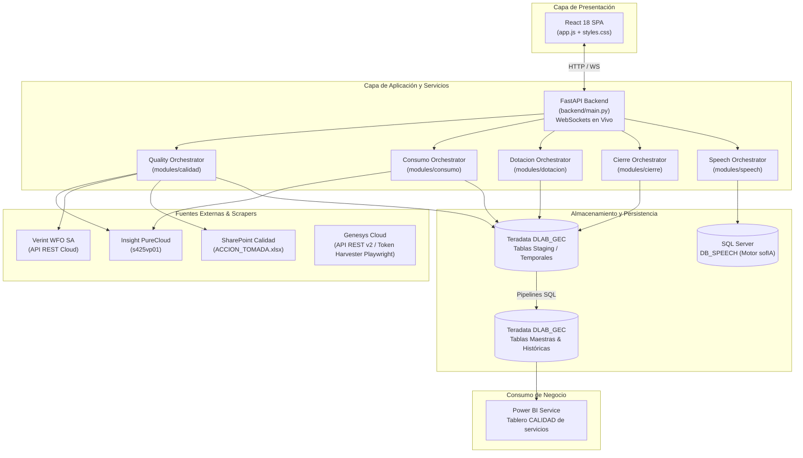
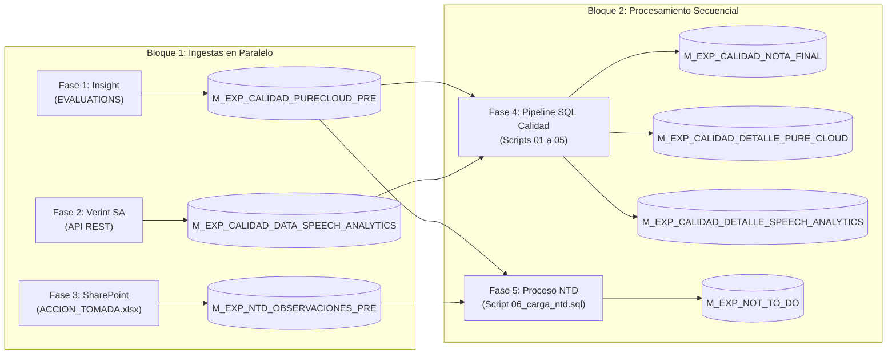
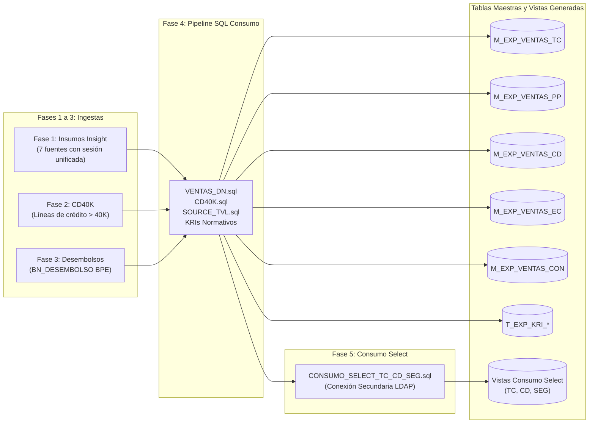

# Referencia Técnica Maestra — Arquitectura y Pipelines de Datos

Documento de referencia técnica sobre la arquitectura de la plataforma `APP_CALIDAD`, flujo de ejecución por fases, dependencias SQL y modelo de datos en Teradata (`DLAB_GEC`).

---

## 1. Arquitectura del Sistema

---

## 2. Pipeline de Calidad (5 Fases)

**Orquestador:** [quality_orchestrator.py](../../modules/calidad/use_cases/quality_orchestrator.py)

### Detalle de Fases de Calidad:
1. **Fase 1 (`phase1_ingest_insight.py`):** Descarga la query `EVALUATIONS` de Insight, limpia tipos de datos con Polars y vacía/carga `DLAB_GEC.M_EXP_CALIDAD_PURECLOUD_PRE`.
2. **Fase 2 (`phase2_ingest_verint.py`):** Descarga vía API REST el reporte de Speech Analytics de Verint para el mes y lo carga en `DLAB_GEC.M_EXP_CALIDAD_DATA_SPEECH_ANALYTICS`.
3. **Fase 3 (`phase3_ingest_accion_tomada.py`):** Refresca el Excel de SharePoint vía automatización COM, deduplica observaciones conservando la severidad más alta y carga `DLAB_GEC.M_EXP_NTD_OBSERVACIONES_PRE`.
4. **Fase 4 (`phase4_sql_scripts.py`):**
   * Valida integridad de tablas origen y detecta preguntas sin mapear.
   * Ejecuta secuencialmente:
     * `01_evaluacion_manual_pc.sql`: Calcula notas de evaluaciones manuales (40% de la nota final).
     * `02_sa_marcacion_ventas_lpdp.sql`: Cruza grabaciones Verint con ventas del mes de Consumo.
     * `03_sa_calculo_pesos_unpivot.sql`: Unpivot de 13 ítems de Speech y promedios.
     * `04_sa_ajustes_curva.sql`: Aplica pesos y curvas por sala comercial.
     * `04_b_sa_parche_nota_cero.sql`: Asigna promedio de sala a asesores sin llamadas evaluadas en SA.
     * `05_consolidacion_nota_final.sql`: Consolida 40% PC + 60% SA = `M_EXP_CALIDAD_NOTA_FINAL`.
   * Actualiza el timestamp de Power BI en `data/reports/conector_calidad.txt`.
5. **Fase 5 (`phase5_ntd.py`):** Ejecuta `06_carga_ntd.sql` para clasificar casuísticas de fraude y no conformidades normativas en `DLAB_GEC.M_EXP_NOT_TO_DO`.

---

## 3. Pipeline de Base Consumo (5 Fases)

**Orquestador:** [consumo_orchestrator.py](../../modules/consumo/use_cases/consumo_orchestrator.py)

### Detalle de Fases de Consumo:
1. **Fase 1 (`phase1_insight_ingest.py`):** Descarga 7 fuentes de Insight reutilizando una **única sesión autenticada HTTP**:
   * Tráfico Genesys (`TRAFICO_GENESYS`)
   * Atributos de Conversaciones (`CONV_ATTRIBUTES`)
   * Tiempos de Derivación (`TIEMPOS_DERIVACION`)
   * Marcas de Transferencia (`MARCAS_TRANSFERENCIA`)
   * Evaluación de Transferencias (`EVALUACION_TRANSFERENCIAS`)
   * Ventas IVR (`VENTAS_IVR`)
   * Consentimiento Diario (`CA_CONSENTIMIENTO_DIARIO`)
2. **Fase 2 (`phase2_cd40k.py`):** Carga `T_SP_CD40K` para control de líneas superiores a 40 mil soles.
3. **Fase 3 (`phase3_desembolsos.py`):** Extrae desembolsos desde SQL Server Market hacia `T_VENTAS_BPE_MARKET`.
4. **Fase 4 (`phase4_sql_scripts.py`):** Cruza ventas oficiales con el padrón de dotación (`VENTAS_DN.sql`), actualiza consentimientos y genera tablas KRI de llamadas sin audio y teléfonos no autorizados. Actualiza timestamp de control en `data/reports/conector_base_consumo.txt`.
5. **Fase 5 (`phase5_selection.py`):** Ejecuta `CONSUMO_SELECT_TC_CD_SEG.sql` utilizando una **conexión secundaria independiente** de Teradata (`TERADATA_USER_SELECT` vía `LDAP`) para generar las vistas analíticas del segmento Select (Tarjetas de Crédito, Crédito Digital y Seguros).

---

## 4. Pipeline de Dotación (Staffing)

**Orquestador:** [dotacion_orchestrator.py](../../modules/dotacion/use_cases/dotacion_orchestrator.py)

1. **Fase 1 (Padrón Consolidado):** Consolida ausentismos, vacaciones y dotación activa desde los libros de `EQUIPO DE VENTAS`.
2. **Fase 2 (Validaciones):** Revisa consistencia de registros de ejecutivos contra la base corporativa.
3. **Fase 3 (Licenciamiento SA):** Cruza asesores activos con las licencias disponibles de Verint Speech Analytics (`LICENCIAS_SA_2026.xlsx`).
4. **Fase 4 (Padrón Preliminar):** Genera `<MES>_TELEVENTAS_EJECUTIVOS_PRELIMINAR.xlsx` para subirlo a la herramienta corporativa web **P021**.
5. **Hook Automático:** Al cargarse a Teradata, se puebla `DLAB_GEC.M_EXP_TELEVENTAS_EJECUTIVOS` y se deriva a `M_EXP_TELEVENTAS_EJECUTIVOS_GROUPED` particionado por `{PERIODO}`.

---

## 5. Proceso de Cierre Mensual Oficial

**Orquestador:** [cierre_orchestrator.py](../../modules/cierre/use_cases/cierre_orchestrator.py)

Se ejecuta una sola vez al mes cuando las notas de Calidad han sido validadas por la jefatura:
1. **Paso 1 (`01_auditoria_y_cierre.sql`):** Limpia el período previo (`DELETE WHERE PERIODO = '{PERIODO}'`) e inserta el snapshot oficial en **`DLAB_GEC.M_EXP_CALIDAD_NOTAS_TOTAL_GERENCIAL`**. Este snapshot es inmutable y alimenta el cálculo de comisiones.
2. **Paso 2 (`02_kri_resumen_total.sql`):** Consolida los riesgos y hallazgos normativos del mes en **`DLAB_GEC.M_KRI_RESUMEN_TOTAL`** para Oficialía de Cumplimiento.
3. **Paso 3 (`03_consolidado_notas_cierre.sql`):** Cierra el histórico general de auditoría.

---

## 6. Diccionario Consolidado de Tablas Teradata (`DLAB_GEC`)

### 6.1 Tablas Temporales Activas (Mes en Curso)
*Estas tablas se sobreescriben en cada ejecución mensual. NUNCA deben ejecutarse para un mes nuevo sin haber cerrado el mes previo.*

| Tabla | Módulo Origen | Uso Principal |
| :--- | :--- | :--- |
| `M_EXP_CALIDAD_PURECLOUD_PRE` | Calidad (Fase 1) | Evaluaciones manuales crudas descargadas de Insight. |
| `M_EXP_CALIDAD_DATA_SPEECH_ANALYTICS` | Calidad (Fase 2) | Transcripciones y marcas de Speech Analytics de Verint. |
| `M_EXP_NTD_OBSERVACIONES_PRE` | Calidad (Fase 3) | Observaciones de supervisores deduplicadas por severidad. |
| `T_VENTAS_BPE_MARKET` | Consumo (Fase 3) | Desembolsos de préstamos comerciales del mes. |
| `T_SP_CD40K` | Consumo (Fase 2) | Líneas de crédito mayores a 40K. |
| `M_EXP_VENTAS_TC` | Consumo (Fase 4) | Ventas oficiales de Tarjeta de Crédito. |
| `M_EXP_VENTAS_PP` | Consumo (Fase 4) | Ventas oficiales de Préstamo Personal. |
| `M_EXP_VENTAS_CD` | Consumo (Fase 4) | Ventas oficiales de Compra de Deuda. |
| `M_EXP_VENTAS_EC` | Consumo (Fase 4) | Ventas oficiales de Extracash. |
| `M_EXP_VENTAS_CON` | Consumo (Fase 4) | Ventas oficiales de Convenios. |
| `M_EXP_TELEVENTAS_EJECUTIVOS` | Dotación (P021) | Padrón activo mensual de ejecutivos, supervisores y jefes. |

### 6.2 Tablas Históricas Particionadas (`WHERE PERIODO = '{PERIODO}'`)

| Tabla | Módulo Origen | Descripción |
| :--- | :--- | :--- |
| `M_EXP_CALIDAD_NOTA_FINAL` | Calidad (Fase 4) | Detalle consolidado de notas finales (40% PC + 60% SA) por asesor. |
| `M_EXP_CALIDAD_DETALLE_PURE_CLOUD` | Calidad (Fase 4) | Desglose pregunta por pregunta de evaluaciones manuales. |
| `M_EXP_CALIDAD_DETALLE_SPEECH_ANALYTICS` | Calidad (Fase 4) | Desglose ítem por ítem de Speech Analytics con curvas aplicadas. |
| `M_EXP_NOT_TO_DO` | Calidad (Fase 5) | Histórico de casuísticas NTD y no conformidades normativas. |
| `M_EXP_TELEVENTAS_EJECUTIVOS_GROUPED` | Calidad / Dotación | Maestro histórico particionado de dotación con jerarquías. |
| `M_EXP_CALIDAD_NOTAS_TOTAL_GERENCIAL` | Cierre Oficial | **Snapshot oficial inmutable** para comisiones y reportes gerenciales. |
| `M_KRI_RESUMEN_TOTAL` | Cierre Oficial | Resumen definitivo de KRIs para Riesgos y Cumplimiento. |

### 6.3 Vistas Analíticas de Consumo en Power BI

| Vista | Finalidad |
| :--- | :--- |
| `V_EXP_CALIDAD_NOTA_FINAL` | Vista optimizada que alimenta directamente el tablero Power BI **"CALIDAD de servicios"**. |
| `V_CHECK_FECHAS_NTD` | Monitoreo de última fecha de actualización de insumos staging de Calidad. |

### 6.4 Vistas Externas del Data Warehouse (`E_DW_VIEWS`)

| Vista | Finalidad |
| :--- | :--- |
| `E_DW_VIEWS.V_CONT_TELEFONO_APICLIENTE` | Teléfonos vigentes y recomendados por cliente (`CODDOC`). Empleada por el bot de Genesys para localizar grabaciones a partir del DNI. |
| `E_DW_VIEWS.V_FCT_RT_TC_HISTORICO` | Maestro histórico de desembolsos y transacciones de tarjetas de crédito (Consumo Fase 4). |
| `E_DW_VIEWS.V_FCT_CNV_VENTAS` | Histórico oficial de ventas comerciales de convenios (Consumo Fase 4). |
