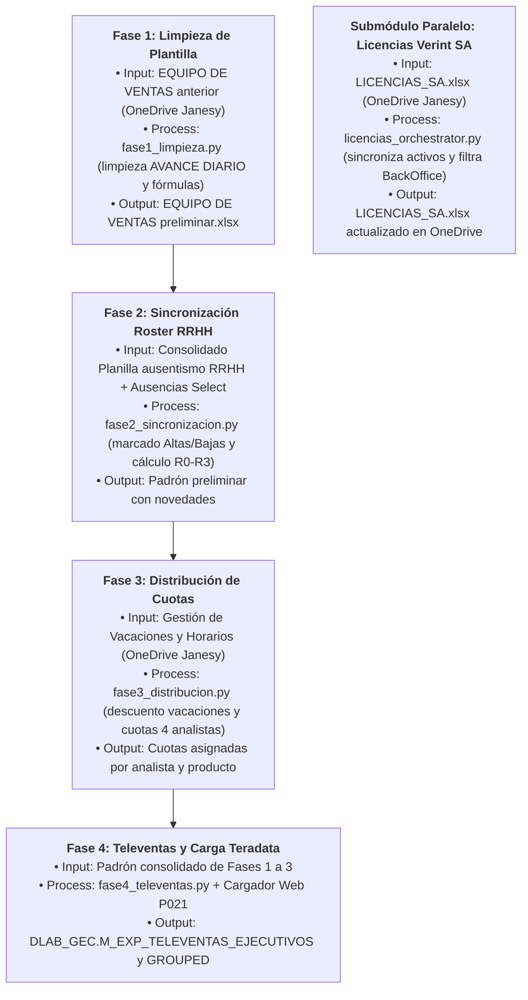
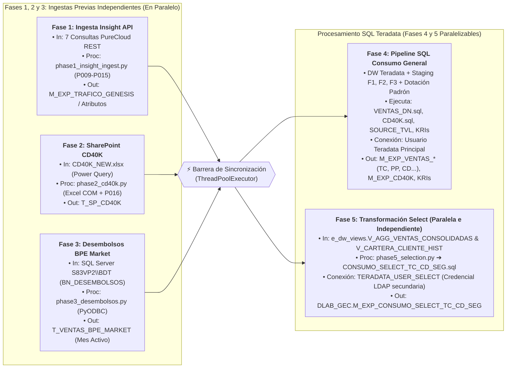
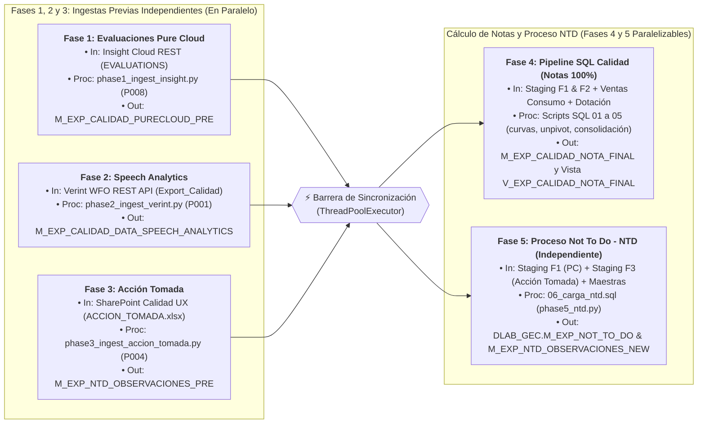
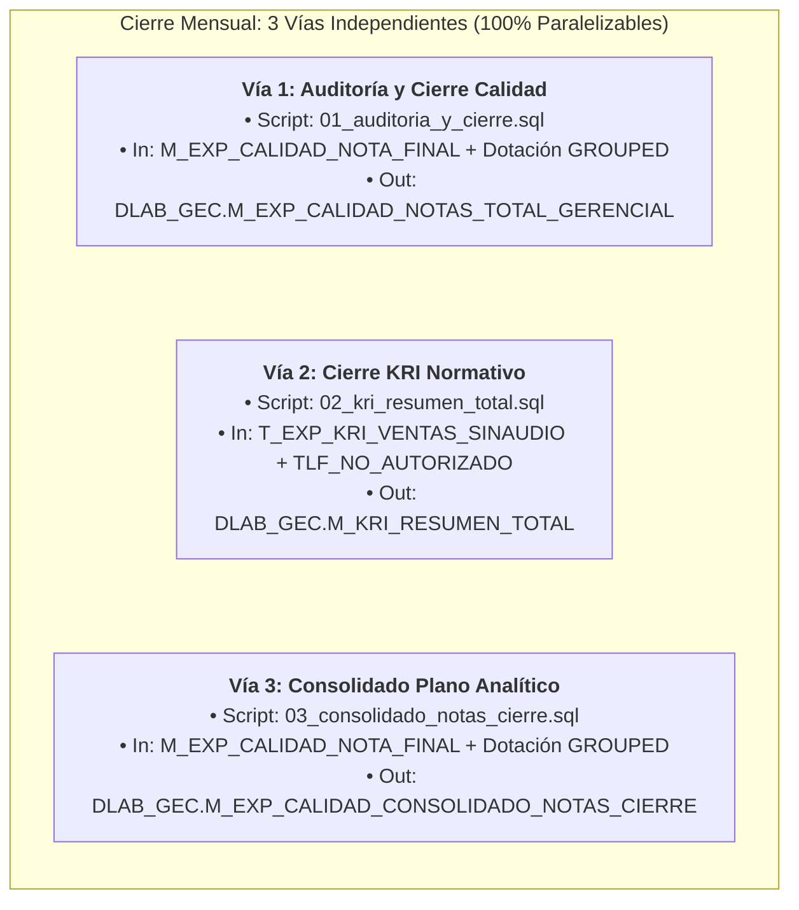
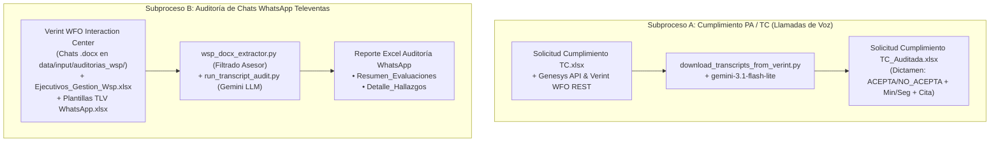

# 🧭 Matriz de Trazabilidad Técnica End-to-End (IPO: Inputs ➔ Process ➔ Outputs)

> **Documento Oficial de Trazabilidad, Linaje de Datos y Auditoría Operativa** de la plataforma **`APP_CALIDAD`**.  
> Mapea cada fase operativa desde su **Origen Identificable (Inputs)**, los **Scripts y Módulos de Procesamiento (Process)** y los **Entregables y Tablas Productivas (Outputs)**.

---

## ⚠️ Regla de Oro Operativa: Interdependencia de Períodos Mensuales

> [!CAUTION]
> **NUNCA ejecutar Base Consumo de un mes nuevo (ej. Septiembre) si aún no se ha cerrado la Fase 4 de Calidad del mes previo (ej. Agosto).**  
> Tanto la tabla de desembolsos `DLAB_GEC.T_VENTAS_BPE_MARKET` (cargada en la **Fase 3 de Consumo**) como las tablas maestras `DLAB_GEC.M_EXP_VENTAS_*` (TC, PP, CD, EC, CON - calculadas en la **Fase 4 de Consumo: `VENTAS_DN.sql`**) solo almacenan el mes activo.  
> Si se sobreescriben con el mes nuevo antes de cerrar Calidad, el script `02_sa_marcacion_ventas_lpdp.sql` de Calidad no encontrará las ventas del mes previo y **anulará las notas de Speech Analytics (SA) de los asesores**.

---

## 📊 Matriz Exhaustiva IPO por Dominio

---

### 1. Dominio: Dotación y Staffing Mensual

* **Frecuencia:** Mensual (Días 25 al 30 de cada mes).
* **Propósito:** Generar el padrón oficial de personal activo, gestionar altas, bajas, antigüedad, vacaciones y repartir las cuotas de evaluación entre los 4 analistas de calidad.

| Fase Operativa | Origen Específico (**Inputs**) | Proceso y Transformación (**Process**) | Entregables y Tablas Finales (**Outputs**) |
| :--- | :--- | :--- | :--- |
| **Fase 1: Limpieza de Plantilla** | **OneDrive Janesy Lopez:** `1. EXPERIENCIA DE COMPRA\EQUIPO DE VENTAS {YYYY}\` • `{M_ANT} EQUIPO DE VENTAS {MES_ANT}.xlsx` | `modules/dotacion/phases/fase1_limpieza.py` Limpia hoja `AVANCE DIARIO`, filas manuales de `RESULTADOS` (18, 21, 24, 27) y resetea pestañas de productos. | Archivo preliminar: • `{M_ACT} EQUIPO DE VENTAS {MES_ACT} {YYYY}_PRELIMINAR.xlsx` *(Celdas protegidas para resguardo de fórmulas).* |
| **Fase 2: Sincronización Roster RRHH** | **OneDrive Rossmery / Jacqueline:** `Dotación {YYYY}\Dotación {YYYYMM}\` • `Consolidado Planilla ausentismo {YYYYMM}.xlsx` • `Equipo Select\Dotacion_Ausencias_Select_{Mes}.xlsx` | `modules/dotacion/phases/fase2_sincronizacion.py` Cruza con planilla RRHH. Marca Bajas (rojo), Altas (amarillo) y calcula antigüedad (`R0` ➔ `R1` ➔ `R2` ➔ `R3`). | Padrón preliminar consolidado con novedades de personal marcadas. |
| **Fase 3: Distribución de Cuotas** | **OneDrive Janesy Lopez:** `1. EXPERIENCIA DE COMPRA\GESTIÓN {YYYY}\VACACIONES\` • `Gestión de Vacaciones y Horarios {YYYY}.xlsx` *(Hoja: Programación de Fechas)* | `modules/dotacion/phases/fase3_distribucion.py` Descuenta días de vacaciones y distribuye cuotas entre 4 analistas (Karin absorbe +12% en Select; BN_B se reparte equitativamente primero). | Libro de trabajo de analistas de calidad con cuotas asignadas por asesor. |
| **Fase 4: Televentas y Carga a Teradata** | Padrón procesado en Fases 1 a 3. | `modules/dotacion/phases/fase4_televentas.py` Construye jerarquía supervisor/jefe (con fallback dinámico en Select) y exporta padrón limpio. | **Archivo para Carga Web:** • `{M_ACT} {MES_ACT}_TELEVENTAS_EJECUTIVOS_PRELIMINAR.xlsx` **Tablas en Teradata (`DLAB_GEC`):** • `M_EXP_TELEVENTAS_EJECUTIVOS` (vía cargador web P021) • `M_EXP_TELEVENTAS_EJECUTIVOS_GROUPED` (vía hook automático) |
| **Submódulo: Licencias SA** | **OneDrive Janesy Lopez:** `1. EXPERIENCIA DE COMPRA\GESTIÓN {YYYY}\DOTACION\` • `LICENCIAS_SA_{YYYY}.xlsx` | `modules/dotacion/phases/licencias_orchestrator.py` Sincroniza asesores activos, desactiva licencias de bajas y preserva puestos BackOffice permanentes. | **Archivo Maestro de Licencias:** • `LICENCIAS_SA_{YYYY}.xlsx` actualizado en OneDrive. |

---

### 2. Dominio: Base Consumo (Ventas Comerciales y Consentimiento)

* **Frecuencia:** Diaria / Mensual (Ejecución matutina).
* **Propósito:** Ingestar tráfico telefónico, líneas CD40K, desembolsos comerciales del mes y generar las tablas maestras de ventas, consentimientos y ventas Select.

| Fase Operativa | Origen Específico (**Inputs**) | Proceso y Transformación (**Process**) | Entregables y Tablas Finales (**Outputs**) |
| :--- | :--- | :--- | :--- |
| **Fase 1: Ingesta Insight Cloud API** | **PureCloud API (Insight Cloud):** Consultas REST de tráfico y eventos telefónicos: 1. `TRAFICO_GENESYS` 2. `CONV_ATTRIBUTES` 3. `DERIVA_BT` 4. `CLOUD_MARCA_TRANSF` 5. `BT_TRANSFERENCIA` 6. `IVR_VENTAS` | `modules/consumo/use_cases/phases/phase1_insight_ingest.py` Descarga payloads crudos, formatea tipado con Polars y sube a Teradata usando plantillas de staging `P009` a `P015`. | **Tablas Staging Teradata (`DLAB_GEC`):** • `M_EXP_TRAFICO_GENESIS` • `M_EXP_BT_CONVERSATIONS_ATTRIBUTES` • `M_EXP_DERIVA_BT_TIEMPOS` • `M_EXP_CO_CLOUD_MARCA_TRASNFERENCIA_PRE` • `M_DERIVA_BT_EV_TRANSFERENCIA` • `M_EXP_IVR_VENTAS_2022` |
| **Fase 2: SharePoint CD40K y Riesgos** | **SharePoint Janesy Lopez:** • Archivo: `CD40K_NEW.xlsx` *(Conexiones Power Query a bases de riesgo crediticio).* | `modules/consumo/use_cases/phases/phase2_cd40k.py` Abre Excel en background vía COM API, ejecuta `RefreshAll`, parsea hojas con Polars y sube a Teradata con plantilla `P016-CD40K`. | **Tabla Staging Teradata (`DLAB_GEC`):** • `T_SP_CD40K` |
| **Fase 3: Desembolsos SQL Server BPE Market** | **SQL Server Market (`S83VP2\BDT`):** • Base de Datos: `BDT` • Tabla física: `BN_DESEMBOLSOS_GENERAL` | `modules/consumo/use_cases/phases/phase3_desembolsos.py` Conecta vía PyODBC, extrae desembolsos del período activo y carga a Teradata con reemplazo completo (`clear_table=True`). | **Tabla Activa Teradata (`DLAB_GEC`):** • `T_VENTAS_BPE_MARKET` > [!WARNING] > Esta tabla se sobreescribe en esta fase con las ventas del mes activo. |
| **Fase 4: Pipeline SQL Consumo (Ventas y Consentimiento)** | **1. Vistas Data Warehouse Teradata:** • `E_DW_VIEWS.V_FCT_RT_TC_HISTORICO` • `E_DW_VIEWS_DLAB.CGR_PRESTAMOS` • `E_DW_VIEWS_DLAB.CGR_EXTRACASH` • `E_DW_VIEWS_DLAB.V_CD_DESEMB_HISTORICO` • `E_DW_VIEWS.V_FCT_CNV_VENTAS` • `E_DW_VIEWS_DLAB.CGR_UPGRADE_HST` • `E_DW_VIEWS_DLAB.CGR_INC_LINEA_HST` • `E_DW_VIEWS_DLAB.V_CGR_PAGO_AUTOMATICO` • `E_DW_VIEWS_DLAB.V_DLAB_CGR_SEGUROS_VENTAS` **2. Staging Fases 1, 2 y 3:** • `T_SP_CD40K` • `T_VENTAS_BPE_MARKET` **3. Dotación:** • `DLAB_GEC.M_EXP_TELEVENTAS_EJECUTIVOS` | `modules/consumo/use_cases/phases/phase4_sql_pipeline.py` Ejecución secuencial de scripts SQL: 1. `VENTAS_DN.sql`: Cruza DW con dotación para extraer ventas comerciales oficiales. 2. `CD40K.sql`: Cruza `M_EXP_VENTAS_CD` con `T_SP_CD40K` para líneas > 40K. 3. `SOURCE_TVL.sql`: Cruce de consentimientos. 4. `CA_CONSENTIMIENTO_DIARIO.sql`: Consentimientos diarios. 5. `KRI_VENTAS_SIN_AUDIO.sql`: Detección de ventas sin grabación asociada. 6. `TLF_NO_AUTORIZADO.sql`: Marcaciones a teléfonos no autorizados. | **Tablas Maestras de Ventas del Mes (`DLAB_GEC`):** • `M_EXP_VENTAS_TC` • `M_EXP_VENTAS_PP` • `M_EXP_VENTAS_CD` • `M_EXP_VENTAS_EC` • `M_EXP_VENTAS_CON` • `M_EXP_VENTAS_UPG` • `M_EXP_VENTAS_IL` • `M_EXP_VENTAS_PA` • `M_EXP_VENTAS_SEG` • `M_EXP_CD40K` **Tablas de Control KRI:** • `T_EXP_KRI_VENTAS_SINAUDIO` • `T_EXP_KRI_TELF_NO_AUTORIZADO` |
| **Fase 5: Transformación Consumo Select** | **Vistas DW Teradata Corporativas:** • `e_dw_views.V_AGG_VENTAS_CONSOLIDADAS` • `E_DW_VIEWS.V_CARTERA_CLIENTE_HIST` | `modules/consumo/use_cases/phases/phase5_selection.py` Ejecuta `CONSUMO_SELECT_TC_CD_SEG.sql` usando la conexión secundaria (`TERADATA_USER_SELECT` vía LDAP). Vía `DELETE FROM ... ALL; INSERT INTO ...`. | **Tabla de Ventas Select (`DLAB_GEC`):** • `M_EXP_CONSUMO_SELECT_TC_CD_SEG` *(Ventas de TC, Compra de Deuda y Seguros del equipo Interbank Select).* |

---

### 3. Dominio: Proceso Calidad NTD y Speech Analytics

* **Frecuencia:** Semanal / Cierre Mensual.
* **Propósito:** Consolidar evaluaciones manuales (Pure Cloud) y automáticas (Speech Analytics Verint), cruzar con las ventas de Base Consumo, aplicar curvas de calibración y alimentar el proceso Not To Do (NTD).

| Fase Operativa | Origen Específico (**Inputs**) | Proceso y Transformación (**Process**) | Entregables y Tablas Finales (**Outputs**) |
| :--- | :--- | :--- | :--- |
| **Fase 1: Ingesta Evaluaciones Pure Cloud (PC)** | **Insight Cloud:** • Query REST: `EVALUATIONS` *(Formularios de evaluación calificados manualmente por los analistas).* | `modules/calidad/use_cases/phases/phase1_ingest_insight.py` Descarga evaluaciones manuales del mes, normaliza tipos con Polars y sube a Teradata con plantilla `P008-INSIGHT_07_EVALUATIONS`. | **Tabla Staging Teradata (`DLAB_GEC`):** • `M_EXP_CALIDAD_PURECLOUD_PRE` |
| **Fase 2: Ingesta Speech Analytics (Verint WFO)** | **Verint WFO REST API:** • Endpoint: `export_televentas_period` • Archivo: `Export_Calidad_{YYYYMM}.xlsx` *(Transcripciones y métricas fonéticas analizadas por sofIA).* | `modules/calidad/use_cases/phases/phase2_ingest_verint.py` Descarga métricas SA del período, limpia estructuras con Polars y sube a Teradata con plantilla `P001-SPEECH_ANALYTICS`. | **Tabla Staging Teradata (`DLAB_GEC`):** • `M_EXP_CALIDAD_DATA_SPEECH_ANALYTICS` |
| **Fase 3: Ingesta Acción Tomada (SharePoint UX)** | **SharePoint Calidad UX / Vanessa:** • Archivo: `ACCION_TOMADA.xlsx` *(Observaciones operativas, reclamos y feedback).* | `modules/calidad/use_cases/phases/phase3_ingest_accion_tomada.py` Deduplica registros por severidad de error (`CRITICA` > `ALTA` > `MEDIA`), tipifica causas y sube con plantilla `P004-ACCION_TOMADA`. | **Tabla Staging Teradata (`DLAB_GEC`):** • `M_EXP_NTD_OBSERVACIONES_PRE` |
| **Fase 4: Pipeline SQL Calidad (Cruce y Consolidación)** | **1. Staging Calidad (Fases 1 y 2):** • `M_EXP_CALIDAD_PURECLOUD_PRE` • `M_EXP_CALIDAD_DATA_SPEECH_ANALYTICS` **2. Tablas de Ventas Consumo (Fases 3 y 4):** • `T_VENTAS_BPE_MARKET` • `M_EXP_VENTAS_*` (TC, PP, CD, EC, CON) **3. Dotación:** • `M_EXP_TELEVENTAS_EJECUTIVOS_GROUPED` *(Filtrado por `WHERE PERIODO = '{PERIODO}'`)* **4. Maestras:** • `M_EXP_MAESTRA_PESOS_SA` • `M_EXP_CALIDAD_HOMOLOGA_*` | `modules/calidad/use_cases/phases/phase4_sql_pipeline.py` Ejecución secuencial de scripts SQL: 1. `01_evaluacion_manual_pc.sql`: Deduplica y calcula nota de evaluaciones manuales (40% de la nota final). 2. `02_sa_marcacion_ventas_lpdp.sql`: **Cruza llamadas Verint con ventas del mes** asignando `NEVALUACION` 1 o 2 (prioriza BNB sobre BNC para asesores con `SUB_EQUIPO = 'BNB'`). 3. `03_sa_calculo_pesos_unpivot.sql`: Unpivot de 13 ítems de Speech y cálculo de promedios `AVG()`. 4. `04_sa_ajustes_curva.sql`: Multiplica por pesos, aplica curvas por sala y tope máximo de 0.6. 5. `04_b_sa_parche_nota_cero.sql`: Asigna promedio de sala a asesores sin llamadas SA evaluadas. 6. `05_consolidacion_nota_final.sql`: Consolida PC (40%) + SA (60%) = Nota Final 100% (o 100% PC para Select). | **Tablas Productivas Teradata (`DLAB_GEC`):** • `M_EXP_CALIDAD_DETALLE_PURE_CLOUD` • `M_EXP_CALIDAD_DETALLE_SPEECH_ANALYTICS` • `M_EXP_CALIDAD_NOTA_FINAL` **Vista Analítica Directa:** • `V_EXP_CALIDAD_NOTA_FINAL` *(Alimenta el tablero de control de Calidad).* |
| **Fase 5: Proceso Not To Do (NTD)** | **1. Observaciones Staging (Fase 3):** • `M_EXP_NTD_OBSERVACIONES_PRE` **2. Evaluaciones Manuales Staging (Fase 1):** • `M_EXP_CALIDAD_PURECLOUD_PRE` **3. Maestras:** • `M_EXP_MAESTRA_NIVEL_NTD_NORM` | `modules/calidad/use_cases/phases/phase5_ntd.py` Ejecuta `06_carga_ntd.sql` para clasificar casuísticas de fraude y no conformidades normativas. **100% independiente de Fase 4**. | **Tablas Históricas NTD (`DLAB_GEC`):** • `M_EXP_NOT_TO_DO` • `M_EXP_NTD_OBSERVACIONES_NEW` |

---

### 4. Dominio: Cierre Mensual y KRIs Operativos

* **Frecuencia:** Mensual (Primeros 5 días calendario del mes vencido).
* **Propósito:** Congelar las notas oficiales definitivas por jerarquía para el pago de comisiones y consolidar métricas KRI para Cumplimiento Normativo y Riesgo Operativo.
* **Orquestador Backend:** `modules/cierre/use_cases/cierre_orchestrator.py`

| Paso / Script SQL | Origen Específico (**Inputs**) | Proceso y Transformación (**Process**) | Entregables y Tablas Finales (**Outputs**) |
| :--- | :--- | :--- | :--- |
| **Paso 1: Auditoría y Cierre Oficial** `01_auditoria_y_cierre.sql` | **1. Calidad (Fase 4):** • `DLAB_GEC.M_EXP_CALIDAD_NOTA_FINAL` **2. Dotación Histórica:** • `DLAB_GEC.M_EXP_TELEVENTAS_EJECUTIVOS_GROUPED` | 1. `DELETE FROM M_EXP_CALIDAD_NOTAS_TOTAL_GERENCIAL WHERE PERIODO = '{PERIODO}'` (idempotencia). 2. `INSERT` de notas finales del período cerrado. 3. `UPDATE` masivo de dimensiones organizacionales (Asesor, Supervisor, Jefe, Equipo, Subgerencia) desde `GROUPED`. | **Snapshot Gerencial Oficial:** • `DLAB_GEC.M_EXP_CALIDAD_NOTAS_TOTAL_GERENCIAL` *(Fuente inmutable para cálculo de comisiones y Power BI "CALIDAD de servicios").* |
| **Paso 2: Resumen KRI Normativo** `02_kri_resumen_total.sql` | **Control KRI Consumo (Fase 4):** • `DLAB_GEC.T_EXP_KRI_VENTAS_SINAUDIO` • `DLAB_GEC.T_EXP_KRI_TELF_NO_AUTORIZADO` | 1. `DELETE FROM M_KRI_RESUMEN_TOTAL WHERE PERIODO = '{PERIODO}'`. 2. Agrupa y totaliza llamadas sin audio y teléfonos no autorizados por quincena (`Q1` / `Q2`) del período cerrado. | **Resumen Definitivo de Riesgos:** • `DLAB_GEC.M_KRI_RESUMEN_TOTAL` *(Reporte normativo para Oficialía de Cumplimiento y Riesgo Operativo).* |
| **Paso 3: Consolidado Plano Analítico** `03_consolidado_notas_cierre.sql` | **Calidad + Dotación Histórica:** • `DLAB_GEC.M_EXP_CALIDAD_NOTA_FINAL` • `DLAB_GEC.M_EXP_TELEVENTAS_EJECUTIVOS_GROUPED` | 1. `DELETE FROM M_EXP_CALIDAD_CONSOLIDADO_NOTAS_CIERRE WHERE PERIODO = '{PERIODO}'`. 2. Construye un consolidado plano desnormalizado con todas las notas ponderadas y jerarquías completas. | **Consolidado Analítico:** • `DLAB_GEC.M_EXP_CALIDAD_CONSOLIDADO_NOTAS_CIERRE` *(Almacén plano para reportería analítica y auditorías ad-hoc).* |

---

### 5. Dominio: Auditorías Cognitivas IA (Gemini LLM)

* **Frecuencia:** Mensual / A demanda.
* **Propósito:** Auditar de forma automatizada interacciones de audio (grabaciones) y chats de WhatsApp con modelos de lenguaje (`gemini-3.1-flash-lite`) para corroborar consentimientos explícitos, cumplimiento de pautas comerciales y políticas LPDP.

| Subproceso | Origen Específico (**Inputs**) | Proceso y Transformación (**Process**) | Entregables y Dictámenes Finales (**Outputs**) |
| :--- | :--- | :--- | :--- |
| **A. Auditoría Cumplimiento PA / TC (Llamadas)** | **1. Solicitud Base:** • `Solicitud Cumplimiento TC {YYYY}.xlsx` **2. Búsqueda de Interacción:** • Teléfonos de clientes en `DLAB_GEC` • Genesys Cloud API v2 (búsqueda de `conversationId`) • Verint WFO REST API (`download_transcripts_from_verint.py`) | `modules/verint/tools/download_transcripts_from_verint.py` `infrastructure/llm/gemini_client.py` Descarga transcripción fonética oficial desde Verint, construye prompt normativo y envía a `gemini-3.1-flash-lite`. | **Excel de Cumplimiento Auditado:** • `Solicitud Cumplimiento TC {YYYY}_Auditada.xlsx` *(Contiene columnas: `DICTAMEN` [ACEPTA / NO_ACEPTA], `MINUTO`, `SEGUNDO` y `CITA_TEXTUAL`).* |
| **B. Auditoría de Chats WhatsApp Televentas** | **1. Chats Exportados de Verint WFO:** • **Origen Real:** Exportados directamente desde **Verint WFO Interaction Center** (interacciones de chat de WhatsApp del canal Televentas). • Ubicación local: `data/input/auditorias_wsp/*.docx` **2. Mapeo de Ejecutivos:** • `data/input/auditorias_wsp/Ejecutivos_Gestion_Wsp.xlsx` **3. Plantillas Oficiales de Venta:** • `data/input/auditorias_wsp/Plantillas TLV WhatsApp.xlsx` | 1. **Extracción y Filtrado:** `modules/verint/transcripciones/extractors/wsp_docx_extractor.py` Lee el archivo Word, descarta bots y flujos automáticos, y extrae única y exclusivamente los turnos de diálogo del asesor evaluado. 2. **Auditoría LLM y Formato:** `modules/verint/tools/run_transcript_audit.py` y `modules/verint/transcripciones/use_cases/auditor.py` Evalúa el diálogo con `gemini-3.1-flash-lite` contra las plantillas autorizadas. | **Reporte Gerencial WhatsApp:** • Archivo Excel generado por `TranscriptExcelPresenter` con 2 pestañas: 1. `Resumen_Evaluaciones`: Notas por asesor y supervisor. 2. `Detalle_Hallazgos`: Infracciones detectadas y citas textuales. |

---

## 📋 Cuadro Maestro de Tablas en Teradata (`DLAB_GEC`)

| Tabla Teradata | Módulo / Fase que la CREA | Módulo / Proceso que la CONSUME | Ciclo de Vida y Persistencia |
| :--- | :--- | :--- | :--- |
| `M_EXP_TELEVENTAS_EJECUTIVOS` | Dotación (Fase 4 ➔ Web P021) | Consumo (Fase 4), Calidad (Fase 4) | **Mensual Activa** *(Sobreescrita con cada subida de P021)* |
| `M_EXP_TELEVENTAS_EJECUTIVOS_GROUPED` | Hook automático al cargar P021 | Calidad (Fase 4: 04, 04_b, 05), Cierre (01, 03) | **Histórica Particionada** (`WHERE PERIODO = '{PERIODO}'`) |
| `T_SP_CD40K` | Consumo (Fase 2: `phase2_cd40k.py`) | Consumo (Fase 4: `CD40K.sql`) | **Temporal Activa** *(Líneas > 40K del mes)* |
| `T_VENTAS_BPE_MARKET` | Consumo (Fase 3: `phase3_desembolsos.py`) | Consumo (Fase 4), Calidad (Fase 4: `02_sa`) | **Temporal Activa** *(Desembolsos BNB del mes)* |
| `M_EXP_VENTAS_*` (TC, PP, CD, EC, CON...) | Consumo (Fase 4: `VENTAS_DN.sql`) | Calidad (Fase 4: `02_sa_marcacion_ventas_lpdp.sql`) | **Temporal Activa** *(Ventas comerciales del mes activo)* |
| `M_EXP_CONSUMO_SELECT_TC_CD_SEG` | Consumo (Fase 5: `phase5_selection.py`) | Reportería Comercial / Calidad Select | **Mensual Activa** *(Ventas de TC, CD y Seguros Select)* |
| `T_EXP_KRI_VENTAS_SINAUDIO` | Consumo (Fase 4: `KRI_VENTAS_SIN_AUDIO.sql`) | Cierre Mensual (`02_kri_resumen_total.sql`) | **Temporal Activa** *(Ventas sin audio del mes)* |
| `T_EXP_KRI_TELF_NO_AUTORIZADO` | Consumo (Fase 4: `TLF_NO_AUTORIZADO.sql`) | Cierre Mensual (`02_kri_resumen_total.sql`) | **Temporal Activa** *(Teléfonos no autorizados del mes)* |
| `M_EXP_CALIDAD_PURECLOUD_PRE` | Calidad (Fase 1: `phase1_ingest_insight.py`) | Calidad (Fase 4: 01, Fase 5: 06) | **Temporal Activa** *(Evaluaciones manuales del mes)* |
| `M_EXP_CALIDAD_DATA_SPEECH_ANALYTICS` | Calidad (Fase 2: `phase2_ingest_verint.py`) | Calidad (Fase 4: `02_sa_marcacion_ventas_lpdp.sql`) | **Temporal Activa** *(Transcripciones Verint del mes)* |
| `M_EXP_NTD_OBSERVACIONES_PRE` | Calidad (Fase 3: `phase3_ingest_accion_tomada.py`) | Calidad (Fase 5: `phase5_ntd.py`) | **Temporal Activa** *(Observaciones de auditoría operativa)* |
| `M_EXP_CALIDAD_DETALLE_PURE_CLOUD` | Calidad (Fase 4: `01_evaluacion_manual_pc.sql`) | Calidad (Fase 4: `05_consolidacion`) | **Histórica Particionada** (`WHERE PERIODO = '{PERIODO}'`) |
| `M_EXP_CALIDAD_DETALLE_SPEECH_ANALYTICS` | Calidad (Fase 4: `04_sa_ajustes_curva.sql`) | Calidad (Fase 4: `05_consolidacion`) | **Histórica Particionada** (`WHERE PERIODO = '{PERIODO}'`) |
| `M_EXP_CALIDAD_NOTA_FINAL` | Calidad (Fase 4: `05_consolidacion_nota_final.sql`) | Cierre Mensual (`01_auditoria`, `03_consolidado`), PBI | **Histórica Particionada** (`WHERE PERIODO = '{PERIODO}'`) |
| `M_EXP_NOT_TO_DO` | Calidad (Fase 5: `06_carga_ntd.sql`) | Proceso Not To Do - NTD (Power BI / Excel) | **Histórica Particionada** (`WHERE PERIODO = '{PERIODO}'`) |
| `M_EXP_CALIDAD_NOTAS_TOTAL_GERENCIAL` | Cierre Mensual (`01_auditoria_y_cierre.sql`) | **Power BI "CALIDAD de servicios" (Oficial Comisiones)** | **Histórica Particionada Inmutable** |
| `M_KRI_RESUMEN_TOTAL` | Cierre Mensual (`02_kri_resumen_total.sql`) | Oficialía de Cumplimiento / Riesgo Operativo | **Histórica Particionada Inmutable** |
| `M_EXP_CALIDAD_CONSOLIDADO_NOTAS_CIERRE` | Cierre Mensual (`03_consolidado_notas_cierre.sql`) | Reportería Analítica y Auditorías Ad-hoc | **Histórica Particionada Inmutable** |
