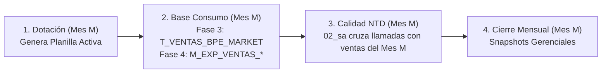
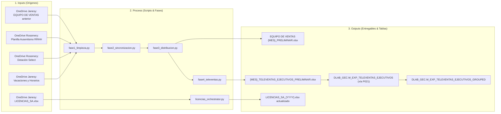
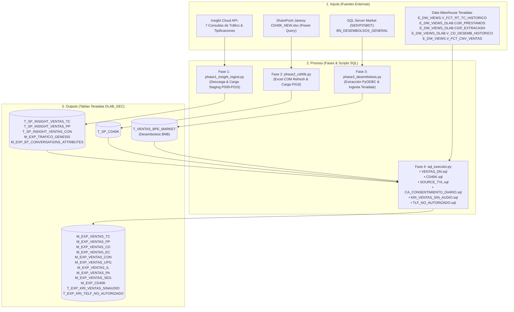
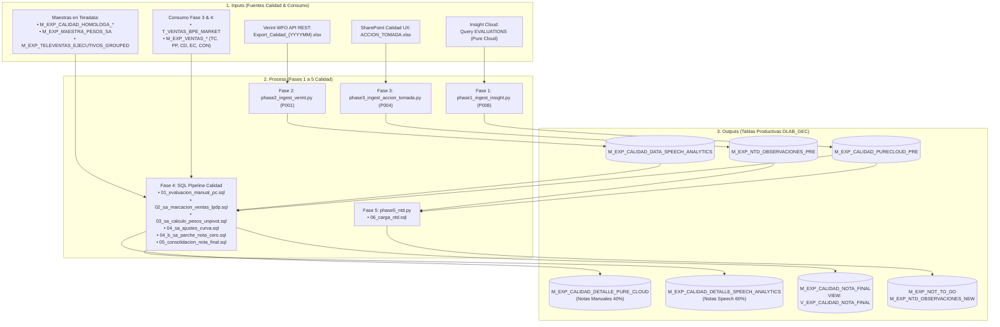
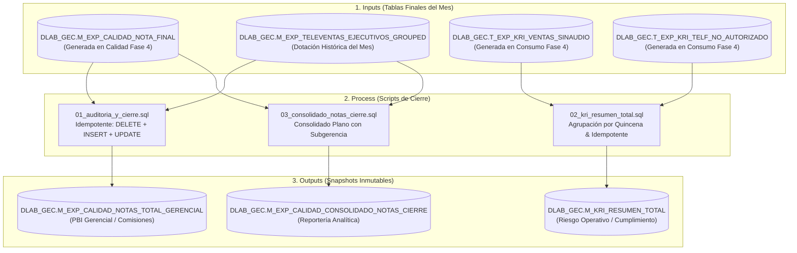
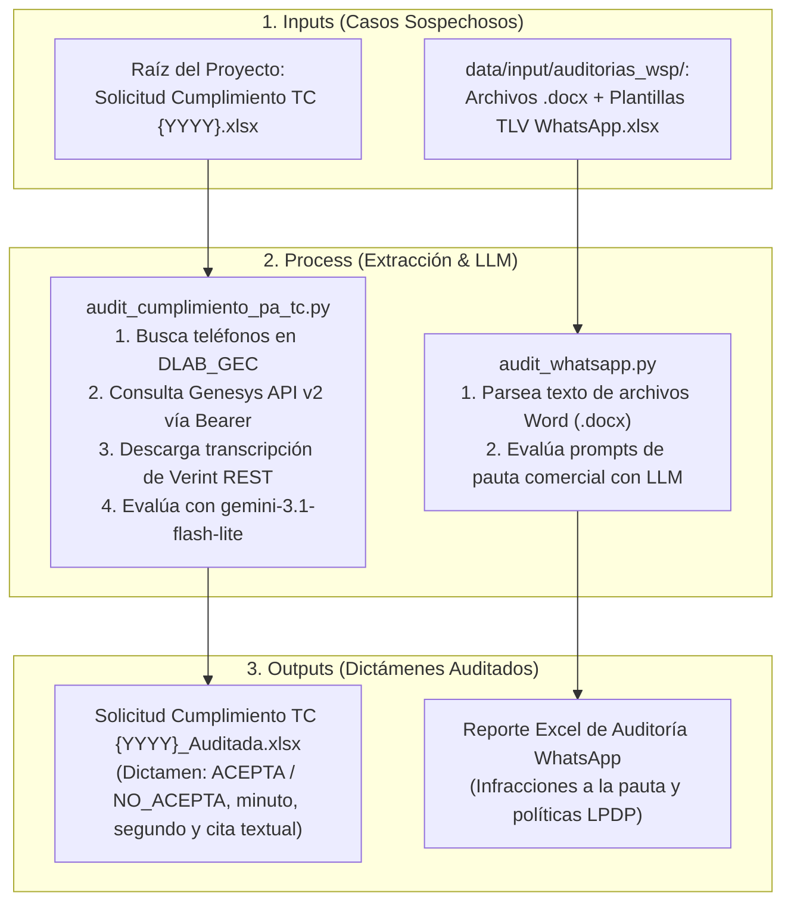

# 🧭 Matriz de Trazabilidad Técnica End-to-End (IPO: Inputs ➔ Process ➔ Outputs)

> **Documento Oficial de Trazabilidad, Auditoría y Linaje de Datos** de la plataforma **`APP_CALIDAD`**.  
> Mapea cada proceso desde su **Origen Identificable (Inputs)**, los **Scripts y Tablas de Transformación (Process)** y los **Entregables / Tablas Productivas (Outputs)**.

---

## ⚠️ Regla de Oro Operativa: Interdependencia de Períodos Mensuales

El pipeline de **Calidad** y el pipeline de **Base Consumo** están fuertemente acoplados por diseño:

> [!CAUTION]
> **NUNCA ejecutar Base Consumo de un mes nuevo (ej. Septiembre) si aún no se ha cerrado la Fase 4 de Calidad del mes previo (ej. Agosto).**  
> Tanto la tabla de desembolsos `DLAB_GEC.T_VENTAS_BPE_MARKET` (cargada en la **Fase 3 de Consumo**) como las tablas maestras `DLAB_GEC.M_EXP_VENTAS_*` (TC, PP, CD, EC, CON - calculadas en la **Fase 4 de Consumo: `VENTAS_DN.sql`**) solo almacenan el mes activo.  
> Si se sobreescriben con el mes nuevo, el script `02_sa_marcacion_ventas_lpdp.sql` de Calidad no encontrará las ventas del mes previo y **anulará las notas de Speech Analytics (SA) de los asesores**.

---

## 📊 Matriz Exhaustiva IPO por Dominio

---

### 1. Dominio: Dotación y Staffing Mensual
* **Frecuencia:** Mensual (Días 25 al 30).
* **Propósito:** Generar el padrón oficial de personal activo, gestionar altas, bajas, antigüedad, vacaciones y repartir las cuotas de evaluación entre los 4 analistas.

| Origen Específico (**Inputs**) | Proceso y Transformación (**Process**) | Entregables y Tablas Finales (**Outputs**) |
| :--- | :--- | :--- |
| **OneDrive Janesy Lopez:** `1. EXPERIENCIA DE COMPRA\EQUIPO DE VENTAS {YYYY}\` • `{M_ANT} EQUIPO DE VENTAS {MES_ANT}.xlsx` | **Fase 1 — Limpieza:** • `modules/dotacion/phases/fase1_limpieza.py` Limpia hoja `AVANCE DIARIO`, filas manuales de `RESULTADOS` (18, 21, 24, 27) y resetea pestañas de productos. | **Libro de Trabajo de Calidad:** • `{M_ACT} EQUIPO DE VENTAS {MES_ACT} {YYYY}_PRELIMINAR.xlsx` *(Celdas protegidas bajo clave para resguardo de fórmulas).* |
| **OneDrive Rossmery / Jacqueline:** `Dotación {YYYY}\Dotación {YYYYMM}\` • `Consolidado Planilla ausentismo {YYYYMM}.xlsx` • `Equipo Select\Dotacion_Ausencias_Select_{Mes}.xlsx` | **Fase 2 — Sincronización Roster:** • `modules/dotacion/phases/fase2_sincronizacion.py` Cruza con planilla RRHH. Marca Bajas (rojo), Altas (amarillo) y calcula antigüedad (`R0` ➔ `R1` ➔ `R2` ➔ `R3`). | **Padrón para Carga a Teradata:** • `{M_ACT} {MES_ACT}_TELEVENTAS_EJECUTIVOS_PRELIMINAR.xlsx` *(Hoja `Hoja2` lista para subir vía cargador web).* |
| **OneDrive Janesy Lopez:** `1. EXPERIENCIA DE COMPRA\GESTIÓN {YYYY}\VACACIONES\` • `Gestión de Vacaciones y Horarios {YYYY}.xlsx` *(Hoja: Programación de Fechas)* | **Fase 3 — Distribución de Cuotas:** • `modules/dotacion/phases/fase3_distribucion.py` Descuenta vacaciones y asigna cuotas de evaluación entre 4 analistas (Karin absorbe +12% en Select; BN_B se reparte primero). | **Tablas Físicas en Teradata (`DLAB_GEC`):** • `M_EXP_TELEVENTAS_EJECUTIVOS` • `M_EXP_TELEVENTAS_EJECUTIVOS_GROUPED` *(Generada por hook automático `process_televentas_grouped` al subir P021).* |
| **OneDrive Janesy Lopez:** `1. EXPERIENCIA DE COMPRA\GESTIÓN {YYYY}\DOTACION\` • `LICENCIAS_SA_{YYYY}.xlsx` | **Fase 4 y Licencias:** • `fase4_televentas.py`: Construye jerarquías supervisor/jefe con fallback dinámico. • `licencias_orchestrator.py`: Sincroniza personal activo y filtra puestos BackOffice permanentes. | **Archivo Maestro de Licencias:** • `LICENCIAS_SA_{YYYY}.xlsx` actualizado en OneDrive. |

---

### 2. Dominio: Base Consumo (Ventas Comerciales y Consentimiento)
* **Frecuencia:** Diaria / Mensual (Ejecución matutina).
* **Propósito:** Centralizar desembolsos, líneas de crédito, tráfico telefónico y evaluar consentimientos de llamadas.

| Origen Específico (**Inputs**) | Proceso y Transformación (**Process**) | Entregables y Tablas Finales (**Outputs**) |
| :--- | :--- | :--- |
| **Insight Cloud (PureCloud API):** • Consultas automáticas: 1. `TRAFICO_GENESYS` 2. `CONV_ATTRIBUTES` 3. `DERIVA_BT` 4. `CLOUD_MARCA_TRANSF` 5. `BT_TRANSFERENCIA` 6. `IVR_VENTAS` 7. `EVALUATIONS` | **Fase 1 (Ingesta Insight):** • `modules/consumo/use_cases/phases/phase1_insight_ingest.py` Descarga reportes crudos, formatea tipos de datos con Polars y sube a Teradata usando plantillas `P009` a `P015`. | **Tablas Staging Teradata (`DLAB_GEC`):** • `M_EXP_TRAFICO_GENESIS` • `M_EXP_BT_CONVERSATIONS_ATTRIBUTES` • `M_EXP_DERIVA_BT_TIEMPOS` • `M_EXP_CO_CLOUD_MARCA_TRASNFERENCIA_PRE` • `M_DERIVA_BT_EV_TRANSFERENCIA` • `M_EXP_IVR_VENTAS_2022` |
| **SharePoint Janesy Lopez:** • Libro Excel: `CD40K_NEW.xlsx` *(Conexiones Power Query a bases de riesgo)* | **Fase 2 (Refresh SharePoint CD40K):** • `modules/consumo/use_cases/phases/phase2_cd40k.py` Ejecuta refresco en background vía Excel COM API (`RefreshAll`), limpia con Polars y sube a Teradata con plantilla `P016-CD40K`. | **Tabla de Líneas CD40K (`DLAB_GEC`):** • `T_SP_CD40K` |
| **SQL Server Market (`S83VP2\BDT`):** • Base de Datos: `BDT` • Tabla física: `BN_DESEMBOLSOS_GENERAL` | **Fase 3 (Extracción Desembolsos):** • `modules/consumo/use_cases/phases/phase3_desembolsos.py` Conecta vía PyODBC, extrae desembolsos del período con Polars y carga en Teradata con `clear_table=True`. | **Tabla Desembolsos BNB (`DLAB_GEC`):** • `T_VENTAS_BPE_MARKET` *(Crucial: se sobreescribe aquí en Fase 3).* |
| **Vistas Data Warehouse Teradata:** • `E_DW_VIEWS.V_FCT_RT_TC_HISTORICO` • `E_DW_VIEWS_DLAB.CGR_PRESTAMOS` • `E_DW_VIEWS_DLAB.CGR_EXTRACASH` • `E_DW_VIEWS_DLAB.V_CD_DESEMB_HISTORICO` • `E_DW_VIEWS.V_FCT_CNV_VENTAS` • `E_DW_VIEWS_DLAB.CGR_UPGRADE_HST` • `E_DW_VIEWS_DLAB.CGR_INC_LINEA_HST` • `E_DW_VIEWS_DLAB.V_CGR_PAGO_AUTOMATICO` • `E_DW_VIEWS_DLAB.V_DLAB_CGR_SEGUROS_VENTAS` | **Fase 4 (Scripts SQL Consumo):** • `modules/consumo/sql/` 1. `VENTAS_DN.sql`: Cruza DW con padrón de dotación y extrae ventas oficiales del mes. 2. `CD40K.sql`: Cruza `M_EXP_VENTAS_CD` con `T_SP_CD40K` y montos > 40K. 3. `SOURCE_TVL.sql`: Cruce de consentimientos. 4. `CA_CONSENTIMIENTO_DIARIO.sql` 5. `KRI_VENTAS_SIN_AUDIO.sql` 6. `TLF_NO_AUTORIZADO.sql` | **Tablas Maestras de Ventas del Mes (`DLAB_GEC`):** • `M_EXP_VENTAS_TC` • `M_EXP_VENTAS_PP` • `M_EXP_VENTAS_CD` • `M_EXP_VENTAS_EC` • `M_EXP_VENTAS_CON` • `M_EXP_VENTAS_UPG` • `M_EXP_VENTAS_IL` • `M_EXP_VENTAS_PA` • `M_EXP_VENTAS_SEG` • `M_EXP_CD40K` **Tablas Intermedias KRI:** • `T_EXP_KRI_VENTAS_SINAUDIO` • `T_EXP_KRI_TELF_NO_AUTORIZADO` |

---

### 3. Dominio: Proceso Calidad NTD y Speech Analytics
* **Frecuencia:** Semanal / Cierre Mensual.
* **Propósito:** Consolidar evaluaciones manuales (Pure Cloud) y automáticas (Speech Analytics Verint), aplicar calibraciones y alimentar el reporte No Te Dejes (NTD).

| Origen Específico (**Inputs**) | Proceso y Transformación (**Process**) | Entregables y Tablas Finales (**Outputs**) |
| :--- | :--- | :--- |
| **Insight Cloud:** • Query `EVALUATIONS` *(Formularios calificados por auditores)* | **Fase 1 — Ingesta Pure Cloud:** • `phase1_ingest_insight.py` Descarga llamadas calificadas del mes y carga con plantilla `P008-INSIGHT_07_EVALUATIONS`. | **Staging Pure Cloud (`DLAB_GEC`):** • `M_EXP_CALIDAD_PURECLOUD_PRE` |
| **Verint WFO Speech Analytics:** • API REST Directa (`export_televentas_period`) • Archivo: `Export_Calidad_{YYYYMM}.xlsx` | **Fase 2 — Ingesta Speech Analytics:** • `phase2_ingest_verint.py` Descarga transcripciones evaluadas por sofIA y carga con plantilla `P001-SPEECH_ANALYTICS`. | **Staging Speech Analytics (`DLAB_GEC`):** • `M_EXP_CALIDAD_DATA_SPEECH_ANALYTICS` |
| **SharePoint Calidad UX / Vanessa:** • Archivo: `ACCION_TOMADA.xlsx` *(Observaciones de auditoría operativa)* | **Fase 3 — Ingesta Acción Tomada:** • `phase3_ingest_accion_tomada.py` Deduplica por severidad de error (`CRITICA` > `ALTA` > `MEDIA`) y carga con plantilla `P004-ACCION_TOMADA`. | **Staging Observaciones NTD (`DLAB_GEC`):** • `M_EXP_NTD_OBSERVACIONES_PRE` |
| **Cruces Clave en Fase 4:** • Tablas de Consumo: `T_VENTAS_BPE_MARKET` + `M_EXP_VENTAS_*` • Dotación: `M_EXP_TELEVENTAS_EJECUTIVOS_GROUPED` • Maestra: `M_EXP_MAESTRA_PESOS_SA` | **Fase 4 — Transformación SQL Calidad:** • `01_evaluacion_manual_pc.sql`: Extrae `NUM_EVALUACION` y calcula notas PC. • `02_sa_marcacion_ventas_lpdp.sql`: **Cruza llamadas Verint con ventas del mes** asignando `NEVALUACION` 1 o 2. • `03_sa_calculo_pesos_unpivot.sql`: Unpivot y promedio `AVG()` de métricas SA. • `04_sa_ajustes_curva.sql`: Multiplica por Maestra de Pesos, aplica curvas y tope 0.6. • `04_b_sa_parche_nota_cero.sql`: Inyecta nota de sala a asesores sin llamadas SA. • `05_consolidacion_nota_final.sql`: Consolida PC (0.4) + SA (0.6) = 1.0 (o 100% PC para Select). | **Tablas Productivas de Calidad (`DLAB_GEC`):** • `M_EXP_CALIDAD_DETALLE_PURE_CLOUD` • `M_EXP_CALIDAD_DETALLE_SPEECH_ANALYTICS` • `M_EXP_CALIDAD_NOTA_FINAL` • Vista: `V_EXP_CALIDAD_NOTA_FINAL` *(Alimenta directamente al Power BI de Calidad).* |
| **Staging NTD + Detalle Pure Cloud** | **Fase 5 — Reporte No Te Dejes (NTD):** • `phase5_ntd.py` ➔ `06_carga_ntd.sql` Cruza errores detectados contra reglas de fraude y no conformidades. | **Tablas Históricas NTD (`DLAB_GEC`):** • `M_EXP_NOT_TO_DO` • `M_EXP_NTD_OBSERVACIONES_NEW` |

---

### 4. Dominio: Cierre Mensual y KRIs Operativos
* **Frecuencia:** Mensual (Días 1 al 5 del mes vencido).
* **Propósito:** Congelar las notas oficiales definitivas por jerarquía para pago de comisiones y consolidar métricas KRI para Cumplimiento Normativo.

| Origen Específico (**Inputs**) | Proceso y Transformación (**Process**) | Entregables y Tablas Finales (**Outputs**) |
| :--- | :--- | :--- |
| **Teradata Calidad:** • `DLAB_GEC.M_EXP_CALIDAD_NOTA_FINAL` **Teradata Dotación:** • `DLAB_GEC.M_EXP_TELEVENTAS_EJECUTIVOS_GROUPED` | **Script 01 (Auditoría y Cierre):** • `modules/cierre/sql/01_auditoria_y_cierre.sql` Limpia registros previos del período cerrado, copia notas de evaluación y hace `UPDATE` de Asesor, Supervisor, Jefe y Equipo desde `GROUPED`. | **Snapshot Gerencial Oficial:** • `DLAB_GEC.M_EXP_CALIDAD_NOTAS_TOTAL_GERENCIAL` *(Fuente oficial inmutable para cálculo de comisiones y PBI "CALIDAD de servicios").* |
| **Teradata Consumo / KRIs:** • `DLAB_GEC.T_EXP_KRI_VENTAS_SINAUDIO` • `DLAB_GEC.T_EXP_KRI_TELF_NO_AUTORIZADO` | **Script 02 (KRI Resumen Total):** • `modules/cierre/sql/02_kri_resumen_total.sql` Totaliza llamadas sin audio y teléfonos no autorizados por quincena para el período cerrado. | **Resumen Definitivo de Riesgos:** • `DLAB_GEC.M_KRI_RESUMEN_TOTAL` *(Entregable normativo a Riesgo Operativo).* |
| **Teradata Calidad + Dotación** | **Script 03 (Consolidado Notas Cierre):** • `modules/cierre/sql/03_consolidado_notas_cierre.sql` Genera tabla plana con desglose por Subgerencia, Negocio, Jefe y Asesor. | **Consolidado Analítico:** • `DLAB_GEC.M_EXP_CALIDAD_CONSOLIDADO_NOTAS_CIERRE` |

---

### 5. Dominio: Auditorías Cognitivas IA (Gemini LLM)
* **Frecuencia:** Mensual / A demanda.
* **Propósito:** Auditoría automática de grabaciones y chats de WhatsApp con modelos Gemini LLM para detectar vicios de consentimiento y corroborar reclamos.

---

## 📋 Cuadro Resumen de Entidades: Dónde se Crea y Quién la Consume

| Tabla Teradata (`DLAB_GEC`) | Módulo / Fase que la CREA / PUEBLA | Módulo / Proceso que la CONSUME | Tipo de Persistencia |
| :--- | :--- | :--- | :--- |
| `M_EXP_TELEVENTAS_EJECUTIVOS` | Dotación (Fase 4 ➔ Web P021) | Consumo (Fase 4), Calidad (Fase 4) | **Mensual Activa** *(Se sobreescribe con cada carga P021)* |
| `M_EXP_TELEVENTAS_EJECUTIVOS_GROUPED` | Hook post-carga de P021 | Calidad (Fase 4: 04, 04_b, 05), Cierre (01, 03) | **Histórica Particionada** (`WHERE PERIODO = '{PERIODO}'`) |
| `T_SP_CD40K` | Consumo (Fase 2: `phase2_cd40k.py`) | Consumo (Fase 4: `CD40K.sql`) | **Temporal Activa** *(Líneas > 40K del mes)* |
| `T_VENTAS_BPE_MARKET` | Consumo (Fase 3: `phase3_desembolsos.py`) | Consumo (Fase 4), Calidad (Fase 4: `02_sa`) | **Temporal Activa** *(Desembolsos BNB del mes)* |
| `M_EXP_VENTAS_*` (TC, PP, CD, EC, CON...) | Consumo (Fase 4: `VENTAS_DN.sql`) | Calidad (Fase 4: `02_sa_marcacion_ventas_lpdp.sql`) | **Temporal Activa** *(Ventas comerciales del mes)* |
| `M_EXP_CALIDAD_PURECLOUD_PRE` | Calidad (Fase 1: `phase1_ingest_insight.py`) | Calidad (Fase 4: `01_evaluacion_manual_pc.sql`) | **Temporal Activa** *(Llamadas calificadas del mes)* |
| `M_EXP_CALIDAD_DATA_SPEECH_ANALYTICS` | Calidad (Fase 2: `phase2_ingest_verint.py`) | Calidad (Fase 4: `02_sa_marcacion_ventas_lpdp.sql`) | **Temporal Activa** *(Transcripciones Verint del mes)* |
| `M_EXP_CALIDAD_DETALLE_PURE_CLOUD` | Calidad (Fase 4: `01_evaluacion_manual_pc.sql`) | Calidad (Fase 4: `05_consolidacion`), NTD (Fase 5) | **Histórica Particionada** (`WHERE PERIODO = '{PERIODO}'`) |
| `M_EXP_CALIDAD_DETALLE_SPEECH_ANALYTICS` | Calidad (Fase 4: `04_sa_ajustes_curva.sql`) | Calidad (Fase 4: `05_consolidacion`) | **Histórica Particionada** (`WHERE PERIODO = '{PERIODO}'`) |
| `M_EXP_CALIDAD_NOTA_FINAL` | Calidad (Fase 4: `05_consolidacion_nota_final.sql`) | Cierre Mensual (`01_auditoria`, `03_consolidado`), PBI | **Histórica Particionada** (`WHERE PERIODO = '{PERIODO}'`) |
| `M_EXP_CALIDAD_NOTAS_TOTAL_GERENCIAL` | Cierre Mensual (`01_auditoria_y_cierre.sql`) | **Power BI "CALIDAD de servicios" (Oficial)** | **Histórica Particionada Inmutable** |
| `M_KRI_RESUMEN_TOTAL` | Cierre Mensual (`02_kri_resumen_total.sql`) | Oficialía de Cumplimiento / Riesgos | **Histórica Particionada Inmutable** |
