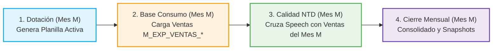

# 🧭 Matriz de Trazabilidad End-to-End (IPO: Inputs ➔ Process ➔ Outputs)

> **Documento de Trazabilidad Operativa y Técnica** para asegurar el control de dependencias, auditoría y orden de ejecución entre módulos de la plataforma **`APP_CALIDAD`**.

---

## ⚠️ Regla de Oro Operativa: Interdependencia de Períodos Mensuales

El pipeline de **Calidad** y el pipeline de **Base Consumo** están acoplados en tiempo de ejecución:


> [!CAUTION]
> **NUNCA ejecutar Base Consumo de un mes nuevo (ej. Septiembre) si aún no se ha cerrado la Fase 4 de Calidad del mes previo (ej. Agosto).**  
> Tanto la tabla de desembolsos `DLAB_GEC.T_VENTAS_BPE_MARKET` (cargada en la **Fase 3 de Consumo**) como las tablas de colocaciones `DLAB_GEC.M_EXP_VENTAS_*` (TC, PP, CD, EC, CON - calculadas en la **Fase 4 de Consumo**) solo almacenan el mes activo. Si se corre la Fase 3 o Fase 4 de Consumo con el mes nuevo, se pisan los datos y el script `02_sa_marcacion_ventas_lpdp.sql` no encontrará las ventas del mes previo, **anulando las notas de Speech Analytics de los asesores (tanto de BNB como de los demás productos)**.

---

## 📊 Matriz Detallada IPO por Dominio

### 1. Dominio: Dotación y Staffing Mensual
* **Frecuencia:** Mensual (Días 25 al 30 de cada mes).
* **Propósito:** Definir el padrón de ejecutivos activos, altas, bajas, antigüedad, vacaciones y cuotas de evaluación para los 4 analistas de calidad.

| Insumo de Entrada (**Inputs**) | Proceso y Transformación (**Process**) | Entregables y Tablas Finales (**Outputs**) |
| :--- | :--- | :--- |
| **Origen:** OneDrive Janesy Lopez<br/>`1. EXPERIENCIA DE COMPRA\EQUIPO DE VENTAS {YYYY}\`<br/>• `{M_ANT} EQUIPO DE VENTAS {MES_ANT} {Y_ANT}.xlsx` | **1. Limpieza de Hojas:**<br/>• `fase1_limpieza.py`: Limpia `AVANCE DIARIO`, filas manuales de `RESULTADOS` (18, 21, 24, 27) y hojas de productos. | **Libro de Trabajo de Calidad:**<br/>• `{M_ACT} EQUIPO DE VENTAS {MES_ACT} {YYYY}_PRELIMINAR.xlsx`<br/>*(Con hojas bloqueadas por celda para evitar alteración de fórmulas)* |
| **Origen:** OneDrive Rossmery / Jacqueline<br/>`Dotación {YYYY}\Dotación {YYYYMM}\`<br/>• `Consolidado Planilla ausentismo {YYYYMM}.xlsx`<br/>• `Equipo Select\Dotacion_Ausencias_Select_{Mes}.xlsx` | **2. Sincronización Roster:**<br/>• `fase2_sincronizacion.py`: Cruza planilla oficial RRHH, detecta Bajas (rojo), Altas (amarillo) y calcula antigüedad (R0 ➔ R1 ➔ R2 ➔ R3). | **Archivo para Teradata:**<br/>• `{M_ACT} {MES_ACT}_TELEVENTAS_EJECUTIVOS_PRELIMINAR.xlsx` |
| **Origen:** OneDrive Janesy Lopez<br/>`1. EXPERIENCIA DE COMPRA\GESTIÓN {YYYY}\VACACIONES\`<br/>• `Gestión de Vacaciones y Horarios {YYYY}.xlsx` | **3. Reparto de Cuotas:**<br/>• `fase3_distribucion.py`: Descuenta días hábiles por vacaciones y distribuye cuotas entre 4 analistas (Karin absorbe +12% en Select; BN_B se reparte primero). | **Tablas Teradata (`DLAB_GEC`):**<br/>• `M_EXP_TELEVENTAS_EJECUTIVOS` *(vía carga web P021)*<br/>• `M_EXP_TELEVENTAS_EJECUTIVOS_GROUPED` *(generada por hook post-carga)* |
| **Origen:** OneDrive Janesy Lopez<br/>`1. EXPERIENCIA DE COMPRA\GESTIÓN {YYYY}\DOTACION\`<br/>• `LICENCIAS_SA_{YYYY}.xlsx` | **4. Sincronización Licencias SA:**<br/>• `licencias_orchestrator.py`: Filtra BackOffice y asigna licencias activas de Verint Speech Analytics. | **Libro de Licencias:**<br/>• `LICENCIAS_SA_{YYYY}.xlsx` *(Actualizado en OneDrive)* |

---

### 2. Dominio: Base Consumo (Ventas Comerciales y Consentimiento)
* **Frecuencia:** Diaria / Mensual (Ejecutar en la mañana).
* **Propósito:** Centralizar las ventas de todos los canales de televentas, líneas aprobadas y desembolsos para el cálculo de conversión y calidad.

| Insumo de Entrada (**Inputs**) | Proceso y Transformación (**Process**) | Entregables y Tablas Finales (**Outputs**) |
| :--- | :--- | :--- |
| **Origen:** Insight Cloud (PureCloud API)<br/>• 7 Consultas automatizadas de llamadas y tipificaciones de venta | **Fase 1 (Ingesta Insight):**<br/>• `phase1_insight_ingest.py`: Descarga y formatea llamadas.<br/>• Carga staging en Teradata (`P009-P015`). | **Tablas Staging Teradata:**<br/>• `DLAB_GEC.T_SP_INSIGHT_VENTAS_TC`<br/>• `DLAB_GEC.T_SP_INSIGHT_VENTAS_PP`<br/>• `DLAB_GEC.T_SP_INSIGHT_VENTAS_CON` |
| **Origen:** SharePoint Janesy Lopez<br/>• `CD40K_NEW.xlsx`<br/>*(Líneas de Crédito Digital > 40K)* | **Fase 2 (CD40K SharePoint Refresh):**<br/>• `phase2_cd40k.py`: Actualiza conexiones SharePoint vía Excel COM/Power Query.<br/>• Carga en Teradata con plantilla `P016-CD40K`. | **Tabla Líneas CD40K:**<br/>• `DLAB_GEC.T_SP_CD40K` |
| **Origen:** SQL Server Market (`S83VP2\BDT`)<br/>• Tabla `BN_DESEMBOLSOS_GENERAL` | **Fase 3 (Extracción Desembolsos):**<br/>• `phase3_desembolsos.py`: Conecta a SQL Server y extrae desembolsos de BPE Market.<br/>• Carga en Teradata con plantilla `P017-BPE_MARKET`. | **Tabla Desembolsos BPE:**<br/>• `DLAB_GEC.T_VENTAS_BPE_MARKET` |
| **Origen:** Teradata Staging + SQL Server + Padrón Ejecutivos | **Fase 4 (Pipeline SQL Consumo):**<br/>• `01_limpieza_staging.sql`<br/>• `02_homologacion_canales.sql`<br/>• `03_cruce_desembolsos.sql`<br/>• `04_ventas_dn.sql` / `cd40k.sql` *(Cruza con `M_EXP_TELEVENTAS_EJECUTIVOS` para filtrar por `SUB_EQUIPO`)* | **Tablas Maestras de Ventas Diarias:**<br/>• `DLAB_GEC.M_EXP_VENTAS_TC`<br/>• `DLAB_GEC.M_EXP_VENTAS_PP`<br/>• `DLAB_GEC.M_EXP_VENTAS_CD`<br/>• `DLAB_GEC.M_EXP_VENTAS_EC`<br/>• `DLAB_GEC.M_EXP_VENTAS_CON`<br/>• `DLAB_GEC.M_EXP_CONSUMO_SELECT_TC_CD_SEG` |

---

### 3. Dominio: Proceso Calidad NTD y Speech Analytics
* **Frecuencia:** Semanal / Cierre Mensual.
* **Propósito:** Calcular notas de evaluaciones manuales (Pure Cloud), transcripciones analíticas (Verint Speech Analytics), aplicar curvas de calibración e identificar errores críticos (No Te Dejes).

| Insumo de Entrada (**Inputs**) | Proceso y Transformación (**Process**) | Entregables y Tablas Finales (**Outputs**) |
| :--- | :--- | :--- |
| **Origen:** Insight Cloud<br/>• Consulta de formularios evaluados por analistas de calidad en Genesys | **Fase 1 (Ingesta Insight):**<br/>• `phase1_ingest_insight.py`: Descarga notas de Pure Cloud.<br/>• Carga con plantilla `P008-INSIGHT_CALIDAD`. | **Staging Evaluaciones Pure Cloud:**<br/>• `DLAB_GEC.M_EXP_CALIDAD_PURECLOUD_PRE` |
| **Origen:** Verint WFO REST API / Web<br/>• Archivos `Export_Calidad_{YYYYMM}.xlsx`<br/>*(Llamadas analizadas por Speech Analytics)* | **Fase 2 (Ingesta Verint SA):**<br/>• `phase2_ingest_verint.py`: Descarga vía API REST / sesión cosechada.<br/>• Carga con plantilla `P001-SPEECH_ANALYTICS`. | **Staging Speech Analytics:**<br/>• `DLAB_GEC.M_EXP_CALIDAD_DATA_SPEECH_ANALYTICS` |
| **Origen:** SharePoint Vanessa Ortega / Calidad UX<br/>• `ACCION_TOMADA.xlsx`<br/>*(Tipificaciones de errores y severidad)* | **Fase 3 (Ingesta Acción Tomada):**<br/>• `phase3_ingest_accion_tomada.py`: Deduplica por severidad (`CRÍTICA` > `ALTA` > `MEDIA`).<br/>• Carga con plantilla `P004-ACCION_TOMADA`. | **Staging Observaciones NTD:**<br/>• `DLAB_GEC.M_EXP_NTD_OBSERVACIONES_PRE` |
| **Origen:** Teradata Staging Calidad + Tablas de Ventas Consumo | **Fase 4 (Pipeline SQL Calidad):**<br/>• `01_evaluacion_manual_pc.sql`: Homologa preguntas y calcula notas PC (peso 40%).<br/>• `02_sa_marcacion_ventas_lpdp.sql`: Cruza llamadas de Verint con ventas de `M_EXP_VENTAS_*` (quincena 1 o 2).<br/>• `03_sa_calculo_pesos_unpivot.sql`: Unpivot de categorías SA.<br/>• `04_sa_ajustes_curva.sql`: Cruza con `M_EXP_MAESTRA_PESOS_SA`, aplica curvas y tope 0.6.<br/>• `04_b_sa_parche_nota_cero.sql`: Inyecta nota de sala a casos vacíos.<br/>• `05_consolidacion_nota_final.sql`: Suma PC (0.4) + SA (0.6) = 1.0 (o 100% PC para Select). | **Tablas Productivas de Calidad:**<br/>• `DLAB_GEC.M_EXP_CALIDAD_DETALLE_PURE_CLOUD`<br/>• `DLAB_GEC.M_EXP_CALIDAD_DETALLE_SPEECH_ANALYTICS`<br/>• `DLAB_GEC.M_EXP_CALIDAD_NOTA_FINAL`<br/>• Vista: `DLAB_GEC.V_EXP_CALIDAD_NOTA_FINAL` |
| **Origen:** Staging NTD + Detalle PC | **Fase 5 (Pipeline NTD):**<br/>• `06_carga_ntd.sql`: Cruce de errores detectados contra reglas No Te Dejes. | **Tablas NTD:**<br/>• `DLAB_GEC.M_EXP_NOT_TO_DO`<br/>• `DLAB_GEC.M_EXP_NTD_OBSERVACIONES_NEW` |

---

### 4. Dominio: Cierre Mensual y KRIs Operativos
* **Frecuencia:** Mensual (Día 1 al 5 del mes siguiente).
* **Propósito:** Generar la fotografía congelada e inmutable de notas gerenciales para pago de comisiones y reporte oficial de riesgos KRI.

| Insumo de Entrada (**Inputs**) | Proceso y Transformación (**Process**) | Entregables y Tablas Finales (**Outputs**) |
| :--- | :--- | :--- |
| **Origen:** Teradata Calidad<br/>• `DLAB_GEC.M_EXP_CALIDAD_NOTA_FINAL`<br/>**Origen:** Teradata Dotación<br/>• `DLAB_GEC.M_EXP_TELEVENTAS_EJECUTIVOS_GROUPED` | **Script 01 (Auditoría y Cierre):**<br/>• `01_auditoria_y_cierre.sql`: Copia notas finales del período `{PERIODO}` y actualiza nombres de Asesor, Supervisor, Jefe y Subgerente desde `GROUPED`. | **Snapshot Gerencial Oficial:**<br/>• `DLAB_GEC.M_EXP_CALIDAD_NOTAS_TOTAL_GERENCIAL`<br/>*(Consumido por Power BI "CALIDAD de servicios")* |
| **Origen:** Teradata KRIs Base<br/>• `DLAB_GEC.T_EXP_KRI_VENTAS_SINAUDIO`<br/>• `DLAB_GEC.T_EXP_KRI_TELF_NO_AUTORIZADO` | **Script 02 (KRI Resumen Total):**<br/>• `02_kri_resumen_total.sql`: Agrupa total de ventas sin audio y marcaciones a teléfonos no consentidos por quincena. | **Tabla KRI Riesgos:**<br/>• `DLAB_GEC.M_KRI_RESUMEN_TOTAL`<br/>*(Reporte mensual a Oficialía de Cumplimiento)* |
| **Origen:** Teradata Calidad + Dotación Histórica | **Script 03 (Consolidado Notas Cierre):**<br/>• `03_consolidado_notas_cierre.sql`: Consolida detalle asesor por asesor con jerarquía de canal para reportería plana. | **Consolidado Analítico:**<br/>• `DLAB_GEC.M_EXP_CALIDAD_CONSOLIDADO_NOTAS_CIERRE` |

---

### 5. Dominio: Auditorías IA Especializadas (Gemini LLM)
* **Frecuencia:** Mensual / A demanda.
* **Propósito:** Auditoría cognitiva automática de consentimientos forzados o ventas sin aceptación del cliente en grabaciones y chats.

| Insumo de Entrada (**Inputs**) | Proceso y Transformación (**Process**) | Entregables y Tablas Finales (**Outputs**) |
| :--- | :--- | :--- |
| **Origen:** Raíz del proyecto<br/>• `Solicitud Cumplimiento TC {YYYY}.xlsx`<br/>*(Base de clientes reclamantes o sospechosos)* | **Auditoría PA-TC (Pago Automático):**<br/>• `audit_cumplimiento_pa_tc.py`:<br/>1. Extrae teléfonos desde Teradata.<br/>2. Busca UUID de llamada en Genesys Cloud API.<br/>3. Descarga transcripción turno a turno desde Verint.<br/>4. Evalúa con Gemini LLM (`gemini-3.1-flash-lite`). | **Archivo Excel Dictaminado:**<br/>• `Solicitud Cumplimiento TC {YYYY}_Auditada.xlsx`<br/>*(Con clasificación: `ACEPTA`, `NO_ACEPTA`, minuto y segundo exacto de la negativa y cita textual)* |
| **Origen:** `data/input/auditorias_wsp/`<br/>• Archivos `.docx` de conversaciones de WhatsApp<br/>• `Plantillas TLV WhatsApp.xlsx` | **Auditoría WhatsApp:**<br/>• `audit_whatsapp.py`: Parser de documentos de chat + evaluación de prompts bancarios vía LLM. | **Reporte de Auditoría WhatsApp:**<br/>• Excel con desglose de infracciones a la pauta comercial y políticas LPDP. |

---

## 🔗 Resumen Rápido de Dependencias entre Tablas

```text
[Dotación: Excel Roster] ➔ M_EXP_TELEVENTAS_EJECUTIVOS ➔ M_EXP_TELEVENTAS_EJECUTIVOS_GROUPED
                                    │                                      │
                                    ▼                                      ▼
[Consumo: SQL Server / SharePoint] ➔ M_EXP_VENTAS_* (TC, PP, CD, BNB...)   │
                                    │                                      │
                                    ▼                                      ▼
[Calidad: Pure Cloud + Verint SA] ➔ 02_sa_marcacion_ventas_lpdp.sql        │
                                    │                                      │
                                    ▼                                      │
                            M_EXP_CALIDAD_NOTA_FINAL                       │
                                    │                                      │
                                    └───────────────────┬──────────────────┘
                                                        ▼
                                       01_auditoria_y_cierre.sql
                                       03_consolidado_notas_cierre.sql
                                                        │
                                                        ▼
                                    M_EXP_CALIDAD_NOTAS_TOTAL_GERENCIAL (Cierre Definitivo)
```
