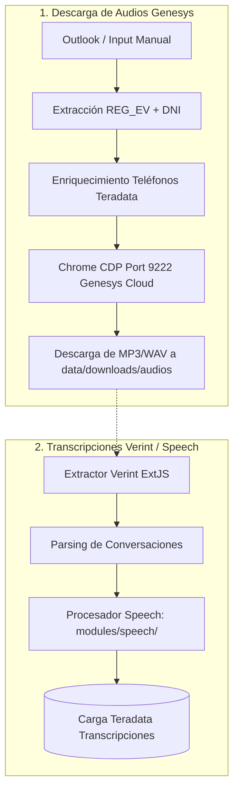

# 🎧 Pipeline: Audios Genesys y Transcripciones Speech Analytics

Este documento describe la arquitectura para la **descarga de audios** y la ingesta de **transcripciones**.

---

## 📊 Diagrama de Flujo

---

## 🛠️ Servicios y Scripts Involucrados

### A. Descarga de Audios Genesys
- **Disparador Web:** `POST /api/genesys/start-download` en [main.py:L260](../../backend/main.py).
- **Disparador CLI:** [run_genesys_download.py:L1](../../modules/genesys/tools/run_genesys_download.py).
- **Lector Outlook:** [outlook_service.py:L1](../../modules/genesys/services/outlook_service.py) (extrae REG_EV y DNI desde correo vía `pywin32`).
- **Descargador CDP:** [downloader.py:L1](../../modules/genesys/services/downloader.py) (automatiza navegador en puerto 9222).
- **Destino:** `data/downloads/audios/{PERIODO}/`.

### B. Transcripciones Verint y Speech Analytics
- **Disparador Web:** `POST /api/speech/sync` en [main.py:L244](../../backend/main.py).
- **Extracción de Transcripciones:**
  - Script CLI: [download_transcripts_from_verint.py:L1](../../modules/verint/tools/download_transcripts_from_verint.py)
  - Extractor: [verint_transcript_extractor.py:L1](../../modules/verint/transcripciones/extractors/verint_transcript_extractor.py)
  - Cosechador de Sesión/Cookies: [verint_cookie_harvester.py:L1](../../modules/verint/services/verint_cookie_harvester.py)
  - Carpeta de Descarga: `data/transcripciones/*.txt`
- **Orquestador Speech Analytics:**
  - Script CLI: [run_sync_speech.py:L1](../../modules/speech/tools/run_sync_speech.py)
  - Orquestador: [speech_orchestrator.py:L1](../../modules/speech/use_cases/speech_orchestrator.py)
  - Enriquecimiento TIPO_LEAD: [insight_lead_service.py:L1](../../modules/speech/services/insight_lead_service.py)
  - Extracción de IDs: [01_extract_conid_tc.sql:L1](../../modules/speech/sql/01_extract_conid_tc.sql)
  - Carga a Base de Datos: [speech_repository.py:L1](../../infrastructure/database/repositories/speech_repository.py) y [sql_transcript_importer.py:L1](../../infrastructure/database/sql_transcript_importer.py)
  - Destino Final: SQL Server `DB_SPEECH.TRANSCRIPCION`.
- **Auditoría de Transcripciones:** [run_transcript_audit.py:L1](../../modules/verint/tools/run_transcript_audit.py).

---

## 🔍 Trazabilidad Completa
Para una matriz consolidada con variables de entorno `.env` y flujos de los demás módulos, ver:
👉 **[trazabilidad_end_to_end.md:L1](../data/trazabilidad_end_to_end.md)**.

