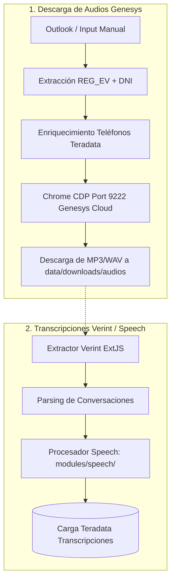

# 🎧 Pipeline: Audios Genesys y Transcripciones Speech Analytics

Este documento describe la arquitectura para la **descarga de audios** y la ingesta de **transcripciones**.

---

## 📊 Diagrama de Flujo

---

## 🛠️ Servicios Involucrados

- **`OutlookService` (`modules/genesys/services/outlook_service.py`):** Lector MAPI vía `pywin32`.
- **`GenesysDownloader` (`modules/genesys/services/downloader.py`):** Automatización vía Chrome DevTools Protocol.
- **`VerintTranscriptExtractor` (`modules/verint/transcripciones/extractors/verint_transcript_extractor.py`):** Extracción de texto e interacciones.
