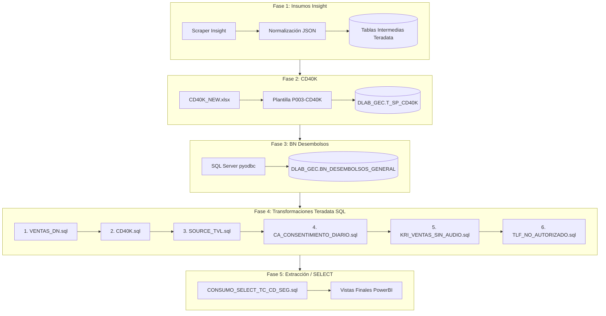

# ⚡ Pipeline: PBI Base Consumo

Este documento describe la arquitectura, fases e insumos del pipeline **PBI Base Consumo**, responsable del cálculo de métricas de ventas y KRI.

---

## 📊 Diagrama de Flujo del Pipeline

---

## 📋 Matriz de Insumos y Fases

| Fase | Nombre | Insumo Principal | Ubicación / Fuente | Obligatoriedad |
| :---: | :--- | :--- | :--- | :---: |
| **1** | Insight | 7 Reportes Insight | Descarga automatizada Scraper | Opcional |
| **2** | CD40K | `CD40K_NEW.xlsx` | `data/input/base_consumo/` | Opcional |
| **3** | Desembolsos | Base Desembolsos | SQL Server Corporativo | Opcional |
| **4** | Proceso SQL | Scripts SQL 01 a 06 | `modules/consumo/infrastructure/sql/` | **Indispensable** |
| **5** | SELECT | Querys de colocación | Teradata `DLAB_GEC` | **Indispensable** |

---

## 🛠️ Scripts SQL en Fase 4

1. **`01_VENTAS_DN.sql`**: Consolida ventas diarias y normaliza canales.
2. **`02_CD40K.sql`**: Cruza colocaciones con base de campañas CD40K.
3. **`03_SOURCE_TVL.sql`**: Integra fuentes de televentas y orígenes de leads.
4. **`04_CA_CONSENTIMIENTO_DIARIO.sql`**: Verifica consentimiento de tratamiento de datos personales.
5. **`05_KRI_VENTAS_SIN_AUDIO.sql`**: Identifica ventas sin grabación de audio asociada.
6. **`06_TLF_NO_AUTORIZADO.sql`**: Filtra gestiones sobre teléfonos no autorizados en listas negras.
