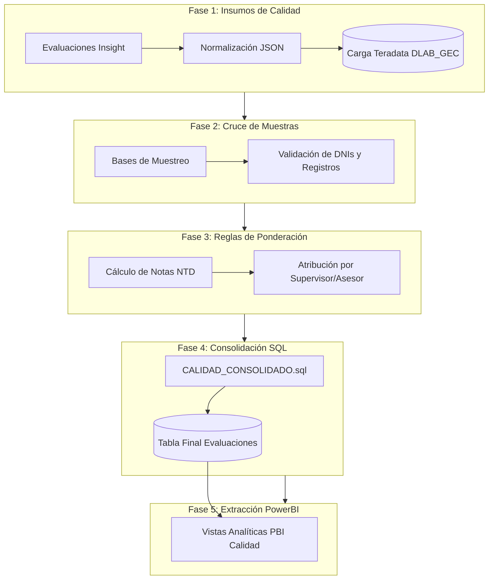

# 📊 Pipeline: PBI Evaluaciones Calidad (NTD)

Este documento describe las fases y orquestación del consolidado mensual de **Evaluaciones de Calidad No Te Dejes (NTD)**.

---

## 📊 Diagrama de Flujo

---

## 📋 Entradas y Salidas

- **Entradas:** Evaluaciones manuales de Insight, cruce de dotación de asesores y catálogo de tipificaciones.
- **Transformación:** Ponderación de no conformidades críticas y no críticas, normalización de DNIs.
- **Salida:** Tablas maestras de calidad en `DLAB_GEC` consumidas directamente por el tablero PowerBI de Calidad Televentas.
