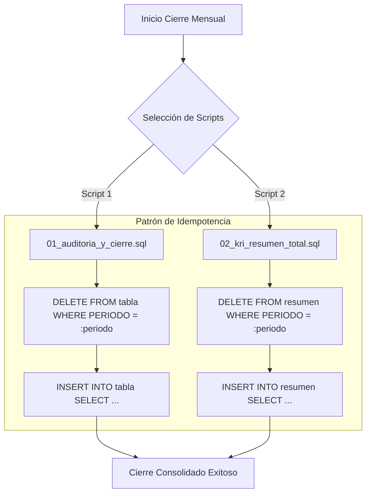

# 🔒 Pipeline: Modo Cierre Mensual

Este documento describe la arquitectura y mecanismos de **Cierre Mensual**, garantizando idempotencia en la consolidación de auditoría y métricas KRI.

---

## ⚙️ Principios de Ejecución e Idempotencia

El proceso de cierre mensual debe ser **100% re-ejecutable** sin generar registros duplicados ni inconsistencias.

---

## 🛠️ Detalle de Scripts de Cierre

1. **`01_auditoria_y_cierre.sql`**:
   - Consolida todas las auditorías del mes cerrado.
   - Ejecuta borrado selectivo por periodo contable antes de la inserción de snapshots definitivos.
2. **`02_kri_resumen_total.sql`**:
   - Genera el resumen ejecutivo totalizado de KRIs de Televentas.
   - Almacena el histórico inmutable para reportes regulatorios y gerenciales.
