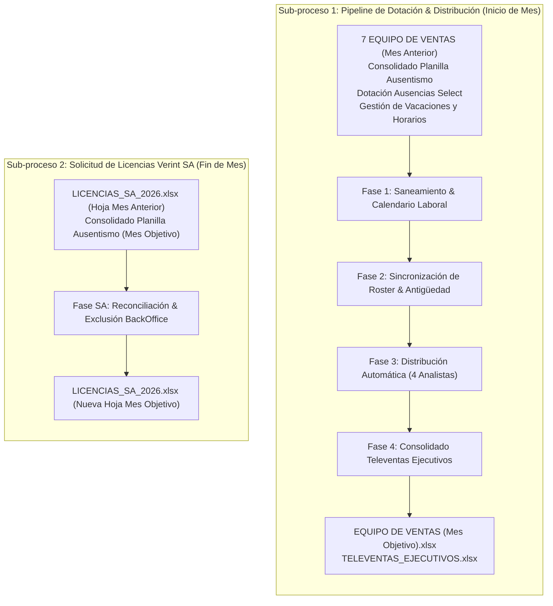

# 👥 Pipeline: Dotación Mensual y Licencias Speech Analytics

Este documento establece el estándar técnico oficial para la gestión, depuración, sincronización de personal y distribución de carga de auditoría del equipo de ventas y televentas en la plataforma.

---

## 🧭 1. Arquitectura General del Dominio

El módulo se compone de **dos sub-procesos completamente independientes**:

---

## ⚡ 2. Sub-proceso 1: Pipeline de Dotación (4 Fases Estándar)

### 🔹 Fase 1: Saneamiento, Feriados y Carga de Ausentismos
- **Entradas:** Libro base del mes anterior (`EQUIPO DE VENTAS`), `Consolidado Planilla ausentismo` y `Dotación Ausencias Select`.
- **Acciones:**
  1. Purga de columnas de evaluaciones y notas del mes anterior.
  2. Eliminación de rangos con nombre corruptos (`#REF!`) y filas fantasma.
  3. Carga automática del calendario de feriados oficiales de Perú y cálculo de días laborables netos.
  4. Ingesta de las hojas `DOTACIÓN` y `Dotación SELECT`.

### 🔹 Fase 2: Sincronización de Roster y Ciclo de Antigüedad
- **Acciones:**
  1. **Cruce de Roster:** Detección de altas (nuevos ingresos), bajas (ceses) y reasignaciones de supervisor.
  2. **Actualización de Antigüedad:** Progresión mensual del estado del asesor:
     $$\text{R0 (Ingreso)} \longrightarrow \text{R1 (1er Mes)} \longrightarrow \text{R2 (2do Mes)} \longrightarrow \text{R3 (Pleno / Regular)}$$
  3. **Imputación de Ausentismos:** Cruce con ausencias justificadas, descansos médicos y licencias.

### 🔹 Fase 3: Distribución Equitativa de Muestras entre 4 Analistas
- **Equipo Auditor:** **Carolina**, **Carmen**, **Jane** y **Karin**.
- **Regla de Capacidad Neta (Automatizada):**
  $$\text{Capacidad Neta}_i = (\text{Días Laborables Mes} - \text{Días Vacaciones}_i) \times \text{Meta Diaria de Auditoría}$$
- **Algoritmo de Reparto:**
  1. Lee automáticamente las vacaciones de `Gestión de Vacaciones y Horarios {YYYY}.xlsx`.
  2. Prioriza asesores con rotación o en etapas de prueba (`R0`, `R1`).
  3. Asigna llamadas de forma balanceada y equitativa proporcional a la capacidad neta de cada analista.

### 🔹 Fase 4: Consolidado y Maestro Televentas Ejecutivos
- **Acciones:**
  1. Reconciliación de ejecutivos clasificados por sucursal, jefatura y campaña.
  2. Generación del libro final validado nativamente mediante Microsoft Excel COM para garantizar compatibilidad XML prístina.

---

## 🔑 3. Sub-proceso 2: Licencias Speech Analytics (Verint SA)

- **Objetivo:** Generar la pestaña mensual del control de licencias Verint WFO para el equipo de Speech Analytics.
- **Reglas de Negocio:**
  1. **Clonado de Estructura:** Copia formato, fórmulas y encabezados de la hoja del mes anterior (`YYYYMM_prev`) a la nueva hoja (`YYYYMM_target`).
  2. **Filtro de BackOffice:** Excluye automáticamente al personal con funciones de *Gestión BackOffice* permanente (manteniendo interinos).
  3. **Etiquetado Operativo:** Asigna los estados `MANTENER LICENCIA`, `AGREGAR LICENCIA` o `RETIRAR LICENCIA`.

---

## 📂 4. Mapa Exacto de Rutas, Carpetas e Insumos (OneDrive / Local)

El sistema resuelve automáticamente la raíz de OneDrive del usuario mediante `os.path.expanduser("~") + r"\OneDrive - Interbank"`. A continuación se detalla la ruta exacta de cada archivo:

| Insumo / Salida | Tipo | Ruta Relativa en OneDrive | Patrón de Nombre de Archivo |
| :--- | :--- | :--- | :--- |
| **Plantilla Mes Anterior** | Insumo | `1. EXPERIENCIA DE COMPRA\EQUIPO DE VENTAS {YYYY}\` | `{M_ANT} EQUIPO DE VENTAS {MES_ANT_UPPER} {Y_ANT}.xlsx` |
| **Consolidado Ausentismo** | Insumo | `Dotación {YYYY}\Dotación {YYYYMM}\` | `Consolidado Planilla ausentismo {YYYYMM}.xlsx` |
| **Dotación Select** | Insumo | `Dotación {YYYY}\Dotación {YYYYMM}\Equipo Select\` | `Dotacion_Ausencias_Select_{MesCap}{YY}.xlsx` |
| **Gestión de Vacaciones** | Insumo | `1. EXPERIENCIA DE COMPRA\GESTIÓN {YYYY}\VACACIONES\` | `Gestión de Vacaciones y Horarios {YYYY}.xlsx` |
| **Televentas Mes Anterior** | Insumo | `1. EXPERIENCIA DE COMPRA\GESTIÓN {YYYY}\DOTACION\TERADATA\` | `{M_ANT} {MES_ANT_UPPER}_TELEVENTAS_EJECUTIVOS.xlsx` |
| **Libro Maestro Licencias SA** | Insumo / Salida | `1. EXPERIENCIA DE COMPRA\GESTIÓN {YYYY}\DOTACION\` | `LICENCIAS_SA_{YYYY}.xlsx` |
| **Equipo de Ventas Final** | Salida | `1. EXPERIENCIA DE COMPRA\EQUIPO DE VENTAS {YYYY}\` | `{M_ACT} EQUIPO DE VENTAS {MES_ACT_UPPER} {YYYY}_PRELIMINAR.xlsx` |
| **Televentas Final** | Salida | `1. EXPERIENCIA DE COMPRA\GESTIÓN {YYYY}\DOTACION\TERADATA\` | `{M_ACT} {MES_ACT_UPPER}_TELEVENTAS_EJECUTIVOS_PRELIMINAR.xlsx` |

> [!TIP]
> **Fallback Automático:** Si el script se ejecuta en un entorno sin OneDrive mapeado o en testing, el resolver buscará automáticamente coincidencias exactas por nombre de archivo en la raíz del proyecto local `./`.

---

## 🖥️ 5. Contratos de Integración API (`APP_CALIDAD`)

El backend expone 2 endpoints en FastAPI conectados a WebSockets para logs en tiempo real:

1. **`POST /api/dotacion/run-pipeline`**:
   - Payload: `{"periodo": "YYYY-MM"}` (o `"AUTO"` para el mes en curso).
   - Ejecuta Fases 1 a 4 con pre-flight checks automáticos y cálculo de vacaciones desde Excel.
2. **`POST /api/dotacion/run-licencias`**:
   - Payload: `{"periodo": "YYYYMM"}` (o `"AUTO"`).
   - Genera la nueva pestaña de licencias Verint excluyendo BackOffice.
